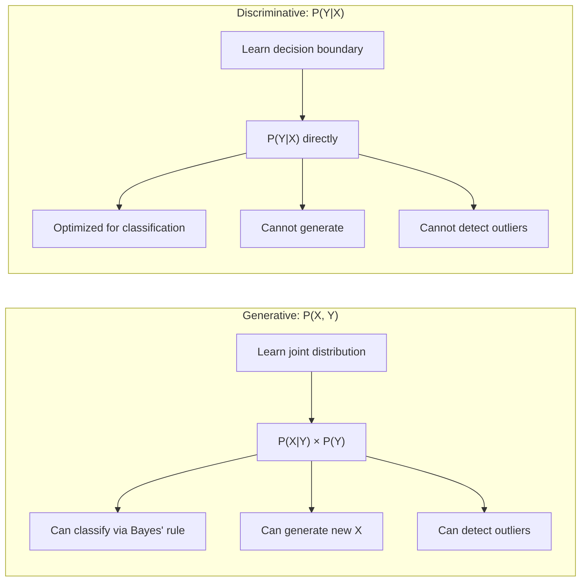
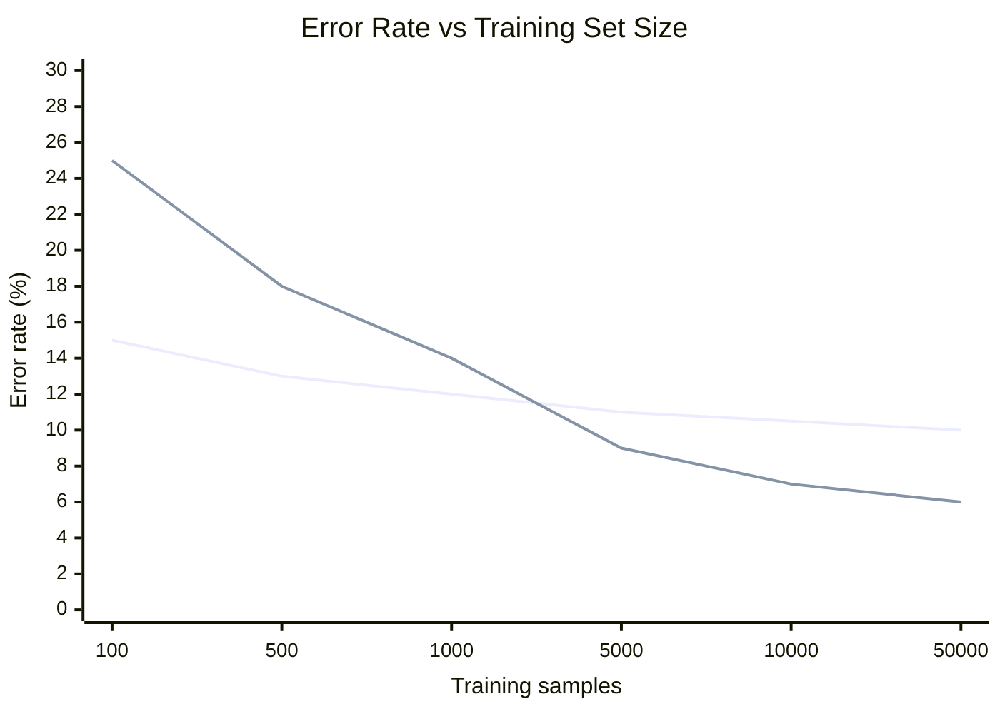
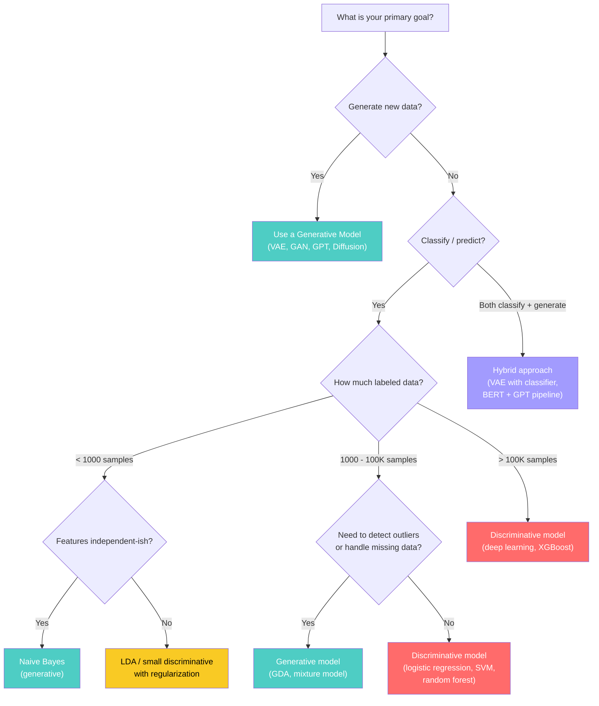

# Choosing the Right Paradigm: Generative vs. Discriminative Models

> **A deep-dive tutorial** on how to choose between generative and discriminative approaches —
> covering the mathematical foundations, trade-offs, decision frameworks, and hybrid strategies
> — with implementations in Python and Rust.

---

## Table of Contents

1. [The Fundamental Distinction](#the-fundamental-distinction)
2. [Mathematical Foundations](#mathematical-foundations)
3. [Generative Models in Depth](#generative-models-in-depth)
4. [Discriminative Models in Depth](#discriminative-models-in-depth)
5. [Head-to-Head Comparison](#head-to-head-comparison)
6. [Decision Framework](#decision-framework)
7. [Hybrid Approaches](#hybrid-approaches)
8. [Practical Case Studies](#practical-case-studies)
9. [Implementation: Generative vs. Discriminative on the Same Task](#implementation-generative-vs-discriminative-on-the-same-task)
10. [When Things Go Wrong](#when-things-go-wrong)
11. [The Modern Landscape](#the-modern-landscape)
12. [Exercises](#exercises)
13. [References](#references)

---

## The Fundamental Distinction

At the highest level, the question is: **what does your model learn?**

| | Generative | Discriminative |
|---|---|---|
| **Models** | $P(X, Y)$ or $P(X \mid Y)$ | $P(Y \mid X)$ directly |
| **Question answered** | "What does data from class $k$ look like?" | "Given this input, which class?" |
| **Can generate new data?** | Yes | No |
| **Can detect anomalies?** | Yes (low $P(X)$) | Generally no |
| **Asymptotic accuracy** | Lower | **Higher** |
| **Small data regime** | **Often better** | Needs more data |
| **Examples** | Naive Bayes, HMMs, GANs, VAEs, GPT | Logistic regression, SVMs, Random Forests, BERT |



---

## Mathematical Foundations

### Generative: Modeling the Joint Distribution

A generative model learns $P(X, Y)$, which can be factored as:

$$P(X, Y) = P(X \mid Y) \, P(Y)$$

To classify, apply **Bayes' theorem**:

$$P(Y = k \mid X) = \frac{P(X \mid Y = k) \, P(Y = k)}{\sum_{j} P(X \mid Y = j) \, P(Y = j)}$$

This requires modeling $P(X \mid Y = k)$ — the class-conditional likelihood — for every class.

**Advantages:**
- Gives you a full model of the data
- Can sample new data: draw $y \sim P(Y)$, then $x \sim P(X \mid Y = y)$
- Handles missing features naturally
- Prior $P(Y)$ can be updated without retraining

**Disadvantages:**
- Must model $P(X)$, which can be very complex (especially in high dimensions)
- Wasted capacity modeling parts of $P(X)$ irrelevant to classification
- Modeling assumptions can be wrong (e.g., Naive Bayes independence)

### Discriminative: Modeling the Conditional

A discriminative model learns $P(Y \mid X)$ directly, without modeling $P(X)$:

$$P(Y = k \mid X; \theta) = f_\theta(X)_k$$

For example, logistic regression:

$$P(Y = 1 \mid X) = \sigma(w^\top X + b) = \frac{1}{1 + e^{-(w^\top X + b)}}$$

**Advantages:**
- Focuses entirely on the decision boundary
- No need to model the (potentially very complex) input distribution
- Typically higher accuracy with enough data
- Can model complex decision boundaries

**Disadvantages:**
- Cannot generate new data
- Cannot compute $P(X)$ (no outlier detection)
- Needs more labeled data
- No principled way to incorporate unlabeled data (without tricks)

### The Ng & Jordan Result (2001)

Andrew Ng and Michael Jordan proved a fundamental result about the asymptotic and finite-sample behavior of generative vs. discriminative classifiers:

> **Theorem (informal):** Naive Bayes converges to its asymptotic error rate in $O(\log n)$ samples, while logistic regression requires $O(n)$ samples — but logistic regression has a lower asymptotic error rate.

This means:

$$\text{Naive Bayes error}_{n \to \infty} \geq \text{Logistic Regression error}_{n \to \infty}$$

But:

$$\text{Naive Bayes error}_{n \text{ small}} \leq \text{Logistic Regression error}_{n \text{ small}}$$



---

## Generative Models in Depth

### Classic Generative Classifiers

#### 1. Naive Bayes

Assumes feature independence:

$$P(X \mid Y = k) = \prod_{i=1}^{d} P(X_i \mid Y = k)$$

Despite the "naive" independence assumption, works surprisingly well for:
- Text classification (with TF-IDF features)
- Spam detection
- Medical diagnosis (with binary symptoms)

#### 2. Gaussian Discriminant Analysis (GDA)

Assumes class-conditional distributions are Gaussian:

$$P(X \mid Y = k) = \mathcal{N}(X; \mu_k, \Sigma_k)$$

- **LDA** (Linear Discriminant Analysis): Shared covariance $\Sigma_k = \Sigma$
- **QDA** (Quadratic Discriminant Analysis): Per-class covariance

#### 3. Hidden Markov Models

For sequential data, model the joint: $P(X_{1:T}, Y_{1:T})$.

See [Hidden Markov Models](hidden_markov_models.md) for details.

### Modern Generative Models

| Model | Type | What it generates |
|---|---|---|
| **VAE** | Explicit density (approximate) | Images, molecules |
| **GAN** | Implicit density | Images, audio, video |
| **GPT / LLaMA** | Autoregressive | Text |
| **Diffusion** | Score-based | Images, audio, video |
| **Normalizing Flow** | Exact density | Images, audio |

---

## Discriminative Models in Depth

### Classic Discriminative Classifiers

#### 1. Logistic Regression

The discriminative counterpart to Naive Bayes:
- Naive Bayes: models $P(X \mid Y)$ and uses Bayes' rule
- Logistic Regression: directly models $P(Y \mid X) = \sigma(w^\top X)$

They are a **generative-discriminative pair** — when Naive Bayes assumptions hold perfectly, they converge to the same classifier.

#### 2. Support Vector Machines (SVMs)

Finds the maximum-margin hyperplane:

$$\min_{w,b} \frac{1}{2} \|w\|^2 \quad \text{s.t.} \quad y_i(w^\top x_i + b) \geq 1 \; \forall i$$

Purely discriminative — no probabilistic interpretation by default.

#### 3. Random Forests / Gradient Boosted Trees

Ensemble methods that learn complex decision boundaries through tree splits. State-of-the-art for tabular data.

### Modern Discriminative Models

| Model | Type | Primary use |
|---|---|---|
| **BERT / RoBERTa** | Transformer (encoder) | Classification, NER, QA |
| **ResNet / ViT** | CNN / Transformer | Image classification |
| **XGBoost** | Gradient boosted trees | Tabular data |
| **Neural ODE** | Continuous dynamics | Time series |

---

## Head-to-Head Comparison

| Criterion | Generative | Discriminative | Winner for... |
|---|---|---|---|
| **Accuracy (large data)** | Lower | **Higher** | Discriminative |
| **Accuracy (small data)** | **Higher** | Lower | Generative |
| **Training speed** | **Often faster** | Varies | Depends on model |
| **Missing features** | **Handles naturally** | Needs imputation | Generative |
| **Outlier detection** | **Yes** ($P(X)$ available) | No | Generative |
| **Data generation** | **Yes** | No | Generative |
| **Semi-supervised** | **Natural** (via $P(X)$) | Difficult | Generative |
| **Interpretability** | Class distributions visible | Decision boundary visible | Tied |
| **Feature interactions** | Must be modeled | **Learned automatically** | Discriminative |
| **Scalability** | Varies | **Often better** | Discriminative |

---

## Decision Framework

Use this flowchart to guide your model selection:



### Quick Decision Rules

1. **If you need to generate data → Generative** (no choice)
2. **If you need anomaly detection → Generative** (need $P(X)$)
3. **If you have very little labeled data → Generative** (better sample efficiency)
4. **If you have lots of labeled data and only classify → Discriminative** (higher accuracy)
5. **If you have tabular data → Discriminative** (XGBoost / random forest dominate)
6. **If you need both → Hybrid** (combine the best of both)

---

## Hybrid Approaches

Modern ML increasingly uses hybrid architectures that combine generative and discriminative components.

### 1. Semi-Supervised Learning

Use a generative model to leverage unlabeled data, then a discriminative model for final classification:

$$\mathcal{L} = \underbrace{\mathcal{L}_{\text{supervised}}(X_L, Y_L)}_{\text{discriminative}} + \lambda \underbrace{\mathcal{L}_{\text{unsupervised}}(X_U)}_{\text{generative}}$$

### 2. Data Augmentation with Generative Models

1. Train a GAN / diffusion model on your dataset
2. Generate synthetic training samples
3. Train a discriminative classifier on real + synthetic data

### 3. Generative Classifiers with Discriminative Fine-Tuning

Start with a generative pre-training objective, then fine-tune discriminatively:
- **GPT → classifier** (OpenAI's original GPT paper used this)
- **BERT** (masked language model pre-training → discriminative fine-tuning)

### 4. Energy-Based Models

Model the joint distribution as:

$$P(X, Y) = \frac{e^{-E_\theta(X, Y)}}{Z}$$

Can be used for both classification ($\arg\min_y E_\theta(X, y)$) and generation (sample from $P(X)$).

---

## Implementation: Generative vs. Discriminative on the Same Task

Let's compare Naive Bayes (generative) and Logistic Regression (discriminative) on text classification, then observe how performance changes with dataset size.

### Python Implementation

```python
import numpy as np
from sklearn.naive_bayes import MultinomialNB
from sklearn.linear_model import LogisticRegression
from sklearn.feature_extraction.text import TfidfVectorizer
from sklearn.model_selection import learning_curve, cross_val_score
from sklearn.datasets import fetch_20newsgroups
import matplotlib.pyplot as plt

# Load data
categories = ['alt.atheism', 'comp.graphics', 'sci.med', 'soc.religion.christian']
newsgroups = fetch_20newsgroups(subset='all', categories=categories, remove=('headers', 'footers'))
X_text, y = newsgroups.data, newsgroups.target

# Feature extraction
vectorizer = TfidfVectorizer(max_features=10000, stop_words='english')
X = vectorizer.fit_transform(X_text)

# Define models
models = {
    "Naive Bayes (Generative)": MultinomialNB(alpha=1.0),
    "Logistic Regression (Discriminative)": LogisticRegression(max_iter=1000, C=1.0),
}

# Learning curves: accuracy vs training set size
train_sizes = np.linspace(0.05, 1.0, 20)

fig, axes = plt.subplots(1, 2, figsize=(14, 5))

for idx, (name, model) in enumerate(models.items()):
    train_sizes_abs, train_scores, test_scores = learning_curve(
        model, X, y,
        train_sizes=train_sizes,
        cv=5,
        scoring='accuracy',
        n_jobs=-1,
    )
    train_mean = np.mean(train_scores, axis=1)
    test_mean = np.mean(test_scores, axis=1)
    test_std = np.std(test_scores, axis=1)

    axes[idx].plot(train_sizes_abs, train_mean, label='Train', color='blue')
    axes[idx].plot(train_sizes_abs, test_mean, label='Test', color='red')
    axes[idx].fill_between(train_sizes_abs, test_mean - test_std, test_mean + test_std, alpha=0.1, color='red')
    axes[idx].set_title(name)
    axes[idx].set_xlabel('Training samples')
    axes[idx].set_ylabel('Accuracy')
    axes[idx].legend()
    axes[idx].set_ylim(0.5, 1.0)

plt.tight_layout()
plt.savefig("learning_curves.png", dpi=150)
plt.show()

# Compare at different dataset sizes
print(f"\n{'Training Size':>15} {'Naive Bayes':>12} {'Log. Reg.':>12} {'Better':>10}")
print("-" * 55)

for frac in [0.01, 0.05, 0.1, 0.25, 0.5, 1.0]:
    n = int(frac * len(y))
    indices = np.random.choice(len(y), n, replace=False)
    X_sub, y_sub = X[indices], y[indices]

    nb_score = cross_val_score(MultinomialNB(), X_sub, y_sub, cv=min(5, n // 4), scoring='accuracy').mean()
    lr_score = cross_val_score(LogisticRegression(max_iter=1000), X_sub, y_sub, cv=min(5, n // 4), scoring='accuracy').mean()

    better = "NB" if nb_score > lr_score else "LR"
    print(f"{n:>15} {nb_score:>12.4f} {lr_score:>12.4f} {better:>10}")
```

**Expected output pattern (illustrative):**

```
  Training Size  Naive Bayes    Log. Reg.     Better
-------------------------------------------------------
             37       0.7200       0.5800         NB    # Small data: NB wins
            187       0.8500       0.8200         NB    # Still NB
            374       0.8800       0.8900         LR    # Crossover point
            935       0.8900       0.9300         LR    # LR pulls ahead
           1870       0.9000       0.9500         LR
           3737       0.9000       0.9600         LR    # Asymptotically better
```

This demonstrates the Ng & Jordan result empirically.

### Rust Implementation

```rust
use ndarray::{Array1, Array2, Axis};
use std::collections::HashMap;

/// A Multinomial Naive Bayes classifier (generative).
struct NaiveBayes {
    /// Log class priors: log P(Y=k)
    log_priors: Vec<f64>,
    /// Log class-conditional feature probabilities: log P(X_i | Y=k)
    log_likelihoods: Vec<Array1<f64>>,
    /// Number of classes
    n_classes: usize,
}

impl NaiveBayes {
    fn fit(x: &Array2<f64>, y: &[usize], n_classes: usize, alpha: f64) -> Self {
        let n_features = x.ncols();
        let n_samples = x.nrows();

        // Compute class priors
        let mut class_counts = vec![0.0; n_classes];
        for &label in y {
            class_counts[label] += 1.0;
        }
        let log_priors: Vec<f64> = class_counts
            .iter()
            .map(|&c| (c / n_samples as f64).ln())
            .collect();

        // Compute class-conditional likelihoods with Laplace smoothing
        let mut log_likelihoods = Vec::with_capacity(n_classes);
        for k in 0..n_classes {
            let mut feature_counts = Array1::from_elem(n_features, alpha);
            for (i, &label) in y.iter().enumerate() {
                if label == k {
                    feature_counts += &x.row(i);
                }
            }
            let total = feature_counts.sum();
            let log_probs = feature_counts.mapv(|c| (c / total).ln());
            log_likelihoods.push(log_probs);
        }

        NaiveBayes { log_priors, log_likelihoods, n_classes }
    }

    fn predict(&self, x: &Array2<f64>) -> Vec<usize> {
        x.rows()
            .into_iter()
            .map(|row| {
                (0..self.n_classes)
                    .max_by(|&a, &b| {
                        let score_a = self.log_priors[a] + row.dot(&self.log_likelihoods[a]);
                        let score_b = self.log_priors[b] + row.dot(&self.log_likelihoods[b]);
                        score_a.partial_cmp(&score_b).unwrap()
                    })
                    .unwrap()
            })
            .collect()
    }

    fn accuracy(&self, x: &Array2<f64>, y: &[usize]) -> f64 {
        let preds = self.predict(x);
        let correct = preds.iter().zip(y).filter(|(&p, &t)| p == t).count();
        correct as f64 / y.len() as f64
    }
}

/// A simple Logistic Regression classifier (discriminative).
/// Uses gradient descent on cross-entropy loss.
struct LogisticRegression {
    /// Weight matrix: (n_classes, n_features)
    weights: Array2<f64>,
    /// Bias: (n_classes,)
    bias: Array1<f64>,
    n_classes: usize,
}

impl LogisticRegression {
    fn new(n_features: usize, n_classes: usize) -> Self {
        let weights = Array2::zeros((n_classes, n_features));
        let bias = Array1::zeros(n_classes);
        LogisticRegression { weights, bias, n_classes }
    }

    /// Softmax over class scores.
    fn softmax(logits: &Array1<f64>) -> Array1<f64> {
        let max_val = logits.iter().cloned().fold(f64::NEG_INFINITY, f64::max);
        let exp_vals: Array1<f64> = logits.mapv(|v| (v - max_val).exp());
        let sum = exp_vals.sum();
        exp_vals / sum
    }

    fn predict_proba(&self, x: &Array1<f64>) -> Array1<f64> {
        let logits: Array1<f64> = self.weights.dot(x) + &self.bias;
        Self::softmax(&logits)
    }

    fn fit(&mut self, x: &Array2<f64>, y: &[usize], lr: f64, epochs: usize) {
        let n_samples = x.nrows();

        for _epoch in 0..epochs {
            let mut grad_w = Array2::zeros(self.weights.raw_dim());
            let mut grad_b = Array1::zeros(self.n_classes);

            for i in 0..n_samples {
                let row = x.row(i).to_owned();
                let probs = self.predict_proba(&row);

                // One-hot target
                let mut target = Array1::zeros(self.n_classes);
                target[y[i]] = 1.0;

                // Gradient: prob - target
                let diff = &probs - &target;

                for k in 0..self.n_classes {
                    grad_w
                        .row_mut(k)
                        .scaled_add(diff[k] / n_samples as f64, &row);
                    grad_b[k] += diff[k] / n_samples as f64;
                }
            }

            self.weights.scaled_add(-lr, &grad_w);
            self.bias.scaled_add(-lr, &grad_b);
        }
    }

    fn predict(&self, x: &Array2<f64>) -> Vec<usize> {
        x.rows()
            .into_iter()
            .map(|row| {
                let probs = self.predict_proba(&row.to_owned());
                probs
                    .iter()
                    .enumerate()
                    .max_by(|(_, a), (_, b)| a.partial_cmp(b).unwrap())
                    .unwrap()
                    .0
            })
            .collect()
    }

    fn accuracy(&self, x: &Array2<f64>, y: &[usize]) -> f64 {
        let preds = self.predict(x);
        let correct = preds.iter().zip(y).filter(|(&p, &t)| p == t).count();
        correct as f64 / y.len() as f64
    }
}

fn main() {
    // Synthetic data: 3 classes, 20 features
    let n_features = 20;
    let n_classes = 3;
    let n_train = 200;
    let n_test = 100;

    // Generate synthetic TF-IDF-like features (non-negative)
    let mut rng_seed = 42u64;
    let mut next_rand = || -> f64 {
        rng_seed = rng_seed.wrapping_mul(6364136223846793005).wrapping_add(1);
        (rng_seed >> 33) as f64 / (1u64 << 31) as f64
    };

    let mut x_train = Array2::zeros((n_train, n_features));
    let mut y_train = vec![0usize; n_train];
    for i in 0..n_train {
        let class = i % n_classes;
        y_train[i] = class;
        for j in 0..n_features {
            // Features correlated with class
            let base = if j % n_classes == class { 2.0 } else { 0.5 };
            x_train[[i, j]] = (base + next_rand()).max(0.01);
        }
    }

    let mut x_test = Array2::zeros((n_test, n_features));
    let mut y_test = vec![0usize; n_test];
    for i in 0..n_test {
        let class = i % n_classes;
        y_test[i] = class;
        for j in 0..n_features {
            let base = if j % n_classes == class { 2.0 } else { 0.5 };
            x_test[[i, j]] = (base + next_rand()).max(0.01);
        }
    }

    // Train and evaluate both models
    println!("=== Generative vs Discriminative Comparison ===\n");

    // Naive Bayes (generative)
    let nb = NaiveBayes::fit(&x_train, &y_train, n_classes, 1.0);
    let nb_train_acc = nb.accuracy(&x_train, &y_train);
    let nb_test_acc = nb.accuracy(&x_test, &y_test);
    println!("Naive Bayes (Generative):");
    println!("  Train accuracy: {:.4}", nb_train_acc);
    println!("  Test accuracy:  {:.4}", nb_test_acc);

    // Logistic Regression (discriminative)
    let mut lr = LogisticRegression::new(n_features, n_classes);
    lr.fit(&x_train, &y_train, 0.1, 100);
    let lr_train_acc = lr.accuracy(&x_train, &y_train);
    let lr_test_acc = lr.accuracy(&x_test, &y_test);
    println!("\nLogistic Regression (Discriminative):");
    println!("  Train accuracy: {:.4}", lr_train_acc);
    println!("  Test accuracy:  {:.4}", lr_test_acc);

    // Sample efficiency comparison at different training sizes
    println!("\n=== Sample Efficiency Comparison ===\n");
    println!("{:>10} {:>12} {:>12} {:>8}", "N_train", "NB Acc", "LR Acc", "Better");
    println!("{}", "-".repeat(46));

    for &n in &[10, 25, 50, 100, 200] {
        let x_sub = x_train.slice(ndarray::s![..n, ..]).to_owned();
        let y_sub = y_train[..n].to_vec();

        let nb_sub = NaiveBayes::fit(&x_sub, &y_sub, n_classes, 1.0);
        let nb_acc = nb_sub.accuracy(&x_test, &y_test);

        let mut lr_sub = LogisticRegression::new(n_features, n_classes);
        lr_sub.fit(&x_sub, &y_sub, 0.1, 200);
        let lr_acc = lr_sub.accuracy(&x_test, &y_test);

        let better = if nb_acc > lr_acc { "NB" } else { "LR" };
        println!("{:>10} {:>12.4} {:>12.4} {:>8}", n, nb_acc, lr_acc, better);
    }
}
```

---

## When Things Go Wrong

### Generative Model Pitfalls

1. **Wrong distributional assumptions** — Naive Bayes assumes independence. If features are highly correlated, it can make overconfident and wrong predictions.

2. **Curse of dimensionality** — Estimating $P(X \mid Y)$ in high dimensions is extremely hard. With $d$ binary features, you need to estimate $2^d$ probabilities per class.

3. **Mode collapse (GANs)** — Generator produces limited variety.

4. **Posterior collapse (VAEs)** — Latent variables are ignored; decoder memorizes.

### Discriminative Model Pitfalls

1. **Overconfident on OOD data** — A discriminative model has no notion of "this input is unlike anything I've seen." It will confidently classify random noise.

```python
import numpy as np
from sklearn.linear_model import LogisticRegression

# Train on digits 0-9
X_train = np.random.randn(1000, 784)  # Simulated digit features
y_train = np.random.randint(0, 10, 1000)

model = LogisticRegression(max_iter=100).fit(X_train, y_train)

# Feed in pure noise — model still gives confident prediction!
noise = np.random.randn(1, 784) * 100
proba = model.predict_proba(noise)
print(f"Max confidence on random noise: {proba.max():.2%}")
# Often > 90% confident — on pure noise!
```

2. **No way to handle missing features** without imputation.

3. **Requires more labeled data** for the same performance at small sample sizes.

4. **Cannot leverage unlabeled data** directly (without semi-supervised extensions).

---

## The Modern Landscape

The boundary between generative and discriminative has blurred significantly:

### Foundation Models

Modern foundation models often combine both paradigms:

| Model | Pre-training | Fine-tuning | Paradigm |
|---|---|---|---|
| **BERT** | Masked LM (generative-ish) | Classification head (discriminative) | Both |
| **GPT** | Autoregressive LM (generative) | Prompt-based (generative) or classifier (discriminative) | Both |
| **CLIP** | Contrastive (discriminative) | Zero-shot classification (discriminative) | Discriminative |
| **Stable Diffusion** | Denoising (generative) | Generation only | Generative |

### The "GPT Classification" Trick

GPT-style models can classify discriminatively through prompting:

```
Classify the following review as POSITIVE or NEGATIVE:
"This movie was terrible. I hated every minute."
Classification:
```

This is a **generative model performing discriminative tasks** through conditional generation. The boundary is essentially gone.

### Recommendation by Task Domain

| Domain | Recommended Approach | Reason |
|---|---|---|
| **Tabular data (< 10K rows)** | Gradient Boosted Trees (disc.) | XGBoost/LightGBM dominate benchmarks |
| **Tabular data (< 100 rows)** | Naive Bayes / GDA (gen.) | Sample efficiency |
| **Text classification** | BERT/RoBERTa (disc.) or GPT (gen.) | Depends on data availability |
| **Image classification** | ViT / ResNet (disc.) | Discriminative dominates |
| **Text generation** | GPT / LLaMA (gen.) | Task requires generation |
| **Image generation** | Diffusion / GAN (gen.) | Task requires generation |
| **Anomaly detection** | VAE / generative model | Need $P(X)$ |
| **Semi-supervised** | Hybrid (gen. + disc.) | Leverage unlabeled data |
| **Medical diagnosis (few patients)** | Generative or Bayesian | Uncertainty, small data |
| **Fraud detection** | Discriminative + anomaly | Classification + OOD |

---

## Exercises

1. **Empirical Ng-Jordan** — Replicate the learning curve experiment from the implementation section on 3 different datasets (text, tabular, image features). Does the crossover point vary?

2. **OOD detection** — Train both a Gaussian Naive Bayes and a Logistic Regression on MNIST digits 0-4. Then test them on digits 5-9. Which model better identifies that these are "unknown" classes? Implement OOD detection using the generative model's $P(X)$.

3. **Semi-supervised boost** — Take a text classification task with 100 labeled and 10,000 unlabeled examples. Compare: (a) Logistic Regression on 100 labeled, (b) Naive Bayes on 100 labeled, (c) EM algorithm using Naive Bayes with all data. When does the unlabeled data help?

4. **Hybrid architecture** — Build a VAE that also has a classification head on the latent space. Train jointly on reconstruction + classification loss. Compare to a standalone classifier and a standalone VAE.

5. **GPT as classifier** — Use a small GPT model to classify text via prompting. Compare accuracy and calibration to a fine-tuned BERT classifier on the same dataset. Under what conditions does each approach win?

6. **Decision framework validation** — Apply the decision framework flowchart to 5 real-world ML tasks (e.g., from Kaggle). Does it recommend the approach that actually wins the competition?

---

## References

1. Ng, A.Y., & Jordan, M. (2001). *On Discriminative vs. Generative classifiers: A comparison of logistic regression and naive Bayes*. NeurIPS.
2. Bishop, C. (2006). *Pattern Recognition and Machine Learning*. Springer.
3. Murphy, K. (2012). *Machine Learning: A Probabilistic Perspective*. MIT Press.
4. Jebara, T. (2004). *Machine Learning: Discriminative and Generative*. Kluwer Academic.
5. Goodfellow, I., et al. (2014). *Generative Adversarial Nets*. NeurIPS.
6. Kingma, D.P., & Welling, M. (2013). *Auto-Encoding Variational Bayes*. arXiv:1312.6114.
7. Devlin, J., et al. (2019). *BERT: Pre-training of Deep Bidirectional Transformers*. NAACL.
8. Rodriguez, C. (2024). *Generative AI Foundations in Python*. Packt Publishing.

---

*Related docs: [Types of Generative Models](types_of_generative_models.md) | [Risks and Implications](risks_and_implications.md) | [Hidden Markov Models](hidden_markov_models.md)*
