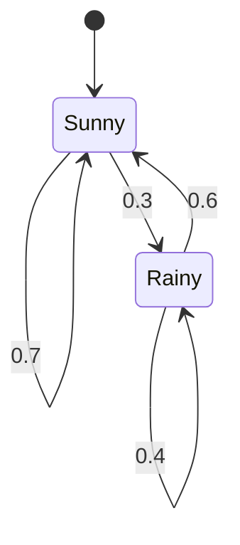
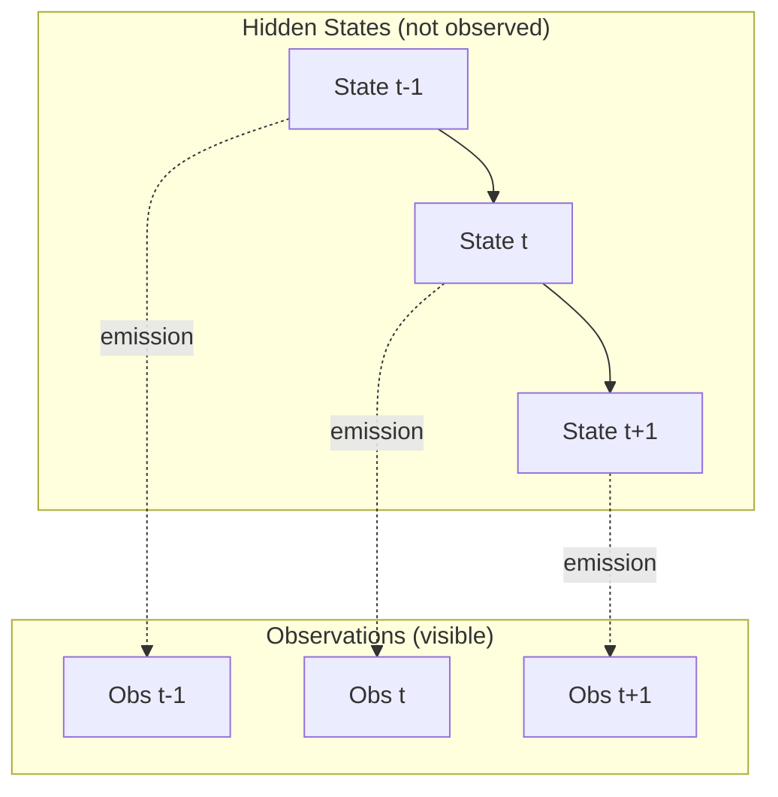
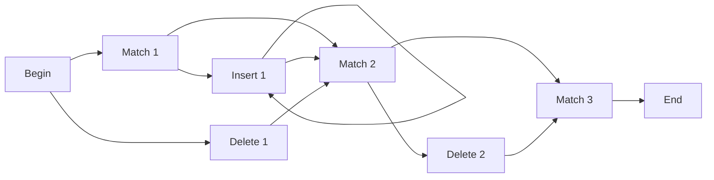

# Hidden Markov Models (HMMs)

> **A deep-dive tutorial** on Hidden Markov Models — from the basics of Markov chains
> through the three fundamental HMM algorithms — with worked examples, mathematical
> derivations, and implementations in Python and Rust.

---

## Table of Contents

1. [Markov Chains — The Foundation](#markov-chains--the-foundation)
2. [From Markov Chains to Hidden Markov Models](#from-markov-chains-to-hidden-markov-models)
3. [Formal Definition of an HMM](#formal-definition-of-an-hmm)
4. [The Three Fundamental Problems](#the-three-fundamental-problems)
5. [Problem 1: Evaluation — The Forward Algorithm](#problem-1-evaluation--the-forward-algorithm)
6. [Problem 2: Decoding — The Viterbi Algorithm](#problem-2-decoding--the-viterbi-algorithm)
7. [Problem 3: Learning — The Baum-Welch Algorithm](#problem-3-learning--the-baum-welch-algorithm)
8. [Worked Example: Weather and Activities](#worked-example-weather-and-activities)
9. [Applications of HMMs](#applications-of-hmms)
10. [HMMs vs. Modern Alternatives](#hmms-vs-modern-alternatives)
11. [Exercises](#exercises)
12. [References](#references)

---

## Markov Chains — The Foundation

A **Markov chain** is a stochastic process where the probability of transitioning to the next state depends *only* on the current state — not on the history of previous states. This is the **Markov property** (memorylessness):

$$P(X_{t+1} = s_j \mid X_t = s_i, X_{t-1} = s_k, \ldots) = P(X_{t+1} = s_j \mid X_t = s_i)$$

### Example: Weather as a Markov Chain

Suppose weather can be Sunny (S) or Rainy (R), with these transition probabilities:



The **transition matrix** $\mathbf{A}$ encodes all transition probabilities:

$$\mathbf{A} = \begin{pmatrix} P(S \to S) & P(S \to R) \\ P(R \to S) & P(R \to R) \end{pmatrix} = \begin{pmatrix} 0.7 & 0.3 \\ 0.6 & 0.4 \end{pmatrix}$$

Each row sums to 1 (it's a **stochastic matrix**).

### Stationary Distribution

As $t \to \infty$, a **regular** Markov chain converges to a stationary distribution $\boldsymbol{\pi}$ satisfying:

$$\boldsymbol{\pi} = \boldsymbol{\pi} \mathbf{A}, \quad \sum_i \pi_i = 1$$

For our weather example: $\pi_S = \frac{0.6}{0.3+0.6} = \frac{2}{3}$, $\pi_R = \frac{1}{3}$.

---

## From Markov Chains to Hidden Markov Models

In a regular Markov chain, the states are **directly observable**. But what if we can only observe **indirect evidence** of the underlying state?

For example:
- You **can't see** the weather outside (hidden state)
- You **can see** whether your coworker carries an umbrella (observation)

This is the core idea of an HMM: **hidden states** generate **observable emissions**.



---

## Formal Definition of an HMM

An HMM is defined by the tuple $\lambda = (\mathbf{A}, \mathbf{B}, \boldsymbol{\pi})$:

| Symbol | Name | Dimension | Description |
|---|---|---|---|
| $N$ | Number of hidden states | scalar | $S = \{s_1, s_2, \ldots, s_N\}$ |
| $M$ | Number of observation symbols | scalar | $V = \{v_1, v_2, \ldots, v_M\}$ |
| $\mathbf{A}$ | Transition matrix | $N \times N$ | $a_{ij} = P(q_{t+1} = s_j \mid q_t = s_i)$ |
| $\mathbf{B}$ | Emission matrix | $N \times M$ | $b_j(k) = P(o_t = v_k \mid q_t = s_j)$ |
| $\boldsymbol{\pi}$ | Initial state distribution | $N \times 1$ | $\pi_i = P(q_1 = s_i)$ |

**Two key assumptions:**

1. **First-order Markov**: $P(q_t \mid q_{t-1}, q_{t-2}, \ldots) = P(q_t \mid q_{t-1})$
2. **Output independence**: $P(o_t \mid q_1, \ldots, q_T, o_1, \ldots, o_T) = P(o_t \mid q_t)$

---

## The Three Fundamental Problems

| Problem | Question | Algorithm | Complexity |
|---|---|---|---|
| **Evaluation** | What is $P(O \mid \lambda)$? Given a model and a sequence of observations, how likely is this sequence? | Forward (or Backward) | $O(N^2 T)$ |
| **Decoding** | What is the most likely hidden state sequence? | Viterbi | $O(N^2 T)$ |
| **Learning** | What model parameters $\lambda$ maximize $P(O \mid \lambda)$? | Baum-Welch (EM) | $O(N^2 T)$ per iteration |

where $N$ = number of states, $T$ = sequence length.

---

## Problem 1: Evaluation — The Forward Algorithm

**Goal:** Compute $P(O \mid \lambda)$ — the probability of observing the sequence $O = (o_1, o_2, \ldots, o_T)$ given model $\lambda$.

### Naive Approach

Sum over all possible state sequences:

$$P(O \mid \lambda) = \sum_{\text{all } Q} P(O \mid Q, \lambda) P(Q \mid \lambda)$$

This requires enumerating $N^T$ sequences — computationally intractable.

### Forward Algorithm (Dynamic Programming)

Define the **forward variable**:

$$\alpha_t(i) = P(o_1, o_2, \ldots, o_t, q_t = s_i \mid \lambda)$$

**Initialization** ($t = 1$):

$$\alpha_1(i) = \pi_i \cdot b_i(o_1) \quad \text{for } i = 1, \ldots, N$$

**Recursion** ($t = 2, \ldots, T$):

$$\alpha_t(j) = \left[\sum_{i=1}^{N} \alpha_{t-1}(i) \cdot a_{ij}\right] \cdot b_j(o_t)$$

**Termination:**

$$P(O \mid \lambda) = \sum_{i=1}^{N} \alpha_T(i)$$

**Python** — Forward algorithm from scratch:

```python
import numpy as np

def forward_algorithm(observations, A, B, pi):
    """
    Compute P(O | lambda) using the forward algorithm.

    Parameters
    ----------
    observations : list[int]
        Sequence of observation indices.
    A : np.ndarray, shape (N, N)
        Transition matrix.
    B : np.ndarray, shape (N, M)
        Emission matrix.
    pi : np.ndarray, shape (N,)
        Initial state distribution.

    Returns
    -------
    prob : float
        P(O | lambda)
    alpha : np.ndarray, shape (T, N)
        Forward variables.
    """
    N = A.shape[0]
    T = len(observations)
    alpha = np.zeros((T, N))

    # Initialization
    alpha[0] = pi * B[:, observations[0]]

    # Recursion
    for t in range(1, T):
        for j in range(N):
            alpha[t, j] = np.sum(alpha[t - 1] * A[:, j]) * B[j, observations[t]]

    # Termination
    prob = np.sum(alpha[-1])
    return prob, alpha


# --- Example: Weather HMM ---
# States: 0=Sunny, 1=Rainy
# Observations: 0=Walk, 1=Shop, 2=Clean
A = np.array([[0.7, 0.3],
              [0.4, 0.6]])

B = np.array([[0.1, 0.4, 0.5],
              [0.6, 0.3, 0.1]])

pi = np.array([0.6, 0.4])

observations = [0, 1, 2, 1]  # Walk, Shop, Clean, Shop

prob, alpha = forward_algorithm(observations, A, B, pi)
print(f"P(O | lambda) = {prob:.6f}")
print(f"Alpha matrix:\n{alpha}")
```

**Rust** — Forward algorithm with `ndarray`:

```rust
use ndarray::{Array1, Array2};

/// Forward algorithm: returns (probability, alpha matrix).
fn forward(
    obs: &[usize],
    a: &Array2<f64>,  // N x N transition matrix
    b: &Array2<f64>,  // N x M emission matrix
    pi: &Array1<f64>, // N initial distribution
) -> (f64, Array2<f64>) {
    let n = a.nrows();
    let t_len = obs.len();
    let mut alpha = Array2::<f64>::zeros((t_len, n));

    // Initialization
    for i in 0..n {
        alpha[[0, i]] = pi[i] * b[[i, obs[0]]];
    }

    // Recursion
    for t in 1..t_len {
        for j in 0..n {
            let mut sum = 0.0;
            for i in 0..n {
                sum += alpha[[t - 1, i]] * a[[i, j]];
            }
            alpha[[t, j]] = sum * b[[j, obs[t]]];
        }
    }

    // Termination
    let prob = alpha.row(t_len - 1).sum();
    (prob, alpha)
}

fn main() {
    let a = Array2::from_shape_vec((2, 2), vec![0.7, 0.3, 0.4, 0.6]).unwrap();
    let b = Array2::from_shape_vec((2, 3), vec![0.1, 0.4, 0.5, 0.6, 0.3, 0.1]).unwrap();
    let pi = Array1::from_vec(vec![0.6, 0.4]);

    let obs = vec![0, 1, 2, 1]; // Walk, Shop, Clean, Shop

    let (prob, alpha) = forward(&obs, &a, &b, &pi);
    println!("P(O | lambda) = {:.6}", prob);
    println!("Alpha:\n{:.4}", alpha);
}
```

### The Backward Algorithm

The backward variable $\beta_t(i) = P(o_{t+1}, \ldots, o_T \mid q_t = s_i, \lambda)$ is computed analogously in reverse:

$$\beta_T(i) = 1 \quad \forall i$$

$$\beta_t(i) = \sum_{j=1}^{N} a_{ij} \cdot b_j(o_{t+1}) \cdot \beta_{t+1}(j)$$

The forward and backward variables together give us **state occupancy probabilities**, which are essential for the Baum-Welch algorithm.

---

## Problem 2: Decoding — The Viterbi Algorithm

**Goal:** Find the most likely sequence of hidden states $Q^* = (q_1^*, q_2^*, \ldots, q_T^*)$ given observations $O$ and model $\lambda$.

$$Q^* = \arg\max_Q P(Q \mid O, \lambda)$$

The Viterbi algorithm is identical in structure to the forward algorithm, but replaces **summation** with **maximization** and keeps **backpointers** to reconstruct the path.

Define:

$$\delta_t(j) = \max_{q_1, \ldots, q_{t-1}} P(q_1, \ldots, q_{t-1}, q_t = s_j, o_1, \ldots, o_t \mid \lambda)$$

**Initialization:**

$$\delta_1(i) = \pi_i \cdot b_i(o_1), \quad \psi_1(i) = 0$$

**Recursion:**

$$\delta_t(j) = \max_i \left[\delta_{t-1}(i) \cdot a_{ij}\right] \cdot b_j(o_t)$$

$$\psi_t(j) = \arg\max_i \left[\delta_{t-1}(i) \cdot a_{ij}\right]$$

**Termination:**

$$q_T^* = \arg\max_i \delta_T(i)$$

**Backtracking:**

$$q_t^* = \psi_{t+1}(q_{t+1}^*) \quad \text{for } t = T-1, \ldots, 1$$

**Python** — Viterbi algorithm:

```python
import numpy as np

def viterbi(observations, A, B, pi):
    """
    Find the most likely state sequence using the Viterbi algorithm.

    Returns
    -------
    best_path : list[int]
        Most likely state sequence.
    best_prob : float
        Probability of the best path.
    """
    N = A.shape[0]
    T = len(observations)

    # Delta and psi matrices
    delta = np.zeros((T, N))
    psi = np.zeros((T, N), dtype=int)

    # Initialization
    delta[0] = pi * B[:, observations[0]]
    psi[0] = 0

    # Recursion
    for t in range(1, T):
        for j in range(N):
            trans_probs = delta[t - 1] * A[:, j]
            psi[t, j] = np.argmax(trans_probs)
            delta[t, j] = np.max(trans_probs) * B[j, observations[t]]

    # Termination: find the best last state
    best_path = [0] * T
    best_path[-1] = np.argmax(delta[-1])
    best_prob = delta[-1, best_path[-1]]

    # Backtracking
    for t in range(T - 2, -1, -1):
        best_path[t] = psi[t + 1, best_path[t + 1]]

    return best_path, best_prob


# Using the weather HMM from before
A = np.array([[0.7, 0.3],
              [0.4, 0.6]])

B = np.array([[0.1, 0.4, 0.5],
              [0.6, 0.3, 0.1]])

pi = np.array([0.6, 0.4])

observations = [0, 1, 2, 1]  # Walk, Shop, Clean, Shop
state_names = ["Sunny", "Rainy"]

path, prob = viterbi(observations, A, B, pi)
print(f"Best path: {[state_names[s] for s in path]}")
print(f"Probability: {prob:.6f}")
```

**Rust** — Viterbi algorithm:

```rust
use ndarray::{Array1, Array2};

/// Viterbi algorithm: returns (best_path, best_probability).
fn viterbi(
    obs: &[usize],
    a: &Array2<f64>,
    b: &Array2<f64>,
    pi: &Array1<f64>,
) -> (Vec<usize>, f64) {
    let n = a.nrows();
    let t_len = obs.len();
    let mut delta = Array2::<f64>::zeros((t_len, n));
    let mut psi = Array2::<usize>::zeros((t_len, n));

    // Initialization
    for i in 0..n {
        delta[[0, i]] = pi[i] * b[[i, obs[0]]];
    }

    // Recursion
    for t in 1..t_len {
        for j in 0..n {
            let mut best_val = f64::NEG_INFINITY;
            let mut best_idx = 0;
            for i in 0..n {
                let val = delta[[t - 1, i]] * a[[i, j]];
                if val > best_val {
                    best_val = val;
                    best_idx = i;
                }
            }
            delta[[t, j]] = best_val * b[[j, obs[t]]];
            psi[[t, j]] = best_idx;
        }
    }

    // Termination
    let mut best_last = 0;
    let mut best_prob = f64::NEG_INFINITY;
    for i in 0..n {
        if delta[[t_len - 1, i]] > best_prob {
            best_prob = delta[[t_len - 1, i]];
            best_last = i;
        }
    }

    // Backtracking
    let mut path = vec![0usize; t_len];
    path[t_len - 1] = best_last;
    for t in (0..t_len - 1).rev() {
        path[t] = psi[[t + 1, path[t + 1]]];
    }

    (path, best_prob)
}

fn main() {
    let a = Array2::from_shape_vec((2, 2), vec![0.7, 0.3, 0.4, 0.6]).unwrap();
    let b = Array2::from_shape_vec((2, 3), vec![0.1, 0.4, 0.5, 0.6, 0.3, 0.1]).unwrap();
    let pi = Array1::from_vec(vec![0.6, 0.4]);

    let obs = vec![0, 1, 2, 1];
    let state_names = ["Sunny", "Rainy"];

    let (path, prob) = viterbi(&obs, &a, &b, &pi);
    let named: Vec<&str> = path.iter().map(|&s| state_names[s]).collect();
    println!("Best path: {:?}", named);
    println!("Probability: {:.6}", prob);
}
```

---

## Problem 3: Learning — The Baum-Welch Algorithm

**Goal:** Find model parameters $\lambda^* = (\mathbf{A}^*, \mathbf{B}^*, \boldsymbol{\pi}^*)$ that maximize $P(O \mid \lambda)$.

Baum-Welch is an instance of the **Expectation-Maximization (EM)** algorithm:

1. **E-step:** Compute expected state occupancies and transitions using forward-backward
2. **M-step:** Re-estimate parameters from the expected counts
3. **Repeat** until convergence

### Key Quantities

**State occupancy probability** (probability of being in state $i$ at time $t$):

$$\gamma_t(i) = \frac{\alpha_t(i) \cdot \beta_t(i)}{P(O \mid \lambda)} = \frac{\alpha_t(i) \cdot \beta_t(i)}{\sum_{j=1}^N \alpha_t(j) \cdot \beta_t(j)}$$

**Transition probability** (probability of transitioning $i \to j$ at time $t$):

$$\xi_t(i,j) = \frac{\alpha_t(i) \cdot a_{ij} \cdot b_j(o_{t+1}) \cdot \beta_{t+1}(j)}{P(O \mid \lambda)}$$

### Re-estimation Formulas (M-step)

$$\hat{\pi}_i = \gamma_1(i)$$

$$\hat{a}_{ij} = \frac{\sum_{t=1}^{T-1} \xi_t(i,j)}{\sum_{t=1}^{T-1} \gamma_t(i)}$$

$$\hat{b}_j(k) = \frac{\sum_{t=1}^{T} \gamma_t(j) \cdot \mathbb{1}[o_t = v_k]}{\sum_{t=1}^{T} \gamma_t(j)}$$

**Python** — Baum-Welch with `hmmlearn`:

```python
import numpy as np
from hmmlearn import hmm

# Create a model and fit it to observed data
model = hmm.CategoricalHMM(n_components=2, n_iter=100, random_state=42)

# Generate training data from a known model
true_model = hmm.CategoricalHMM(n_components=2, random_state=42)
true_model.startprob_ = np.array([0.6, 0.4])
true_model.transmat_ = np.array([[0.7, 0.3],
                                  [0.4, 0.6]])
true_model.emissionprob_ = np.array([[0.1, 0.4, 0.5],
                                      [0.6, 0.3, 0.1]])

# Sample 1000 observations
X, states = true_model.sample(1000)

# Fit a new model to the observations (Baum-Welch under the hood)
model.fit(X)

print("Learned transition matrix:")
print(model.transmat_.round(3))
print("\nLearned emission matrix:")
print(model.emissionprob_.round(3))
print("\nLearned initial distribution:")
print(model.startprob_.round(3))
```

**Rust** — Baum-Welch from scratch:

```rust
use ndarray::{Array1, Array2, Axis};

/// One iteration of Baum-Welch re-estimation.
/// Returns updated (A, B, pi) and log-likelihood.
fn baum_welch_step(
    obs: &[usize],
    a: &Array2<f64>,
    b: &Array2<f64>,
    pi: &Array1<f64>,
    n_obs_symbols: usize,
) -> (Array2<f64>, Array2<f64>, Array1<f64>, f64) {
    let n = a.nrows();
    let t_len = obs.len();

    // --- Forward pass ---
    let mut alpha = Array2::<f64>::zeros((t_len, n));
    for i in 0..n {
        alpha[[0, i]] = pi[i] * b[[i, obs[0]]];
    }
    for t in 1..t_len {
        for j in 0..n {
            let mut s = 0.0;
            for i in 0..n {
                s += alpha[[t - 1, i]] * a[[i, j]];
            }
            alpha[[t, j]] = s * b[[j, obs[t]]];
        }
    }

    // --- Backward pass ---
    let mut beta = Array2::<f64>::zeros((t_len, n));
    for i in 0..n {
        beta[[t_len - 1, i]] = 1.0;
    }
    for t in (0..t_len - 1).rev() {
        for i in 0..n {
            let mut s = 0.0;
            for j in 0..n {
                s += a[[i, j]] * b[[j, obs[t + 1]]] * beta[[t + 1, j]];
            }
            beta[[t, i]] = s;
        }
    }

    let ll = alpha.row(t_len - 1).sum().ln();

    // --- Gamma and Xi ---
    let mut gamma = Array2::<f64>::zeros((t_len, n));
    for t in 0..t_len {
        let denom: f64 = (0..n).map(|i| alpha[[t, i]] * beta[[t, i]]).sum();
        for i in 0..n {
            gamma[[t, i]] = alpha[[t, i]] * beta[[t, i]] / denom;
        }
    }

    // Re-estimate A
    let mut new_a = Array2::<f64>::zeros((n, n));
    for i in 0..n {
        let denom: f64 = (0..t_len - 1).map(|t| gamma[[t, i]]).sum();
        for j in 0..n {
            let numer: f64 = (0..t_len - 1)
                .map(|t| {
                    alpha[[t, i]] * a[[i, j]] * b[[j, obs[t + 1]]] * beta[[t + 1, j]]
                        / alpha.row(t_len - 1).sum()
                })
                .sum();
            new_a[[i, j]] = numer / denom;
        }
    }

    // Re-estimate B
    let mut new_b = Array2::<f64>::zeros((n, n_obs_symbols));
    for j in 0..n {
        let denom: f64 = (0..t_len).map(|t| gamma[[t, j]]).sum();
        for k in 0..n_obs_symbols {
            let numer: f64 = (0..t_len)
                .filter(|&t| obs[t] == k)
                .map(|t| gamma[[t, j]])
                .sum();
            new_b[[j, k]] = numer / denom;
        }
    }

    // Re-estimate pi
    let new_pi = gamma.row(0).to_owned();

    (new_a, new_b, new_pi, ll)
}

fn main() {
    let n_states = 2;
    let n_symbols = 3;

    // Initial (random) parameters
    let mut a = Array2::from_shape_vec((2, 2), vec![0.5, 0.5, 0.5, 0.5]).unwrap();
    let mut b = Array2::from_shape_vec(
        (2, 3),
        vec![0.33, 0.33, 0.34, 0.33, 0.33, 0.34],
    )
    .unwrap();
    let mut pi = Array1::from_vec(vec![0.5, 0.5]);

    let obs = vec![0, 1, 2, 1, 0, 0, 1, 2, 2, 1, 0, 1, 2, 1, 0];

    // Run 50 iterations of Baum-Welch
    for epoch in 0..50 {
        let (new_a, new_b, new_pi, ll) = baum_welch_step(&obs, &a, &b, &pi, n_symbols);
        a = new_a;
        b = new_b;
        pi = new_pi;
        if epoch % 10 == 0 {
            println!("Epoch {}: log-likelihood = {:.4}", epoch, ll);
        }
    }

    println!("\nLearned A:\n{:.3}", a);
    println!("Learned B:\n{:.3}", b);
    println!("Learned pi: {:.3}", pi);
}
```

---

## Worked Example: Weather and Activities

Let's trace through a complete example step by step.

### Setup

- **Hidden states**: $S = \{\text{Sunny}, \text{Rainy}\}$
- **Observations**: $V = \{\text{Walk}, \text{Shop}, \text{Clean}\}$
- **Observation sequence**: $O = (\text{Walk}, \text{Shop}, \text{Clean})$

**Parameters:**

$$\boldsymbol{\pi} = (0.6, 0.4), \quad \mathbf{A} = \begin{pmatrix} 0.7 & 0.3 \\ 0.4 & 0.6 \end{pmatrix}, \quad \mathbf{B} = \begin{pmatrix} 0.1 & 0.4 & 0.5 \\ 0.6 & 0.3 & 0.1 \end{pmatrix}$$

### Forward Pass (step by step)

**$t = 1$, observe Walk:**

$$\alpha_1(\text{Sunny}) = 0.6 \times 0.1 = 0.06$$
$$\alpha_1(\text{Rainy}) = 0.4 \times 0.6 = 0.24$$

**$t = 2$, observe Shop:**

$$\alpha_2(\text{Sunny}) = (0.06 \times 0.7 + 0.24 \times 0.4) \times 0.4 = 0.138 \times 0.4 = 0.0552$$
$$\alpha_2(\text{Rainy}) = (0.06 \times 0.3 + 0.24 \times 0.6) \times 0.3 = 0.162 \times 0.3 = 0.0486$$

**$t = 3$, observe Clean:**

$$\alpha_3(\text{Sunny}) = (0.0552 \times 0.7 + 0.0486 \times 0.4) \times 0.5 = 0.05808 \times 0.5 = 0.02904$$
$$\alpha_3(\text{Rainy}) = (0.0552 \times 0.3 + 0.0486 \times 0.6) \times 0.1 = 0.04572 \times 0.1 = 0.004572$$

**Result:**

$$P(O \mid \lambda) = 0.02904 + 0.004572 = 0.033612$$

### Viterbi Decoding

$$\delta_1(\text{S}) = 0.06, \quad \delta_1(\text{R}) = 0.24$$
$$\delta_2(\text{S}) = \max(0.06 \times 0.7, 0.24 \times 0.4) \times 0.4 = 0.096 \times 0.4 = 0.0384 \quad [\text{backptr: R}]$$
$$\delta_2(\text{R}) = \max(0.06 \times 0.3, 0.24 \times 0.6) \times 0.3 = 0.144 \times 0.3 = 0.0432 \quad [\text{backptr: R}]$$
$$\delta_3(\text{S}) = \max(0.0384 \times 0.7, 0.0432 \times 0.4) \times 0.5 = 0.02688 \times 0.5 = 0.01344 \quad [\text{backptr: S}]$$
$$\delta_3(\text{R}) = \max(0.0384 \times 0.3, 0.0432 \times 0.6) \times 0.1 = 0.02592 \times 0.1 = 0.002592 \quad [\text{backptr: R}]$$

**Best final state:** Sunny ($\delta_3 = 0.01344$)

**Backtrack:** Sunny ← Sunny ← Rainy

$$Q^* = (\text{Rainy}, \text{Sunny}, \text{Sunny})$$

---

## Applications of HMMs

| Domain | Hidden States | Observations |
|---|---|---|
| **Speech recognition** | Phonemes | Acoustic features (MFCCs) |
| **POS tagging** | Grammatical tags (NOUN, VERB) | Words |
| **Gene finding** | Exon / Intron / Intergenic | DNA nucleotides (A, C, G, T) |
| **Financial modeling** | Market regimes (bull, bear) | Asset returns |
| **Gesture recognition** | Gesture phases | Sensor readings |
| **Music analysis** | Chord progressions | Audio features |

### HMMs in Computational Biology

HMMs are particularly powerful in bioinformatics. **Profile HMMs** model protein families by representing each position in a multiple sequence alignment as an HMM state:



Tools like **HMMER** use profile HMMs to search protein sequence databases.

---

## HMMs vs. Modern Alternatives

| Feature | HMM | CRF | RNN / LSTM | Transformer |
|---|---|---|---|---|
| **Model type** | Generative | Discriminative | Discriminative | Discriminative |
| **Inference** | Exact (forward-backward) | Exact (forward-backward) | Approximate | Approximate |
| **Long-range deps** | Limited (first-order) | Limited (features) | Better (LSTM) | Excellent (attention) |
| **Training data** | Works with small data | Needs labeled data | Needs lots of data | Needs massive data |
| **Interpretability** | High (clear probabilistic semantics) | Medium | Low | Low |
| **Speed** | Very fast | Fast | Moderate | Slow (but parallelizable) |

**When to still use HMMs:**
- Small datasets where neural models overfit
- When you need exact probabilistic inference
- When interpretability matters (e.g., regulatory requirements)
- As a baseline before trying more complex models
- Domains with strong sequential/temporal structure and small state spaces

---

## Exercises

1. **Forward by hand** — Compute $P(O \mid \lambda)$ for $O = (\text{Walk}, \text{Walk}, \text{Clean}, \text{Shop})$ using the weather HMM parameters above. Show all intermediate $\alpha$ values.

2. **Viterbi implementation** — Modify the Viterbi code (Python or Rust) to also return the $\delta$ matrix and verify your hand-computed results match.

3. **Log-space Viterbi** — Rewrite the Viterbi algorithm to work in log-space (replacing multiplications with additions). Why is this important for long sequences?

4. **Higher-order HMM** — Extend the forward algorithm to handle a second-order HMM where $P(q_t \mid q_{t-1}, q_{t-2})$. What happens to the state space and complexity?

5. **POS tagging with HMM** — Use `hmmlearn` or your from-scratch code to build a POS tagger on the Brown corpus (available in `nltk`). Compare its accuracy to spaCy's neural tagger.

6. **Baum-Welch convergence** — Run Baum-Welch with different random initializations. Plot the log-likelihood over iterations. Do you always converge to the same parameters? Why or why not?

---

## References

1. Rabiner, L.R. (1989). *A Tutorial on Hidden Markov Models and Selected Applications in Speech Recognition*. Proceedings of the IEEE, 77(2), 257-286.
2. Jurafsky, D. & Martin, J.H. (2024). *Speech and Language Processing* (3rd ed.), Ch. 8.
3. Bishop, C.M. (2006). *Pattern Recognition and Machine Learning*, Ch. 13.
4. Durbin, R., et al. (1998). *Biological Sequence Analysis: Probabilistic Models of Proteins and Nucleic Acids*. Cambridge University Press.
5. Rodriguez, C. (2024). *Generative AI Foundations in Python*. Packt Publishing.
6. `hmmlearn` documentation. [https://hmmlearn.readthedocs.io](https://hmmlearn.readthedocs.io).

---

*Related docs: [N-Grams](n_grams.md) | [Natural Language Processing](natural_language_processing.md) | [Recurrent Neural Networks](recurrent_neural_networks.md)*
