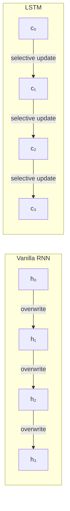
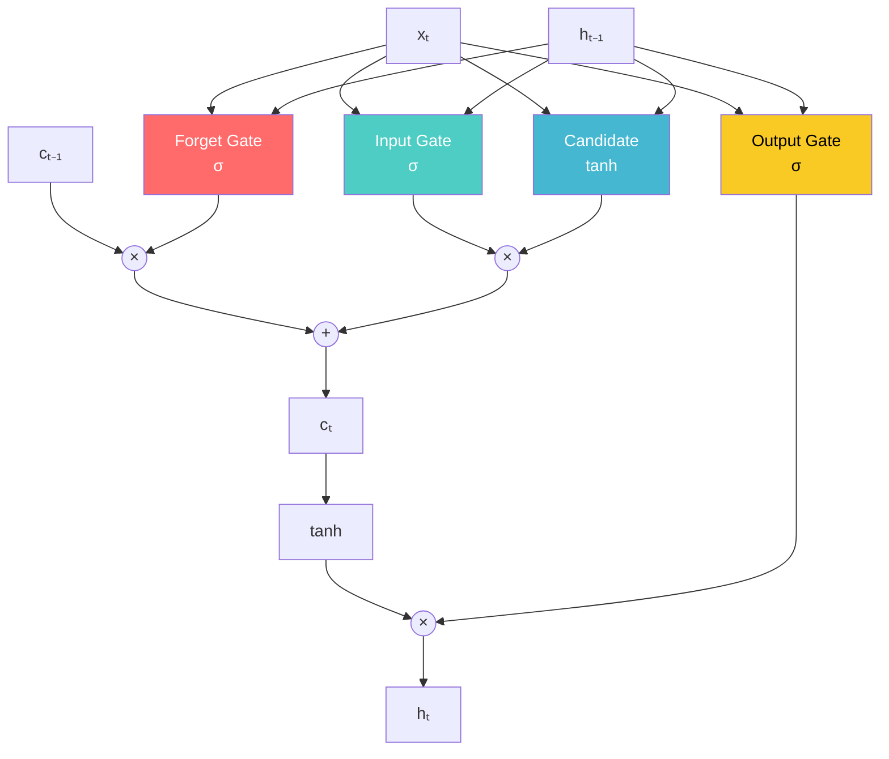
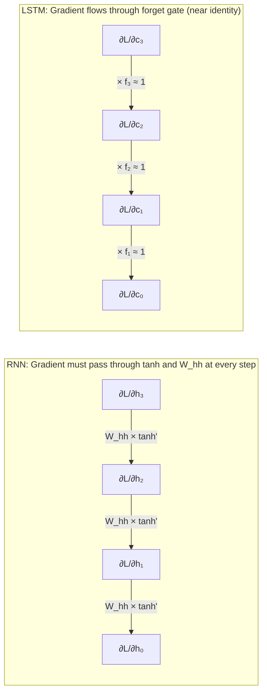
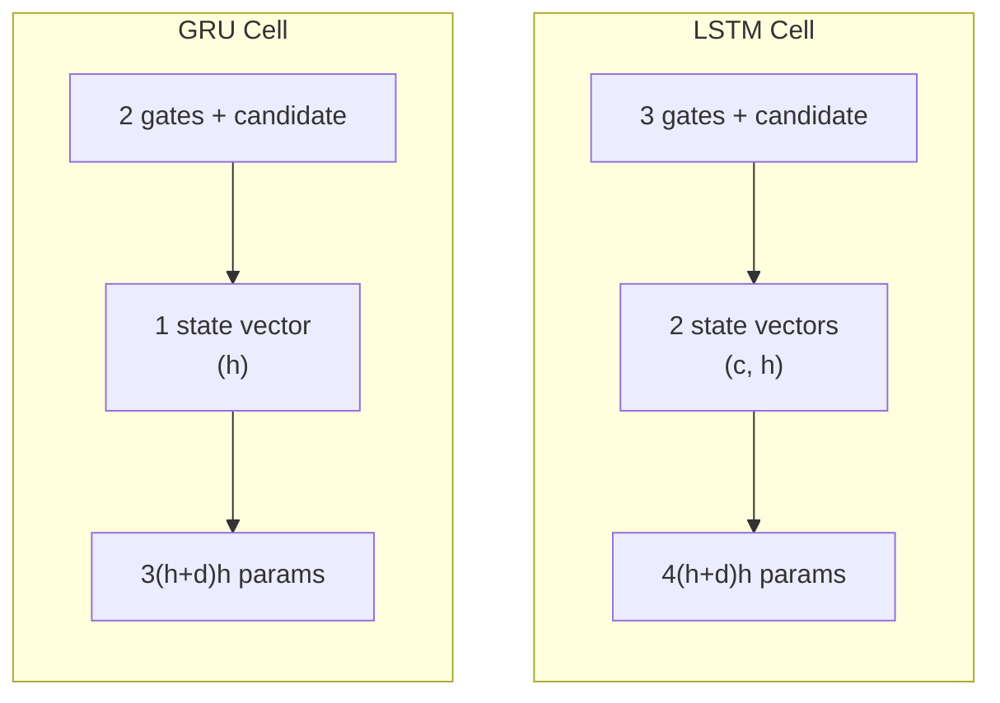
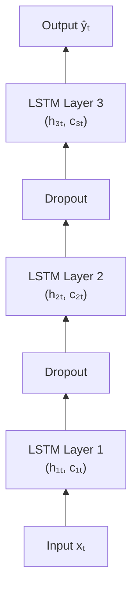

# Long Short-Term Memory (LSTM)

> **A deep-dive tutorial** on LSTM networks — the gating mechanisms that solved the vanishing
> gradient problem, GRU as a simplified variant, peephole connections, and stacked
> architectures — with mathematical derivations, cell diagrams, and implementations in
> Python and Rust.

---

## Table of Contents

1. [Motivation: Why Gates?](#motivation-why-gates)
2. [LSTM Cell Architecture](#lstm-cell-architecture)
3. [The Four Gates — Equations and Intuition](#the-four-gates--equations-and-intuition)
4. [How LSTMs Solve the Vanishing Gradient Problem](#how-lstms-solve-the-vanishing-gradient-problem)
5. [Gated Recurrent Unit (GRU)](#gated-recurrent-unit-gru)
6. [Peephole Connections](#peephole-connections)
7. [Stacked and Bidirectional LSTMs](#stacked-and-bidirectional-lstms)
8. [Implementation: PyTorch LSTM](#implementation-pytorch-lstm)
9. [LSTM Cell from Scratch](#lstm-cell-from-scratch)
10. [Comparison: RNN vs LSTM vs GRU](#comparison-rnn-vs-lstm-vs-gru)
11. [Exercises](#exercises)
12. [References](#references)

---

## Motivation: Why Gates?

Recall from the [RNN tutorial](recurrent_neural_networks.md) that vanilla RNNs suffer from the **vanishing gradient problem**: gradients flowing backward through time shrink exponentially, making it impossible to learn dependencies spanning more than ~10-20 time steps.

The core issue is the hidden state update:

$$\mathbf{h}_t = \tanh(\mathbf{W}_{hh} \mathbf{h}_{t-1} + \mathbf{W}_{xh} \mathbf{x}_t + \mathbf{b})$$

Every time step **completely overwrites** the hidden state through a nonlinear squashing function. Information from the distant past is repeatedly compressed and distorted.

**LSTMs** (Hochreiter & Schmidhuber, 1997) introduce a **cell state** $\mathbf{c}_t$ that acts as a "conveyor belt" — information can flow along it **unchanged** across many time steps. **Learnable gates** control what information to add, remove, or output from this cell state.



---

## LSTM Cell Architecture



The LSTM has **two** state vectors flowing through time:
- **Cell state** $\mathbf{c}_t$ — the long-term memory (the "conveyor belt")
- **Hidden state** $\mathbf{h}_t$ — the short-term / working memory (also the output)

---

## The Four Gates — Equations and Intuition

All four computations take the same inputs: the previous hidden state $\mathbf{h}_{t-1}$ and the current input $\mathbf{x}_t$.

### 1. Forget Gate ($\mathbf{f}_t$)  — "What to forget"

$$\mathbf{f}_t = \sigma(\mathbf{W}_f [\mathbf{h}_{t-1}, \mathbf{x}_t] + \mathbf{b}_f)$$

- Output: values in $(0, 1)$ per cell state dimension
- $f_t \approx 0$: **forget** this dimension of the cell state
- $f_t \approx 1$: **keep** this dimension unchanged

**Intuition:** When processing a new sentence, the model may want to forget the subject of the previous sentence.

### 2. Input Gate ($\mathbf{i}_t$) — "What to write"

$$\mathbf{i}_t = \sigma(\mathbf{W}_i [\mathbf{h}_{t-1}, \mathbf{x}_t] + \mathbf{b}_i)$$

Controls **how much** of the new candidate values to add to the cell state.

### 3. Candidate Values ($\tilde{\mathbf{c}}_t$) — "What to write"

$$\tilde{\mathbf{c}}_t = \tanh(\mathbf{W}_c [\mathbf{h}_{t-1}, \mathbf{x}_t] + \mathbf{b}_c)$$

The candidate new information to potentially store. The tanh squashes values to $(-1, 1)$.

### 4. Cell State Update — "Forget + Write"

$$\mathbf{c}_t = \mathbf{f}_t \odot \mathbf{c}_{t-1} + \mathbf{i}_t \odot \tilde{\mathbf{c}}_t$$

where $\odot$ is element-wise (Hadamard) multiplication.

This is the **key equation**: the cell state is a weighted combination of what to keep from the past ($\mathbf{f}_t \odot \mathbf{c}_{t-1}$) and what new information to add ($\mathbf{i}_t \odot \tilde{\mathbf{c}}_t$).

### 5. Output Gate ($\mathbf{o}_t$) — "What to output"

$$\mathbf{o}_t = \sigma(\mathbf{W}_o [\mathbf{h}_{t-1}, \mathbf{x}_t] + \mathbf{b}_o)$$

### 6. Hidden State — "Filtered output"

$$\mathbf{h}_t = \mathbf{o}_t \odot \tanh(\mathbf{c}_t)$$

The hidden state is a filtered version of the cell state — the model chooses what aspects of its long-term memory to expose.

### Parameter Count

For an LSTM with input dimension $d$ and hidden dimension $h$:

$$\text{Parameters} = 4 \times [(h + d) \times h + h] = 4h^2 + 4hd + 4h$$

The factor of 4 is because there are four weight matrices ($\mathbf{W}_f, \mathbf{W}_i, \mathbf{W}_c, \mathbf{W}_o$) — making an LSTM roughly **4× more expensive** than a vanilla RNN.

| Component | Weights | Biases |
|---|---|---|
| Forget gate | $(h+d) \times h$ | $h$ |
| Input gate | $(h+d) \times h$ | $h$ |
| Candidate | $(h+d) \times h$ | $h$ |
| Output gate | $(h+d) \times h$ | $h$ |
| **Total** | $4(h+d)h$ | $4h$ |

---

## How LSTMs Solve the Vanishing Gradient Problem

### The Gradient Highway

The key is the cell state update:

$$\mathbf{c}_t = \mathbf{f}_t \odot \mathbf{c}_{t-1} + \mathbf{i}_t \odot \tilde{\mathbf{c}}_t$$

The gradient of the loss with respect to $\mathbf{c}_{t-k}$ (a cell state $k$ steps in the past) flows through:

$$\frac{\partial \mathbf{c}_t}{\partial \mathbf{c}_{t-1}} = \text{diag}(\mathbf{f}_t) + \text{(terms involving gates' dependence on } \mathbf{c}_{t-1}\text{)}$$

When $\mathbf{f}_t \approx 1$ (forget gate fully open), the gradient is:

$$\frac{\partial \mathbf{c}_t}{\partial \mathbf{c}_{t-1}} \approx \mathbf{I}$$

The gradient flows through **unmodified** — no squashing, no matrix multiplication with $\mathbf{W}_{hh}$. This is analogous to skip connections in ResNets.

### Gradient Flow Comparison



### Forget Gate Bias Initialization

A practical trick: **initialize the forget gate bias to a positive value** (e.g., 1.0 or 2.0) so that $\sigma(b_f) \approx 1$ at the start of training. This ensures the gradient highway is open from the beginning.

```python
# PyTorch: initialize forget gate bias to 1.0
for name, param in lstm.named_parameters():
    if "bias" in name:
        n = param.size(0)
        # LSTM biases are ordered: [input, forget, candidate, output]
        # Each section has hidden_dim entries
        start = n // 4      # forget gate starts at index hidden_dim
        end = n // 2         # forget gate ends at index 2*hidden_dim
        param.data[start:end].fill_(1.0)
```

---

## Gated Recurrent Unit (GRU)

The GRU (Cho et al., 2014) is a simplified variant of the LSTM that **merges the cell and hidden states** and uses only **two gates** instead of three:

### GRU Equations

**Update gate** (combines forget + input):

$$\mathbf{z}_t = \sigma(\mathbf{W}_z [\mathbf{h}_{t-1}, \mathbf{x}_t] + \mathbf{b}_z)$$

**Reset gate** (controls how much past to expose to the candidate):

$$\mathbf{r}_t = \sigma(\mathbf{W}_r [\mathbf{h}_{t-1}, \mathbf{x}_t] + \mathbf{b}_r)$$

**Candidate hidden state:**

$$\tilde{\mathbf{h}}_t = \tanh(\mathbf{W}_h [\mathbf{r}_t \odot \mathbf{h}_{t-1}, \mathbf{x}_t] + \mathbf{b}_h)$$

**Hidden state update:**

$$\mathbf{h}_t = (1 - \mathbf{z}_t) \odot \mathbf{h}_{t-1} + \mathbf{z}_t \odot \tilde{\mathbf{h}}_t$$

### GRU vs LSTM — Key Differences

| Feature | LSTM | GRU |
|---|---|---|
| States | Cell state + hidden state | Hidden state only |
| Gates | 3 (forget, input, output) | 2 (update, reset) |
| Parameters | $4h^2 + 4hd + 4h$ | $3h^2 + 3hd + 3h$ |
| Separate memory | Yes (cell state) | No |
| Output filtering | Yes (output gate) | No |



### When to Prefer GRU over LSTM

- **Smaller datasets** — fewer parameters means less overfitting risk
- **Faster training** — ~25% fewer computations per step
- **Comparable performance** — on many tasks, GRU matches LSTM accuracy
- **Simpler implementation** — easier to debug and understand

In practice, the performance difference is often negligible. **Try both and pick the better one for your specific task.**

---

## Peephole Connections

**Peephole connections** (Gers & Schmidhuber, 2000) allow the gates to peek at the cell state directly:

$$\mathbf{f}_t = \sigma(\mathbf{W}_f [\mathbf{h}_{t-1}, \mathbf{x}_t] + \mathbf{W}_{pf} \odot \mathbf{c}_{t-1} + \mathbf{b}_f)$$

$$\mathbf{i}_t = \sigma(\mathbf{W}_i [\mathbf{h}_{t-1}, \mathbf{x}_t] + \mathbf{W}_{pi} \odot \mathbf{c}_{t-1} + \mathbf{b}_i)$$

$$\mathbf{o}_t = \sigma(\mathbf{W}_o [\mathbf{h}_{t-1}, \mathbf{x}_t] + \mathbf{W}_{po} \odot \mathbf{c}_t + \mathbf{b}_o)$$

Note: the forget and input gates peek at $\mathbf{c}_{t-1}$, while the output gate peeks at the **updated** $\mathbf{c}_t$.

Peephole connections add $3h$ diagonal weight parameters. They can help with tasks requiring **precise timing** (e.g., frequency detection) but often provide minimal improvement in standard NLP tasks.

---

## Stacked and Bidirectional LSTMs

### Stacked (Deep) LSTMs

Multiple LSTM layers stacked vertically — the output of layer $l$ feeds layer $l+1$:



**Guidelines:**
- 2-3 layers is standard for NLP; 4+ for speech recognition
- **Dropout between layers** (not within a layer's recurrence):

$$\mathbf{h}_t^{(l)} = \text{LSTM}^{(l)}(\text{dropout}(\mathbf{h}_t^{(l-1)}), \mathbf{h}_{t-1}^{(l)}, \mathbf{c}_{t-1}^{(l)})$$

### Bidirectional LSTM

Combines forward and backward LSTMs to capture both past and future context:

$$\overrightarrow{\mathbf{h}_t}, \overrightarrow{\mathbf{c}_t} = \overrightarrow{\text{LSTM}}(\mathbf{x}_t, \overrightarrow{\mathbf{h}_{t-1}}, \overrightarrow{\mathbf{c}_{t-1}})$$

$$\overleftarrow{\mathbf{h}_t}, \overleftarrow{\mathbf{c}_t} = \overleftarrow{\text{LSTM}}(\mathbf{x}_t, \overleftarrow{\mathbf{h}_{t+1}}, \overleftarrow{\mathbf{c}_{t+1}})$$

$$\mathbf{h}_t = [\overrightarrow{\mathbf{h}_t} \; ; \; \overleftarrow{\mathbf{h}_t}] \quad \text{(concatenation, dimension } 2h\text{)}$$

Bidirectional LSTMs powered many state-of-the-art NLP systems before transformers:
- **ELMo** (2018) — biLSTM for contextual word embeddings
- **Many NER and POS tagging systems**
- **Speech recognition** (when full utterance is available)

---

## Implementation: PyTorch LSTM

A full sentiment classification model using a bidirectional stacked LSTM.

**Python** — PyTorch:

```python
import torch
import torch.nn as nn

class LSTMClassifier(nn.Module):
    """
    Bidirectional stacked LSTM for text classification.

    Architecture:
        Embedding → BiLSTM (2 layers) → Attention Pooling → FC → Output
    """

    def __init__(
        self,
        vocab_size: int,
        embed_dim: int = 128,
        hidden_dim: int = 256,
        num_classes: int = 2,
        num_layers: int = 2,
        dropout: float = 0.3,
        pad_idx: int = 0,
    ):
        super().__init__()
        self.hidden_dim = hidden_dim
        self.num_layers = num_layers

        self.embedding = nn.Embedding(vocab_size, embed_dim, padding_idx=pad_idx)
        self.lstm = nn.LSTM(
            input_size=embed_dim,
            hidden_size=hidden_dim,
            num_layers=num_layers,
            batch_first=True,
            bidirectional=True,
            dropout=dropout if num_layers > 1 else 0.0,
        )

        # Self-attention pooling over time steps
        self.attention = nn.Linear(hidden_dim * 2, 1)

        self.fc = nn.Sequential(
            nn.Dropout(dropout),
            nn.Linear(hidden_dim * 2, hidden_dim),
            nn.ReLU(),
            nn.Dropout(dropout),
            nn.Linear(hidden_dim, num_classes),
        )

        self._init_weights()

    def _init_weights(self):
        """Initialize forget gate biases to 1.0."""
        for name, param in self.lstm.named_parameters():
            if "bias" in name:
                n = param.size(0)
                param.data[n // 4 : n // 2].fill_(1.0)

    def forward(self, text: torch.Tensor, lengths: torch.Tensor | None = None) -> torch.Tensor:
        """
        Parameters
        ----------
        text : Tensor, shape (batch, seq_len)
            Token indices.
        lengths : Tensor, shape (batch,), optional
            Actual sequence lengths for packing.

        Returns
        -------
        logits : Tensor, shape (batch, num_classes)
        """
        embedded = self.embedding(text)  # (batch, seq_len, embed_dim)

        if lengths is not None:
            packed = nn.utils.rnn.pack_padded_sequence(
                embedded, lengths.cpu(), batch_first=True, enforce_sorted=False
            )
            packed_out, (hidden, cell) = self.lstm(packed)
            output, _ = nn.utils.rnn.pad_packed_sequence(packed_out, batch_first=True)
        else:
            output, (hidden, cell) = self.lstm(embedded)

        # output: (batch, seq_len, hidden*2)

        # Attention pooling: learn which time steps matter most
        attn_weights = torch.softmax(self.attention(output).squeeze(-1), dim=1)
        # attn_weights: (batch, seq_len)
        context = torch.bmm(attn_weights.unsqueeze(1), output).squeeze(1)
        # context: (batch, hidden*2)

        return self.fc(context)


# --- Usage ---
model = LSTMClassifier(vocab_size=30000, embed_dim=128, hidden_dim=256, num_classes=2)
print(f"Total parameters: {sum(p.numel() for p in model.parameters()):,}")

# Example forward pass
batch = torch.randint(0, 30000, (8, 100))  # 8 sequences of length 100
lengths = torch.randint(20, 100, (8,))
logits = model(batch, lengths)
print(f"Output shape: {logits.shape}")  # (8, 2)
```

**Rust** — LSTM with `tch-rs`:

```rust
use tch::{nn, nn::Module, nn::RNNConfig, Device, Kind, Tensor};

/// Bidirectional LSTM classifier using tch-rs.
struct LSTMClassifier {
    embedding: nn::Embedding,
    lstm: nn::LSTM,
    fc1: nn::Linear,
    fc2: nn::Linear,
}

impl LSTMClassifier {
    fn new(vs: &nn::Path, vocab_size: i64, embed_dim: i64, hidden_dim: i64, num_classes: i64) -> Self {
        let embedding = nn::embedding(
            vs / "embedding",
            vocab_size,
            embed_dim,
            Default::default(),
        );

        let lstm_config = nn::RNNConfig {
            num_layers: 2,
            batch_first: true,
            bidirectional: true,
            dropout: 0.3,
            ..Default::default()
        };
        let lstm = nn::lstm(vs / "lstm", embed_dim, hidden_dim, lstm_config);

        // hidden_dim * 2 because bidirectional
        let fc1 = nn::linear(vs / "fc1", hidden_dim * 2, hidden_dim, Default::default());
        let fc2 = nn::linear(vs / "fc2", hidden_dim, num_classes, Default::default());

        Self { embedding, lstm, fc1, fc2 }
    }

    fn forward(&self, input: &Tensor) -> Tensor {
        let embedded = self.embedding.forward(input);
        let (output, _) = self.lstm.seq(&embedded);
        // output: (batch, seq_len, hidden*2)

        // Mean pooling over time dimension
        let pooled = output.mean_dim(1, false, Kind::Float);
        // pooled: (batch, hidden*2)

        let h = pooled.apply(&self.fc1).relu();
        h.apply(&self.fc2)
    }
}

fn main() {
    let device = Device::cuda_if_available();
    let vs = nn::VarStore::new(device);

    let model = LSTMClassifier::new(&vs.root(), 30000, 128, 256, 2);

    let param_count: i64 = vs.variables().iter().map(|(_, t)| t.numel() as i64).sum();
    println!("Total parameters: {}", param_count);

    // Forward pass
    let input = Tensor::randint(30000, &[8, 100], (Kind::Int64, device));
    let logits = model.forward(&input);
    println!("Output shape: {:?}", logits.size()); // [8, 2]
}
```

---

## LSTM Cell from Scratch

Understanding the internals by implementing an LSTM cell with raw matrix operations.

**Python** — NumPy:

```python
import numpy as np

class LSTMCell:
    """A single LSTM cell implemented from scratch with NumPy."""

    def __init__(self, input_dim: int, hidden_dim: int):
        self.input_dim = input_dim
        self.hidden_dim = hidden_dim

        # Concatenated weight matrix for all 4 gates: [f, i, c̃, o]
        # Shape: (4 * hidden_dim, input_dim + hidden_dim)
        concat_dim = input_dim + hidden_dim
        scale = np.sqrt(2.0 / concat_dim)
        self.W = np.random.randn(4 * hidden_dim, concat_dim) * scale
        self.b = np.zeros(4 * hidden_dim)

        # Initialize forget gate bias to 1.0
        self.b[hidden_dim : 2 * hidden_dim] = 1.0

    def forward(self, x: np.ndarray, h_prev: np.ndarray, c_prev: np.ndarray):
        """
        One forward step.

        Parameters
        ----------
        x : shape (input_dim,)
        h_prev : shape (hidden_dim,)
        c_prev : shape (hidden_dim,)

        Returns
        -------
        h : shape (hidden_dim,)
        c : shape (hidden_dim,)
        cache : dict (for backprop)
        """
        H = self.hidden_dim

        # Concatenate input and previous hidden state
        concat = np.concatenate([h_prev, x])  # (input_dim + hidden_dim,)

        # Compute all gates in one matrix multiply
        gates = self.W @ concat + self.b      # (4 * hidden_dim,)

        # Split into individual gates
        f_gate = self._sigmoid(gates[0:H])          # Forget gate
        i_gate = self._sigmoid(gates[H:2*H])        # Input gate
        c_tilde = np.tanh(gates[2*H:3*H])           # Candidate
        o_gate = self._sigmoid(gates[3*H:4*H])      # Output gate

        # Cell state update
        c = f_gate * c_prev + i_gate * c_tilde

        # Hidden state
        h = o_gate * np.tanh(c)

        cache = {
            "concat": concat, "f_gate": f_gate, "i_gate": i_gate,
            "c_tilde": c_tilde, "o_gate": o_gate, "c": c, "c_prev": c_prev,
            "h_prev": h_prev, "tanh_c": np.tanh(c),
        }

        return h, c, cache

    def backward(self, dh, dc, cache):
        """
        Backward pass through one LSTM cell.

        Parameters
        ----------
        dh : shape (hidden_dim,) - gradient w.r.t. hidden state
        dc : shape (hidden_dim,) - gradient w.r.t. cell state (from future)

        Returns
        -------
        dh_prev : gradient for previous hidden state
        dc_prev : gradient for previous cell state
        dW, db : parameter gradients
        """
        H = self.hidden_dim
        f, i, c_tilde, o = cache["f_gate"], cache["i_gate"], cache["c_tilde"], cache["o_gate"]
        tanh_c = cache["tanh_c"]

        # Gradient through output gate
        dc += dh * o * (1 - tanh_c ** 2)

        # Gate gradients
        df = dc * cache["c_prev"] * f * (1 - f)       # sigmoid derivative
        di = dc * c_tilde * i * (1 - i)
        dc_tilde = dc * i * (1 - c_tilde ** 2)         # tanh derivative
        do = dh * tanh_c * o * (1 - o)

        # Stack gate gradients
        dgates = np.concatenate([df, di, dc_tilde, do])

        # Parameter gradients
        dW = np.outer(dgates, cache["concat"])
        db = dgates

        # Input gradients
        dconcat = self.W.T @ dgates
        dh_prev = dconcat[:H]
        dc_prev = dc * f

        return dh_prev, dc_prev, dW, db

    @staticmethod
    def _sigmoid(x):
        return 1.0 / (1.0 + np.exp(-np.clip(x, -500, 500)))


class LSTMNetwork:
    """Full LSTM network for sequence processing."""

    def __init__(self, input_dim, hidden_dim, output_dim):
        self.cell = LSTMCell(input_dim, hidden_dim)
        self.W_out = np.random.randn(output_dim, hidden_dim) * 0.1
        self.b_out = np.zeros(output_dim)

    def forward_sequence(self, inputs):
        """
        Process a full sequence.

        Parameters
        ----------
        inputs : list of np.ndarray, each shape (input_dim,)

        Returns
        -------
        outputs, hiddens, cells, caches
        """
        H = self.cell.hidden_dim
        h = np.zeros(H)
        c = np.zeros(H)

        hiddens, cells, caches, outputs = [], [], [], []

        for x in inputs:
            h, c, cache = self.cell.forward(x, h, c)
            y = self.W_out @ h + self.b_out
            hiddens.append(h)
            cells.append(c)
            caches.append(cache)
            outputs.append(y)

        return outputs, hiddens, cells, caches


# --- Demo: learn a simple pattern ---
np.random.seed(42)
lstm = LSTMNetwork(input_dim=1, hidden_dim=32, output_dim=1)

# Generate a sine wave
t = np.linspace(0, 4 * np.pi, 100)
data = np.sin(t)

# Predict next value from current
inputs = [np.array([data[i]]) for i in range(len(data) - 1)]
targets = [np.array([data[i + 1]]) for i in range(len(data) - 1)]

outputs, hiddens, cells, caches = lstm.forward_sequence(inputs)

# Compute MSE
mse = np.mean([(o[0] - t[0]) ** 2 for o, t in zip(outputs, targets)])
print(f"Initial MSE: {mse:.4f}")
```

**Rust** — LSTM cell from scratch with `ndarray`:

```rust
use ndarray::{Array1, Array2, concatenate, Axis};

/// A single LSTM cell implemented from scratch.
struct LSTMCell {
    w: Array2<f64>,       // (4*hidden, input+hidden)
    b: Array1<f64>,       // (4*hidden,)
    hidden_dim: usize,
}

impl LSTMCell {
    fn new(input_dim: usize, hidden_dim: usize) -> Self {
        use rand::Rng;
        let mut rng = rand::thread_rng();
        let concat_dim = input_dim + hidden_dim;
        let scale = (2.0 / concat_dim as f64).sqrt();

        let w = Array2::from_shape_fn(
            (4 * hidden_dim, concat_dim),
            |_| rng.gen::<f64>() * scale - scale / 2.0,
        );

        let mut b = Array1::zeros(4 * hidden_dim);
        // Initialize forget gate bias to 1.0
        for i in hidden_dim..2 * hidden_dim {
            b[i] = 1.0;
        }

        LSTMCell { w, b, hidden_dim }
    }

    fn forward(
        &self,
        x: &Array1<f64>,
        h_prev: &Array1<f64>,
        c_prev: &Array1<f64>,
    ) -> (Array1<f64>, Array1<f64>) {
        let h = self.hidden_dim;

        // Concatenate h_prev and x
        let concat = concatenate![Axis(0), h_prev.view(), x.view()];

        // All gates in one matmul
        let gates = self.w.dot(&concat) + &self.b;

        // Split and apply activations
        let f_gate = gates.slice(ndarray::s![0..h]).mapv(sigmoid);
        let i_gate = gates.slice(ndarray::s![h..2*h]).mapv(sigmoid);
        let c_tilde = gates.slice(ndarray::s![2*h..3*h]).mapv(f64::tanh);
        let o_gate = gates.slice(ndarray::s![3*h..4*h]).mapv(sigmoid);

        // Cell state update: c = f * c_prev + i * c_tilde
        let c_new = &f_gate * c_prev + &i_gate * &c_tilde;

        // Hidden state: h = o * tanh(c)
        let h_new = &o_gate * &c_new.mapv(f64::tanh);

        (h_new.to_owned(), c_new.to_owned())
    }
}

fn sigmoid(x: f64) -> f64 {
    1.0 / (1.0 + (-x.clamp(-500.0, 500.0)).exp())
}

/// Process a full sequence through the LSTM.
fn forward_sequence(
    cell: &LSTMCell,
    inputs: &[Array1<f64>],
) -> (Vec<Array1<f64>>, Vec<Array1<f64>>) {
    let mut h = Array1::zeros(cell.hidden_dim);
    let mut c = Array1::zeros(cell.hidden_dim);
    let mut hiddens = Vec::new();
    let mut cells = Vec::new();

    for x in inputs {
        let (h_new, c_new) = cell.forward(x, &h, &c);
        h = h_new;
        c = c_new;
        hiddens.push(h.clone());
        cells.push(c.clone());
    }

    (hiddens, cells)
}

fn main() {
    let cell = LSTMCell::new(1, 32);

    // Generate sine wave input
    let inputs: Vec<Array1<f64>> = (0..100)
        .map(|i| {
            let t = i as f64 * 4.0 * std::f64::consts::PI / 100.0;
            Array1::from_vec(vec![t.sin()])
        })
        .collect();

    let (hiddens, cells) = forward_sequence(&cell, &inputs);

    println!("Sequence length: {}", hiddens.len());
    println!("Final hidden norm: {:.4}", hiddens.last().unwrap().mapv(|v| v * v).sum().sqrt());
    println!("Final cell norm:   {:.4}", cells.last().unwrap().mapv(|v| v * v).sum().sqrt());

    // Demonstrate the cell state stability
    for (i, c) in cells.iter().enumerate().step_by(20) {
        let norm = c.mapv(|v| v * v).sum().sqrt();
        println!("t={:3}: cell_norm={:.4}", i, norm);
    }
}
```

---

## Comparison: RNN vs LSTM vs GRU

| Feature | Vanilla RNN | LSTM | GRU |
|---|---|---|---|
| **Year** | 1990 (Elman) | 1997 (Hochreiter) | 2014 (Cho) |
| **States** | $\mathbf{h}$ | $\mathbf{h}, \mathbf{c}$ | $\mathbf{h}$ |
| **Gates** | 0 | 3 (forget, input, output) | 2 (update, reset) |
| **Parameters** ($d=h$) | $2h^2 + 2h$ | $8h^2 + 4h$ | $6h^2 + 3h$ |
| **Long-range deps** | ~10-20 steps | ~100-500 steps | ~100-500 steps |
| **Vanishing gradient** | Severe | Mitigated | Mitigated |
| **Training speed** | Fastest | Slowest | Middle |
| **Memory usage** | Lowest | Highest | Middle |
| **Best for** | Very short seqs, baselines | Long seqs, complex patterns | Medium seqs, limited data |

### Empirical Results

On common benchmarks, the performance ranking is typically:

$$\text{Transformer} \gg \text{LSTM} \approx \text{GRU} \gg \text{RNN}$$

But for **small data** or **streaming** scenarios:

$$\text{LSTM} \approx \text{GRU} > \text{Transformer} > \text{RNN}$$

---

## Exercises

1. **Gate visualization** — Train an LSTM on a text classification task. Visualize the forget, input, and output gate activations for a sample sequence. Which gates are most active at punctuation marks? At content words?

2. **Forget gate ablation** — Fix $\mathbf{f}_t = 1$ (never forget) or $\mathbf{f}_t = 0$ (always forget) and retrain. How does performance change?

3. **Long-range dependency test** — Create a synthetic task: given a sequence of 100 tokens, the correct label depends on the first token. Compare vanilla RNN, LSTM, and GRU accuracy as a function of sequence length.

4. **LSTM from scratch — full training** — Extend the from-scratch LSTM to include full BPTT and train it on character-level text generation. Compare the output quality to a vanilla RNN after the same number of epochs.

5. **GRU implementation** — Implement a GRU cell from scratch (both Python and Rust). Verify that the parameter count is ~75% of the LSTM.

6. **Peephole experiment** — Add peephole connections to the from-scratch LSTM. Test on a task requiring precise timing (e.g., counting time steps modulo $k$). Does it help?

7. **Attention pooling vs. last hidden** — Compare three output pooling strategies for classification: (a) last hidden state, (b) mean pooling, (c) attention pooling. Which performs best and why?

---

## References

1. Hochreiter, S. & Schmidhuber, J. (1997). *Long Short-Term Memory*. Neural Computation, 9(8), 1735-1780.
2. Cho, K., et al. (2014). *Learning Phrase Representations using RNN Encoder-Decoder for Statistical Machine Translation*. EMNLP.
3. Gers, F.A. & Schmidhuber, J. (2000). *Recurrent Nets that Time and Count*. IJCNN.
4. Greff, K., et al. (2017). *LSTM: A Search Space Odyssey*. IEEE Transactions on Neural Networks and Learning Systems, 28(10), 2222-2232.
5. Chung, J., et al. (2014). *Empirical Evaluation of Gated Recurrent Neural Networks on Sequence Modeling*. arXiv:1412.3555.
6. Jozefowicz, R., Zaremba, W., & Sutskever, I. (2015). *An Empirical Exploration of Recurrent Network Architectures*. ICML.
7. Peters, M.E., et al. (2018). *Deep Contextualized Word Representations (ELMo)*. NAACL.
8. Olah, C. (2015). *Understanding LSTM Networks*. [Blog post](https://colah.github.io/posts/2015-08-Understanding-LSTMs/).
9. Rodriguez, C. (2024). *Generative AI Foundations in Python*. Packt Publishing.

---

*Related docs: [Recurrent Neural Networks](recurrent_neural_networks.md) | [Reinforcement Learning with Human Feedback](reinforcement_learning_human_feedback.md) | [Types of Generative Models](types_of_generative_models.md)*
