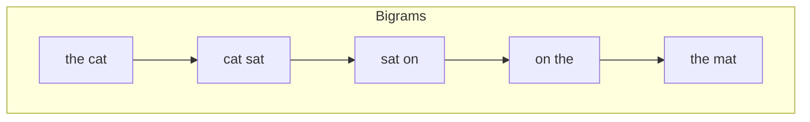

# N-Grams

> **A deep-dive tutorial** on n-gram language models — from unigrams through higher-order
> models, smoothing techniques, evaluation metrics, and modern relevance — with worked
> examples and implementations in Python and Rust.

---

## Table of Contents

1. [What Are N-Grams?](#what-are-n-grams)
2. [N-Gram Language Models](#n-gram-language-models)
3. [Estimating N-Gram Probabilities (MLE)](#estimating-n-gram-probabilities-mle)
4. [Building an N-Gram Model — Step by Step](#building-an-n-gram-model--step-by-step)
5. [The Sparsity Problem](#the-sparsity-problem)
6. [Smoothing Techniques](#smoothing-techniques)
7. [Evaluation: Perplexity](#evaluation-perplexity)
8. [Text Generation with N-Grams](#text-generation-with-n-grams)
9. [N-Grams in Modern NLP](#n-grams-in-modern-nlp)
10. [Character-Level N-Grams](#character-level-n-grams)
11. [Exercises](#exercises)
12. [References](#references)

---

## What Are N-Grams?

An **n-gram** is a contiguous sequence of $n$ items (typically words or characters) from a given text. The value of $n$ determines the type:

| n | Name | Example (from "the cat sat on the mat") |
|---|---|---|
| 1 | Unigram | "the", "cat", "sat", "on", "the", "mat" |
| 2 | Bigram | "the cat", "cat sat", "sat on", "on the", "the mat" |
| 3 | Trigram | "the cat sat", "cat sat on", "sat on the", "on the mat" |
| 4 | 4-gram | "the cat sat on", "cat sat on the", "sat on the mat" |
| 5 | 5-gram | "the cat sat on the", "cat sat on the mat" |



N-grams are the simplest way to capture local word order and context. Despite their simplicity, they form the foundation of **statistical language modeling** and remain useful across many NLP tasks.

---

## N-Gram Language Models

A **language model** assigns a probability to a sequence of words:

$$P(w_1, w_2, \ldots, w_m)$$

Using the chain rule of probability:

$$P(w_1, w_2, \ldots, w_m) = \prod_{i=1}^{m} P(w_i \mid w_1, w_2, \ldots, w_{i-1})$$

This is intractable because the conditioning context grows without bound. The **n-gram approximation** truncates the history to $n-1$ words (the **Markov assumption**):

### Bigram Model ($n = 2$)

$$P(w_i \mid w_1, \ldots, w_{i-1}) \approx P(w_i \mid w_{i-1})$$

### Trigram Model ($n = 3$)

$$P(w_i \mid w_1, \ldots, w_{i-1}) \approx P(w_i \mid w_{i-2}, w_{i-1})$$

### General N-Gram

$$P(w_i \mid w_1, \ldots, w_{i-1}) \approx P(w_i \mid w_{i-n+1}, \ldots, w_{i-1})$$

This is essentially a **Markov chain** over words — connecting n-grams directly to the theory behind Hidden Markov Models.

---

## Estimating N-Gram Probabilities (MLE)

The **Maximum Likelihood Estimate (MLE)** for n-gram probabilities is simply the relative frequency:

### Bigram MLE

$$P_{\text{MLE}}(w_i \mid w_{i-1}) = \frac{\text{count}(w_{i-1}, w_i)}{\text{count}(w_{i-1})}$$

### Trigram MLE

$$P_{\text{MLE}}(w_i \mid w_{i-2}, w_{i-1}) = \frac{\text{count}(w_{i-2}, w_{i-1}, w_i)}{\text{count}(w_{i-2}, w_{i-1})}$$

### Unigram MLE

$$P_{\text{MLE}}(w_i) = \frac{\text{count}(w_i)}{N}$$

where $N$ is the total number of tokens in the corpus.

### Worked Example

**Corpus** (3 sentences with start/end tokens):

```
<s> I like cats </s>
<s> I like dogs </s>
<s> dogs like me </s>
```

**Bigram counts:**

| Bigram | Count | $P(\text{word} \mid \text{prev})$ |
|---|---|---|
| `<s> I` | 2 | $P(\text{I} \mid \text{<s>}) = 2/3 = 0.667$ |
| `<s> dogs` | 1 | $P(\text{dogs} \mid \text{<s>}) = 1/3 = 0.333$ |
| `I like` | 2 | $P(\text{like} \mid \text{I}) = 2/2 = 1.0$ |
| `like cats` | 1 | $P(\text{cats} \mid \text{like}) = 1/3 = 0.333$ |
| `like dogs` | 1 | $P(\text{dogs} \mid \text{like}) = 1/3 = 0.333$ |
| `like me` | 1 | $P(\text{me} \mid \text{like}) = 1/3 = 0.333$ |
| `cats </s>` | 1 | $P(\text{</s>} \mid \text{cats}) = 1/1 = 1.0$ |
| `dogs </s>` | 1 | $P(\text{</s>} \mid \text{dogs}) = 1/2 = 0.5$ |
| `dogs like` | 1 | $P(\text{like} \mid \text{dogs}) = 1/2 = 0.5$ |
| `me </s>` | 1 | $P(\text{</s>} \mid \text{me}) = 1/1 = 1.0$ |

**Sentence probability:**

$$P(\text{<s> I like dogs </s>}) = P(\text{I} \mid \text{<s>}) \times P(\text{like} \mid \text{I}) \times P(\text{dogs} \mid \text{like}) \times P(\text{</s>} \mid \text{dogs})$$

$$= \frac{2}{3} \times 1 \times \frac{1}{3} \times \frac{1}{2} = 0.111$$

---

## Building an N-Gram Model — Step by Step

**Python** — complete n-gram model:

```python
from collections import defaultdict, Counter
import re
import random

class NGramModel:
    """
    A simple n-gram language model with Laplace smoothing.

    Parameters
    ----------
    n : int
        The order of the model (2 = bigram, 3 = trigram, etc.)
    """

    def __init__(self, n: int = 2):
        self.n = n
        self.ngram_counts: dict[tuple, Counter] = defaultdict(Counter)
        self.context_counts: Counter = Counter()
        self.vocab: set[str] = set()

    def _tokenize(self, text: str) -> list[str]:
        """Simple whitespace tokenizer with start/end tokens."""
        tokens = re.findall(r"\b\w+\b", text.lower())
        # Pad with (n-1) start tokens and 1 end token
        return ["<s>"] * (self.n - 1) + tokens + ["</s>"]

    def train(self, corpus: list[str]) -> None:
        """Train the model on a list of sentences."""
        for sentence in corpus:
            tokens = self._tokenize(sentence)
            self.vocab.update(tokens)
            for i in range(self.n - 1, len(tokens)):
                context = tuple(tokens[i - self.n + 1 : i])
                word = tokens[i]
                self.ngram_counts[context][word] += 1
                self.context_counts[context] += 1

    def probability(self, word: str, context: tuple[str, ...], alpha: float = 1.0) -> float:
        """
        P(word | context) with Laplace (add-alpha) smoothing.

        Parameters
        ----------
        word : str
            The word to compute probability for.
        context : tuple[str, ...]
            The (n-1)-gram context.
        alpha : float
            Smoothing parameter (1.0 = Laplace, 0 = MLE).
        """
        count_ngram = self.ngram_counts[context][word]
        count_context = self.context_counts[context]
        V = len(self.vocab)
        return (count_ngram + alpha) / (count_context + alpha * V)

    def sentence_probability(self, sentence: str, alpha: float = 1.0) -> float:
        """Compute P(sentence) under the model."""
        tokens = self._tokenize(sentence)
        prob = 1.0
        for i in range(self.n - 1, len(tokens)):
            context = tuple(tokens[i - self.n + 1 : i])
            word = tokens[i]
            prob *= self.probability(word, context, alpha)
        return prob

    def perplexity(self, test_sentences: list[str], alpha: float = 1.0) -> float:
        """Compute perplexity on a test set."""
        import math
        log_prob_sum = 0.0
        total_words = 0
        for sentence in test_sentences:
            tokens = self._tokenize(sentence)
            for i in range(self.n - 1, len(tokens)):
                context = tuple(tokens[i - self.n + 1 : i])
                word = tokens[i]
                p = self.probability(word, context, alpha)
                log_prob_sum += math.log2(p)
                total_words += 1
        return 2 ** (-log_prob_sum / total_words)

    def generate(self, max_length: int = 20, seed: int | None = None) -> str:
        """Generate a sentence by sampling from the model."""
        if seed is not None:
            random.seed(seed)

        tokens = ["<s>"] * (self.n - 1)
        for _ in range(max_length):
            context = tuple(tokens[-(self.n - 1):])
            if context not in self.ngram_counts:
                break
            # Sample weighted by counts
            candidates = list(self.ngram_counts[context].items())
            words, counts = zip(*candidates)
            total = sum(counts)
            probs = [c / total for c in counts]
            word = random.choices(words, weights=probs, k=1)[0]
            if word == "</s>":
                break
            tokens.append(word)

        return " ".join(t for t in tokens if t not in ("<s>", "</s>"))


# --- Usage ---
corpus = [
    "The cat sat on the mat.",
    "The cat ate the fish.",
    "The dog sat on the log.",
    "The dog ate the bone.",
    "A cat saw a dog.",
    "The fish sat on the mat.",
]

model = NGramModel(n=3)  # trigram
model.train(corpus)

# Probability of a sentence
p = model.sentence_probability("The cat sat on the mat")
print(f"P('The cat sat on the mat') = {p:.6f}")

# Perplexity on held-out data
pp = model.perplexity(["The dog sat on the mat", "A cat ate the fish"])
print(f"Perplexity: {pp:.2f}")

# Generate text
for i in range(5):
    print(f"Generated: {model.generate(seed=i)}")
```

**Rust** — complete n-gram model:

```rust
use std::collections::HashMap;
use rand::Rng;
use rand::SeedableRng;
use rand::rngs::StdRng;

/// An n-gram language model with Laplace smoothing.
struct NGramModel {
    n: usize,
    ngram_counts: HashMap<Vec<String>, HashMap<String, usize>>,
    context_counts: HashMap<Vec<String>, usize>,
    vocab: std::collections::HashSet<String>,
}

impl NGramModel {
    fn new(n: usize) -> Self {
        Self {
            n,
            ngram_counts: HashMap::new(),
            context_counts: HashMap::new(),
            vocab: std::collections::HashSet::new(),
        }
    }

    fn tokenize(&self, text: &str) -> Vec<String> {
        let mut tokens: Vec<String> = vec!["<s>".to_string(); self.n - 1];
        tokens.extend(
            text.split_whitespace()
                .map(|w| {
                    w.to_lowercase()
                        .chars()
                        .filter(|c| c.is_alphanumeric())
                        .collect::<String>()
                })
                .filter(|w| !w.is_empty()),
        );
        tokens.push("</s>".to_string());
        tokens
    }

    fn train(&mut self, corpus: &[&str]) {
        for sentence in corpus {
            let tokens = self.tokenize(sentence);
            for t in &tokens {
                self.vocab.insert(t.clone());
            }
            for i in (self.n - 1)..tokens.len() {
                let context: Vec<String> = tokens[i - self.n + 1..i].to_vec();
                let word = tokens[i].clone();
                *self
                    .ngram_counts
                    .entry(context.clone())
                    .or_default()
                    .entry(word)
                    .or_insert(0) += 1;
                *self.context_counts.entry(context).or_insert(0) += 1;
            }
        }
    }

    fn probability(&self, word: &str, context: &[String], alpha: f64) -> f64 {
        let ctx = context.to_vec();
        let count_ngram = self
            .ngram_counts
            .get(&ctx)
            .and_then(|m| m.get(word))
            .copied()
            .unwrap_or(0) as f64;
        let count_context = self.context_counts.get(&ctx).copied().unwrap_or(0) as f64;
        let v = self.vocab.len() as f64;
        (count_ngram + alpha) / (count_context + alpha * v)
    }

    fn sentence_log_prob(&self, sentence: &str, alpha: f64) -> f64 {
        let tokens = self.tokenize(sentence);
        let mut log_prob = 0.0;
        for i in (self.n - 1)..tokens.len() {
            let context = &tokens[i - self.n + 1..i];
            let p = self.probability(&tokens[i], context, alpha);
            log_prob += p.log2();
        }
        log_prob
    }

    fn perplexity(&self, test: &[&str], alpha: f64) -> f64 {
        let mut log_sum = 0.0;
        let mut total = 0usize;
        for sentence in test {
            let tokens = self.tokenize(sentence);
            for i in (self.n - 1)..tokens.len() {
                let context = &tokens[i - self.n + 1..i];
                let p = self.probability(&tokens[i], context, alpha);
                log_sum += p.log2();
                total += 1;
            }
        }
        2.0_f64.powf(-log_sum / total as f64)
    }

    fn generate(&self, max_length: usize, seed: u64) -> String {
        let mut rng = StdRng::seed_from_u64(seed);
        let mut tokens: Vec<String> = vec!["<s>".to_string(); self.n - 1];

        for _ in 0..max_length {
            let ctx: Vec<String> = tokens[tokens.len() - (self.n - 1)..].to_vec();
            let dist = match self.ngram_counts.get(&ctx) {
                Some(d) => d,
                None => break,
            };
            let total: usize = dist.values().sum();
            let mut r = rng.gen_range(0..total);
            let mut chosen = String::new();
            for (word, &count) in dist {
                if r < count {
                    chosen = word.clone();
                    break;
                }
                r -= count;
            }
            if chosen == "</s>" {
                break;
            }
            tokens.push(chosen);
        }

        tokens
            .iter()
            .filter(|t| *t != "<s>" && *t != "</s>")
            .cloned()
            .collect::<Vec<_>>()
            .join(" ")
    }
}

fn main() {
    let corpus = vec![
        "The cat sat on the mat.",
        "The cat ate the fish.",
        "The dog sat on the log.",
        "The dog ate the bone.",
        "A cat saw a dog.",
        "The fish sat on the mat.",
    ];

    let mut model = NGramModel::new(3); // trigram
    model.train(&corpus);

    // Perplexity
    let pp = model.perplexity(
        &["The dog sat on the mat", "A cat ate the fish"],
        1.0,
    );
    println!("Perplexity: {:.2}", pp);

    // Generate
    for seed in 0..5 {
        println!("Generated: {}", model.generate(20, seed));
    }
}
```

---

## The Sparsity Problem

The fundamental weakness of n-gram models: **most n-grams never appear in the training data**.

Consider a vocabulary of $|V| = 50{,}000$ words:

| N-gram order | Possible n-grams | Seen in 1M-word corpus (typical) |
|---|---|---|
| Unigram | $5 \times 10^4$ | ~20,000 (40%) |
| Bigram | $2.5 \times 10^9$ | ~500,000 (0.02%) |
| Trigram | $1.25 \times 10^{14}$ | ~2,000,000 (0.000002%) |
| 4-gram | $6.25 \times 10^{18}$ | ~3,000,000 (≈0%) |

This means:
- **Zero-count n-grams** dominate — the model assigns $P = 0$ to most valid word sequences
- A single unseen bigram makes an entire sentence have probability 0
- Higher-order models are more expressive but far more sparse

This is why **smoothing** is essential.

---

## Smoothing Techniques

Smoothing redistributes probability mass from seen n-grams to unseen ones. Here are the major approaches, from simplest to most sophisticated:

### 1. Laplace (Add-One) Smoothing

Add 1 to every count:

$$P_{\text{Laplace}}(w_i \mid w_{i-1}) = \frac{\text{count}(w_{i-1}, w_i) + 1}{\text{count}(w_{i-1}) + |V|}$$

**Pros:** Simple, never assigns zero probability.
**Cons:** Steals too much probability from seen n-grams; works poorly in practice.

### 2. Add-$k$ Smoothing

Generalize Laplace with a fractional count:

$$P_{\text{add-}k}(w_i \mid w_{i-1}) = \frac{\text{count}(w_{i-1}, w_i) + k}{\text{count}(w_{i-1}) + k|V|}$$

Typical values: $k \in [0.001, 0.5]$. Better than add-1, but still ad hoc.

### 3. Good-Turing Smoothing

Re-estimate counts using the **frequency of frequencies**. If $N_c$ is the number of n-grams that occur exactly $c$ times:

$$c^* = (c + 1) \frac{N_{c+1}}{N_c}$$

The intuition: the probability mass for unseen events is estimated from events seen only once.

### 4. Interpolation

Combine models of different orders:

$$P_{\text{interp}}(w_i \mid w_{i-2}, w_{i-1}) = \lambda_3 P_3(w_i \mid w_{i-2}, w_{i-1}) + \lambda_2 P_2(w_i \mid w_{i-1}) + \lambda_1 P_1(w_i)$$

where $\lambda_1 + \lambda_2 + \lambda_3 = 1$.

The $\lambda$ values are typically optimized on held-out data using **deleted interpolation**.

### 5. Backoff (Katz Backoff)

Use the highest-order model that has sufficient data; "back off" to lower orders otherwise:

$$P_{\text{BO}}(w_i \mid w_{i-n+1:i-1}) = \begin{cases} P^*(w_i \mid w_{i-n+1:i-1}) & \text{if count} > 0 \\ \alpha(w_{i-n+1:i-1}) \cdot P_{\text{BO}}(w_i \mid w_{i-n+2:i-1}) & \text{otherwise} \end{cases}$$

where $\alpha$ is a backoff weight ensuring probabilities sum to 1.

### 6. Kneser-Ney Smoothing (State of the Art)

The gold standard for n-gram smoothing. Uses **absolute discounting** (subtract a fixed $d$ from each count) plus a clever lower-order distribution based on **continuation probability** — how many different contexts a word appears in:

$$P_{\text{KN}}(w_i \mid w_{i-1}) = \frac{\max(\text{count}(w_{i-1}, w_i) - d, 0)}{\text{count}(w_{i-1})} + \lambda(w_{i-1}) \cdot P_{\text{continuation}}(w_i)$$

where:

$$P_{\text{continuation}}(w_i) = \frac{|\{w : \text{count}(w, w_i) > 0\}|}{|\{(w', w'') : \text{count}(w', w'') > 0\}|}$$

The intuition: "Francisco" has high unigram frequency but low continuation probability (it almost always follows "San"), so Kneser-Ney correctly assigns it lower probability than backoff would.

**Python** — interpolation smoothing:

```python
import math
from collections import defaultdict, Counter

class InterpolatedNGram:
    """Trigram model with deleted interpolation."""

    def __init__(self):
        self.unigram = Counter()
        self.bigram = defaultdict(Counter)
        self.trigram = defaultdict(Counter)
        self.total = 0
        # Interpolation weights (tuned on held-out data)
        self.lambdas = (0.1, 0.3, 0.6)  # unigram, bigram, trigram

    def train(self, sentences: list[list[str]]):
        for tokens in sentences:
            padded = ["<s>", "<s>"] + tokens + ["</s>"]
            for i in range(2, len(padded)):
                w = padded[i]
                self.unigram[w] += 1
                self.total += 1
                self.bigram[padded[i-1]][w] += 1
                self.trigram[(padded[i-2], padded[i-1])][w] += 1

    def prob(self, w: str, w1: str, w2: str) -> float:
        l1, l2, l3 = self.lambdas

        # Unigram
        p1 = self.unigram[w] / self.total if self.total > 0 else 1e-10

        # Bigram
        bi_total = sum(self.bigram[w2].values())
        p2 = self.bigram[w2][w] / bi_total if bi_total > 0 else p1

        # Trigram
        tri_total = sum(self.trigram[(w1, w2)].values())
        p3 = self.trigram[(w1, w2)][w] / tri_total if tri_total > 0 else p2

        return l1 * p1 + l2 * p2 + l3 * p3

    def perplexity(self, sentences: list[list[str]]) -> float:
        log_sum = 0.0
        count = 0
        for tokens in sentences:
            padded = ["<s>", "<s>"] + tokens + ["</s>"]
            for i in range(2, len(padded)):
                p = self.prob(padded[i], padded[i-2], padded[i-1])
                log_sum += math.log2(max(p, 1e-20))
                count += 1
        return 2 ** (-log_sum / count)
```

**Rust** — Kneser-Ney bigram smoothing (simplified):

```rust
use std::collections::{HashMap, HashSet};

struct KneserNeyBigram {
    bigram_counts: HashMap<(String, String), usize>,
    unigram_counts: HashMap<String, usize>,
    /// Number of distinct bigram types starting with w
    continuation_start: HashMap<String, HashSet<String>>,
    /// Number of distinct bigram types ending with w
    continuation_end: HashMap<String, HashSet<String>>,
    total_bigram_types: usize,
    discount: f64,
}

impl KneserNeyBigram {
    fn new(discount: f64) -> Self {
        Self {
            bigram_counts: HashMap::new(),
            unigram_counts: HashMap::new(),
            continuation_start: HashMap::new(),
            continuation_end: HashMap::new(),
            total_bigram_types: 0,
            discount,
        }
    }

    fn train(&mut self, sentences: &[Vec<String>]) {
        for tokens in sentences {
            let padded: Vec<String> = std::iter::once("<s>".to_string())
                .chain(tokens.iter().cloned())
                .chain(std::iter::once("</s>".to_string()))
                .collect();

            for window in padded.windows(2) {
                let w1 = &window[0];
                let w2 = &window[1];
                *self.bigram_counts.entry((w1.clone(), w2.clone())).or_insert(0) += 1;
                *self.unigram_counts.entry(w1.clone()).or_insert(0) += 1;
                self.continuation_start.entry(w1.clone()).or_default().insert(w2.clone());
                self.continuation_end.entry(w2.clone()).or_default().insert(w1.clone());
            }
            // Count last unigram
            if let Some(last) = padded.last() {
                *self.unigram_counts.entry(last.clone()).or_insert(0) += 1;
            }
        }
        self.total_bigram_types = self.bigram_counts.len();
    }

    fn prob(&self, w2: &str, w1: &str) -> f64 {
        let bigram_count = self
            .bigram_counts
            .get(&(w1.to_string(), w2.to_string()))
            .copied()
            .unwrap_or(0) as f64;
        let w1_count = self.unigram_counts.get(w1).copied().unwrap_or(0) as f64;

        if w1_count == 0.0 {
            // Fall back to continuation probability only
            return self.continuation_prob(w2);
        }

        let first_term = (bigram_count - self.discount).max(0.0) / w1_count;

        // Lambda: interpolation weight
        let num_types_after_w1 = self
            .continuation_start
            .get(w1)
            .map(|s| s.len())
            .unwrap_or(0) as f64;
        let lambda = (self.discount / w1_count) * num_types_after_w1;

        first_term + lambda * self.continuation_prob(w2)
    }

    fn continuation_prob(&self, w: &str) -> f64 {
        let num_contexts = self
            .continuation_end
            .get(w)
            .map(|s| s.len())
            .unwrap_or(0) as f64;
        let total = self.total_bigram_types as f64;
        if total == 0.0 { 1e-10 } else { num_contexts / total }
    }
}

fn main() {
    let corpus: Vec<Vec<String>> = vec![
        vec!["the", "cat", "sat", "on", "the", "mat"],
        vec!["the", "cat", "ate", "the", "fish"],
        vec!["the", "dog", "sat", "on", "the", "log"],
    ]
    .into_iter()
    .map(|s| s.into_iter().map(String::from).collect())
    .collect();

    let mut model = KneserNeyBigram::new(0.75);
    model.train(&corpus);

    // Known bigram
    println!("P(cat | the) = {:.4}", model.prob("cat", "the"));
    // Unknown bigram — backed off via continuation
    println!("P(fish | cat) = {:.4}", model.prob("fish", "cat"));
    // Continuation probability for "Francisco" would be low
}
```

### Smoothing Comparison

| Method | Handles zeros? | Theoretical basis | Used in practice? |
|---|---|---|---|
| Laplace | Yes | Maximum a posteriori | Rarely (too aggressive) |
| Add-$k$ | Yes | MAP | Sometimes |
| Good-Turing | Yes | Frequency re-estimation | In older systems |
| Interpolation | Yes | Mixture model | Yes |
| Katz Backoff | Yes | Discounting + backoff | Yes |
| **Kneser-Ney** | **Yes** | **Absolute discounting + continuation** | **Gold standard** |

---

## Evaluation: Perplexity

**Perplexity** is the standard intrinsic evaluation metric for language models. It measures how "surprised" the model is by test data:

$$\text{PP}(W) = P(w_1, w_2, \ldots, w_N)^{-1/N} = 2^{H(W)}$$

where $H(W)$ is the cross-entropy:

$$H(W) = -\frac{1}{N} \sum_{i=1}^{N} \log_2 P(w_i \mid w_{i-n+1}, \ldots, w_{i-1})$$

**Interpretation:**
- Lower perplexity = better model
- Perplexity of $k$ ≈ the model is as uncertain as if choosing uniformly among $k$ words at each step
- A uniform model over vocabulary $V$ has perplexity $|V|$

| Model | Typical Perplexity (Wall Street Journal) |
|---|---|
| Unigram | ~960 |
| Bigram | ~170 |
| Trigram | ~110 |
| 4-gram (Kneser-Ney) | ~90 |
| Neural LM (LSTM) | ~60 |
| GPT-2 (small) | ~30 |
| GPT-3 | ~20 |

**Python** — computing perplexity:

```python
import math

def perplexity(model, test_tokens: list[str], n: int) -> float:
    """
    Compute perplexity of an n-gram model on test data.

    Parameters
    ----------
    model : callable
        model(word, context) -> probability
    test_tokens : list[str]
        Token sequence including <s> and </s>.
    n : int
        N-gram order.
    """
    log_prob_sum = 0.0
    count = 0
    for i in range(n - 1, len(test_tokens)):
        context = tuple(test_tokens[i - n + 1 : i])
        word = test_tokens[i]
        p = model(word, context)
        if p > 0:
            log_prob_sum += math.log2(p)
        else:
            log_prob_sum += math.log2(1e-20)  # avoid -inf
        count += 1

    cross_entropy = -log_prob_sum / count
    return 2 ** cross_entropy
```

---

## Text Generation with N-Grams

N-gram models can generate text by **sampling** from the conditional distribution at each step. The results are locally coherent but lack global structure — a key motivation for neural language models.

### Sampling Strategies

| Strategy | Description | Quality |
|---|---|---|
| **Random sampling** | Sample proportional to $P(w \mid \text{context})$ | High diversity, can be incoherent |
| **Top-$k$ sampling** | Sample from the $k$ most likely next words | Better coherence |
| **Greedy** | Always pick the most likely next word | Repetitive, deterministic |
| **Temperature** | Divide logits by $\tau$ before softmax | $\tau < 1$: confident; $\tau > 1$: creative |

**Python** — text generation with temperature:

```python
import numpy as np

def generate_with_temperature(model, n, max_length=50, temperature=1.0, seed=None):
    """
    Generate text from an n-gram model with temperature scaling.

    Parameters
    ----------
    model : NGramModel
        A trained n-gram model.
    n : int
        N-gram order.
    max_length : int
        Max tokens to generate.
    temperature : float
        Sampling temperature. Lower = more deterministic.
    """
    rng = np.random.default_rng(seed)
    tokens = ["<s>"] * (n - 1)

    for _ in range(max_length):
        context = tuple(tokens[-(n - 1):])
        if context not in model.ngram_counts:
            break

        words = list(model.ngram_counts[context].keys())
        counts = np.array([model.ngram_counts[context][w] for w in words], dtype=float)

        # Apply temperature
        log_probs = np.log(counts / counts.sum())
        scaled = log_probs / temperature
        probs = np.exp(scaled - np.max(scaled))  # numerical stability
        probs /= probs.sum()

        word = rng.choice(words, p=probs)
        if word == "</s>":
            break
        tokens.append(word)

    return " ".join(t for t in tokens if t not in ("<s>", "</s>"))


# Temperature comparison
# temperature=0.5 → conservative, repetitive
# temperature=1.0 → balanced
# temperature=2.0 → creative, sometimes nonsensical
```

---

## N-Grams in Modern NLP

Despite the dominance of neural models, n-grams remain relevant in several ways:

### 1. Feature Engineering

N-gram features are commonly used in traditional ML classifiers:

```python
from sklearn.feature_extraction.text import CountVectorizer
from sklearn.linear_model import LogisticRegression
from sklearn.pipeline import Pipeline

# Use character n-grams for language detection
pipeline = Pipeline([
    ("vectorizer", CountVectorizer(
        analyzer="char",
        ngram_range=(2, 4),  # character bigrams through 4-grams
        max_features=10000
    )),
    ("classifier", LogisticRegression(max_iter=1000))
])

# Train on labeled language samples
texts = ["this is english text", "c'est un texte français", "dies ist ein deutscher text"]
labels = ["en", "fr", "de"]
pipeline.fit(texts, labels)
```

### 2. Spelling Correction and Fuzzy Matching

Character n-grams power similarity metrics like **Jaccard similarity**:

$$\text{Jaccard}(A, B) = \frac{|A \cap B|}{|A \cup B|}$$

where $A$ and $B$ are sets of character n-grams.

```python
def char_ngrams(text: str, n: int = 3) -> set[str]:
    """Extract character n-grams from text."""
    padded = f"${'$' * (n-1)}{text}{'$' * (n-1)}"
    return {padded[i:i+n] for i in range(len(padded) - n + 1)}

def jaccard_similarity(a: str, b: str, n: int = 3) -> float:
    grams_a = char_ngrams(a, n)
    grams_b = char_ngrams(b, n)
    return len(grams_a & grams_b) / len(grams_a | grams_b)

print(jaccard_similarity("python", "pyhton"))   # 0.6 — catches the typo
print(jaccard_similarity("python", "javascript")) # ~0.0
```

### 3. BLEU Score (Machine Translation Evaluation)

BLEU (Bilingual Evaluation Understudy) is a precision-based metric that compares n-gram overlap between generated and reference translations:

$$\text{BLEU} = \text{BP} \cdot \exp\left(\sum_{n=1}^{N} w_n \log p_n\right)$$

where $p_n$ is the **modified n-gram precision** and BP is a brevity penalty:

$$\text{BP} = \begin{cases} 1 & \text{if } c > r \\ e^{1 - r/c} & \text{if } c \leq r \end{cases}$$

### 4. Byte-Pair Encoding (BPE)

BPE — the tokenization algorithm used by GPT-2/3/4 — is essentially a character-pair n-gram merger:

1. Start with character vocabulary
2. Count all adjacent character bigrams
3. Merge the most frequent pair into a new token
4. Repeat until vocabulary size is reached

This iterative merging of frequent byte (or character) pairs is fundamentally an n-gram operation.

### 5. KenLM: Production N-Gram Models

For production use, **KenLM** provides extremely fast and memory-efficient n-gram language models. It uses:
- Modified Kneser-Ney smoothing
- Trie-based or probing hash table storage
- Memory-mapped files for scaling to billion-word corpora

```python
# Using KenLM (after building a model with `lmplz`)
import kenlm

model = kenlm.Model("en_5gram.binary")
sentence = "natural language processing is fascinating"
score = model.score(sentence, bos=True, eos=True)
print(f"Log-10 probability: {score:.4f}")

# Full state access for streaming
state = kenlm.State()
model.BeginSentenceWrite(state)
```

---

## Character-Level N-Grams

Character-level n-grams operate on individual characters rather than words. They're particularly useful for:

- **Language identification** (different languages have different character patterns)
- **Morphologically rich languages** (Turkish, Finnish, Hungarian)
- **Handling misspellings and OOV words**
- **Authorship attribution** (writing style fingerprinting)

**Python** — language identification with character trigrams:

```python
from collections import Counter

def char_trigram_profile(text: str, top_n: int = 200) -> dict[str, int]:
    """Build a character trigram frequency profile."""
    text = text.lower()
    trigrams = [text[i:i+3] for i in range(len(text) - 2)]
    return dict(Counter(trigrams).most_common(top_n))

def profile_distance(p1: dict[str, int], p2: dict[str, int]) -> float:
    """Out-of-place distance between two trigram profiles."""
    all_grams = set(p1.keys()) | set(p2.keys())
    rank1 = {gram: i for i, gram in enumerate(p1.keys())}
    rank2 = {gram: i for i, gram in enumerate(p2.keys())}
    max_rank = max(len(p1), len(p2))

    distance = 0
    for gram in all_grams:
        r1 = rank1.get(gram, max_rank)
        r2 = rank2.get(gram, max_rank)
        distance += abs(r1 - r2)
    return distance

# Build profiles for known languages
english_profile = char_trigram_profile("This is a sample of English text for profiling purposes")
french_profile = char_trigram_profile("Ceci est un exemple de texte français pour le profilage")

# Classify unknown text
unknown = "the weather today is quite pleasant and warm"
unknown_profile = char_trigram_profile(unknown)

d_en = profile_distance(unknown_profile, english_profile)
d_fr = profile_distance(unknown_profile, french_profile)
print(f"Distance to English: {d_en}")
print(f"Distance to French:  {d_fr}")
print(f"Detected: {'English' if d_en < d_fr else 'French'}")
```

**Rust** — character n-gram extraction:

```rust
use std::collections::HashMap;

/// Extract character n-grams from text.
fn char_ngrams(text: &str, n: usize) -> Vec<&str> {
    let bytes = text.as_bytes(); // Assuming ASCII for simplicity
    if bytes.len() < n {
        return vec![];
    }
    // For UTF-8 safe slicing, use char_indices
    let chars: Vec<(usize, char)> = text.char_indices().collect();
    let mut grams = Vec::new();
    for window in chars.windows(n) {
        let start = window[0].0;
        let end = if let Some(next) = chars.get(window.last().unwrap().0 - chars[0].0 + 1) {
            next.0
        } else {
            text.len()
        };
        // Safe approach: collect chars
        grams.push(&text[window[0].0..]);
    }
    // Simpler correct approach:
    grams.clear();
    let char_vec: Vec<char> = text.chars().collect();
    // We'll return owned strings instead
    grams // (see below for the practical version)
}

/// Practical version returning owned strings for UTF-8 safety.
fn char_ngrams_owned(text: &str, n: usize) -> HashMap<String, usize> {
    let chars: Vec<char> = text.to_lowercase().chars().collect();
    let mut counts: HashMap<String, usize> = HashMap::new();
    if chars.len() < n {
        return counts;
    }
    for window in chars.windows(n) {
        let gram: String = window.iter().collect();
        *counts.entry(gram).or_insert(0) += 1;
    }
    counts
}

fn main() {
    let text = "natural language processing";
    let trigrams = char_ngrams_owned(text, 3);

    // Sort by frequency
    let mut sorted: Vec<_> = trigrams.iter().collect();
    sorted.sort_by(|a, b| b.1.cmp(a.1));

    println!("Top character trigrams:");
    for (gram, count) in sorted.iter().take(10) {
        println!("  '{}' → {}", gram, count);
    }
    // ' la', 'lan', 'ang', 'ngu', 'gua', 'uag', 'age', ...
}
```

---

## Exercises

1. **Build a bigram model** — Train a bigram model on a corpus of your choice (e.g., a book from Project Gutenberg). Compute the perplexity on a held-out test set. Compare MLE, Laplace smoothing, and interpolation.

2. **Shakespeare generator** — Train a character-level 7-gram model on Shakespeare's plays. Generate 500 characters of text at different temperatures (0.3, 1.0, 2.0). How does temperature affect readability vs creativity?

3. **Smoothing showdown** — Implement Laplace, add-$k$, and interpolation smoothing. Plot perplexity vs smoothing parameter on a held-out set. Which value of $k$ minimizes perplexity?

4. **N-gram order selection** — Train unigram through 5-gram models on the same corpus. Plot perplexity vs n-gram order. When does increasing $n$ stop helping?

5. **BLEU from scratch** — Implement the BLEU metric using n-gram precision up to $n=4$. Test it on machine translation output vs. reference translations. Verify your results match the `nltk.translate.bleu_score` implementation.

6. **N-gram fingerprinting** — Build character trigram profiles for 5 programming languages (Python, Rust, Java, JavaScript, C++). Can you build a classifier that identifies the language of a code snippet with >90% accuracy?

7. **Zipf's Law** — Plot the n-gram frequency distribution (log frequency vs. log rank) for unigrams, bigrams, and trigrams from a large corpus. Does Zipf's law ($f \propto 1/r^\alpha$) hold for higher-order n-grams?

---

## References

1. Shannon, C.E. (1948). *A Mathematical Theory of Communication*. Bell System Technical Journal, 27(3), 379-423.
2. Jurafsky, D. & Martin, J.H. (2024). *Speech and Language Processing* (3rd ed.), Ch. 3: N-gram Language Models.
3. Chen, S.F. & Goodman, J. (1999). *An Empirical Study of Smoothing Techniques for Language Modeling*. Computer Speech and Language, 13(4), 359-394.
4. Kneser, R. & Ney, H. (1995). *Improved backing-off for M-gram language modeling*. ICASSP.
5. Papineni, K., et al. (2002). *BLEU: A Method for Automatic Evaluation of Machine Translation*. ACL.
6. Heafield, K. (2011). *KenLM: Faster and Smaller Language Model Queries*. Workshop on Statistical Machine Translation.
7. Sennrich, R., Haddow, B., & Birch, A. (2016). *Neural Machine Translation of Rare Words with Subword Units*. ACL.
8. Rodriguez, C. (2024). *Generative AI Foundations in Python*. Packt Publishing.

---

*Related docs: [Natural Language Processing](natural_language_processing.md) | [Hidden Markov Models](hidden_markov_models.md) | [Recurrent Neural Networks](recurrent_neural_networks.md)*
