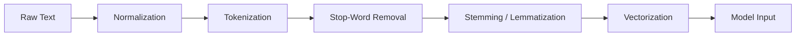
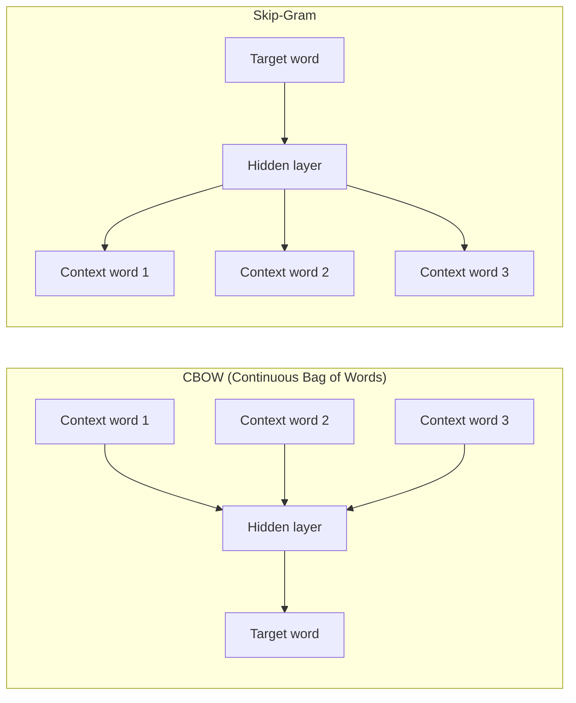
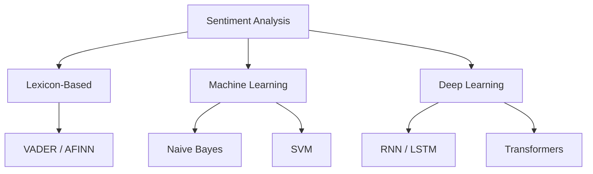
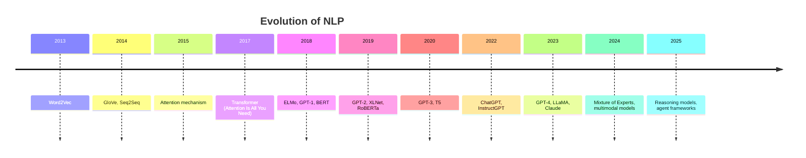
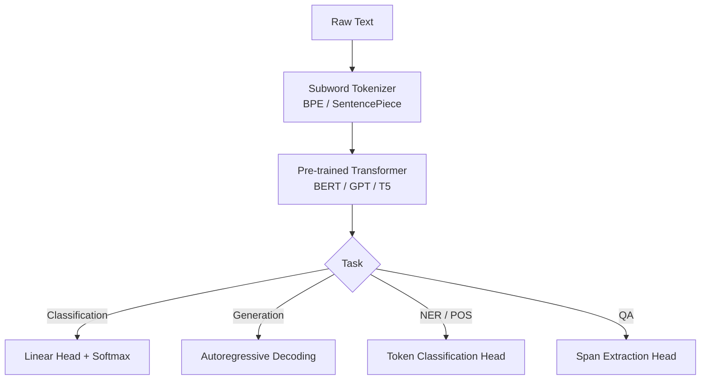

# Natural Language Processing (NLP)

> **A deep-dive tutorial** covering the foundations of NLP — from classical text-processing
> techniques through modern neural approaches — with worked examples in Python and Rust.

---

## Table of Contents

1. [What Is NLP?](#what-is-nlp)
2. [Text Preprocessing Pipeline](#text-preprocessing-pipeline)
3. [Tokenization](#tokenization)
4. [Stemming and Lemmatization](#stemming-and-lemmatization)
5. [Bag of Words and TF-IDF](#bag-of-words-and-tf-idf)
6. [Word Embeddings](#word-embeddings)
7. [Named Entity Recognition (NER)](#named-entity-recognition-ner)
8. [Part-of-Speech (POS) Tagging](#part-of-speech-pos-tagging)
9. [Sentiment Analysis](#sentiment-analysis)
10. [Modern NLP Pipelines](#modern-nlp-pipelines)
11. [Exercises](#exercises)
12. [References](#references)

---

## What Is NLP?

Natural Language Processing sits at the intersection of **computer science**, **linguistics**, and **artificial intelligence**. Its goal is to enable machines to understand, interpret, generate, and respond to human language in ways that are both meaningful and useful.

NLP powers applications you interact with daily:

| Application | NLP Task |
|---|---|
| Search engines | Query understanding, document ranking |
| Voice assistants (Siri, Alexa) | Speech recognition, intent classification |
| Email spam filters | Text classification |
| Machine translation (Google Translate) | Sequence-to-sequence generation |
| Chatbots (ChatGPT, Claude) | Language modeling, dialogue management |
| Auto-complete | Next-token prediction |

### Why NLP Is Hard

Human language is:

- **Ambiguous** — "I saw the man with the telescope" (who has the telescope?)
- **Context-dependent** — "bank" means different things near "river" vs "money"
- **Evolving** — slang, neologisms, and cultural shifts
- **Implicit** — sarcasm, irony, and pragmatics are rarely literal
- **Structurally diverse** — 7,000+ languages with vastly different grammars

---

## Text Preprocessing Pipeline

Before any model can work with text, the raw input must be transformed into a structured numerical representation. The standard pipeline looks like this:



Each stage is a design decision — modern transformer-based models often skip stop-word removal and stemming entirely, learning those patterns implicitly.

---

## Tokenization

Tokenization splits a stream of text into discrete units (tokens). These can be words, subwords, or characters depending on the strategy.

### Word-Level Tokenization

The simplest approach — split on whitespace and punctuation.

**Python** — using `nltk`:

```python
import nltk
nltk.download('punkt_tab')
from nltk.tokenize import word_tokenize

text = "NLP isn't just about splitting words — it's about understanding meaning."
tokens = word_tokenize(text)
print(tokens)
# ['NLP', 'is', "n't", 'just', 'about', 'splitting', 'words',
#  '—', 'it', "'s", 'about', 'understanding', 'meaning', '.']
```

**Rust** — hand-rolled iterator-based tokenizer:

```rust
/// A minimal whitespace + punctuation tokenizer.
fn tokenize(text: &str) -> Vec<&str> {
    let mut tokens = Vec::new();
    let mut start = None;

    for (i, ch) in text.char_indices() {
        if ch.is_alphanumeric() || ch == '\'' {
            if start.is_none() {
                start = Some(i);
            }
        } else {
            if let Some(s) = start {
                tokens.push(&text[s..i]);
                start = None;
            }
            if ch.is_ascii_punctuation() {
                tokens.push(&text[i..i + ch.len_utf8()]);
            }
        }
    }
    // Flush trailing token
    if let Some(s) = start {
        tokens.push(&text[s..]);
    }
    tokens
}

fn main() {
    let text = "NLP isn't just about splitting words.";
    let tokens = tokenize(text);
    println!("{:?}", tokens);
    // ["NLP", "isn't", "just", "about", "splitting", "words", "."]
}
```

### Subword Tokenization (BPE, WordPiece, Unigram)

Modern models use **subword** tokenizers that balance vocabulary size with coverage of rare words.

| Algorithm | Used By | Key Idea |
|---|---|---|
| **BPE** (Byte-Pair Encoding) | GPT-2, GPT-3, LLaMA | Iteratively merge the most frequent byte pairs |
| **WordPiece** | BERT | Maximize likelihood of training data |
| **Unigram** | T5, ALBERT | Start large, prune to maximize likelihood |
| **SentencePiece** | Many multilingual models | Language-agnostic; operates on raw Unicode |

**Python** — using Hugging Face `tokenizers`:

```python
from tokenizers import Tokenizer
from tokenizers.models import BPE
from tokenizers.trainers import BpeTrainer
from tokenizers.pre_tokenizers import Whitespace

# Build a BPE tokenizer from scratch
tokenizer = Tokenizer(BPE(unk_token="[UNK]"))
tokenizer.pre_tokenizer = Whitespace()

trainer = BpeTrainer(special_tokens=["[UNK]", "[PAD]", "[CLS]", "[SEP]"], vocab_size=8000)
tokenizer.train(files=["corpus.txt"], trainer=trainer)

output = tokenizer.encode("Tokenization is fundamental to NLP.")
print(output.tokens)
# ['Token', 'ization', 'is', 'fundamental', 'to', 'NL', 'P', '.']
```

**Rust** — using the same `tokenizers` crate (Hugging Face's Rust-native library):

```rust
use tokenizers::tokenizer::{Result, Tokenizer};
use tokenizers::models::bpe::BPE;

fn main() -> Result<()> {
    // Load a pre-trained tokenizer (e.g., from a saved JSON file)
    let tokenizer = Tokenizer::from_file("tokenizer.json")?;

    let encoding = tokenizer.encode("Tokenization is fundamental to NLP.", false)?;
    println!("{:?}", encoding.get_tokens());
    // ["Token", "ization", "is", "fundamental", "to", "NL", "P", "."]

    Ok(())
}
```

> **Note:** Hugging Face's `tokenizers` library is written *in Rust* and exposed to Python via PyO3 — so you're running the same Rust code in both examples.

---

## Stemming and Lemmatization

Both reduce words to a base form, but with different strategies:

| | Stemming | Lemmatization |
|---|---|---|
| **Approach** | Rule-based suffix stripping | Dictionary + morphological analysis |
| **Speed** | Very fast | Slower |
| **Accuracy** | Approximate ("studies" → "studi") | Exact ("studies" → "study") |
| **Requires POS?** | No | Yes (for best results) |

**Python** — stemming with `nltk` and lemmatization with `spaCy`:

```python
# --- Stemming ---
from nltk.stem import PorterStemmer
stemmer = PorterStemmer()
words = ["running", "studies", "better", "geese"]
print([stemmer.stem(w) for w in words])
# ['run', 'studi', 'better', 'gees']

# --- Lemmatization ---
import spacy
nlp = spacy.load("en_core_web_sm")
doc = nlp("The geese were running better studies.")
print([(token.text, token.lemma_) for token in doc])
# [('The', 'the'), ('geese', 'goose'), ('were', 'be'),
#  ('running', 'run'), ('better', 'well'), ('studies', 'study'), ('.', '.')]
```

**Rust** — a minimal Porter stemmer implementation:

```rust
/// Simplified Porter stemmer — handles common suffixes only.
/// Production code should use the `rust-stemmers` crate.
fn stem(word: &str) -> String {
    let w = word.to_lowercase();
    // Step-like suffix removal (simplified)
    if let Some(base) = w.strip_suffix("ing") {
        if base.len() >= 3 { return base.to_string(); }
    }
    if let Some(base) = w.strip_suffix("ies") {
        return format!("{}y", base);   // "studies" → "study"
    }
    if let Some(base) = w.strip_suffix("s") {
        if !base.ends_with('s') { return base.to_string(); }
    }
    w
}

fn main() {
    let words = vec!["running", "studies", "cats", "geese"];
    let stemmed: Vec<String> = words.iter().map(|w| stem(w)).collect();
    println!("{:?}", stemmed);
    // ["runn", "study", "cat", "geese"]  — note: irregular forms are missed
}
```

> For production Rust stemming, use the [`rust-stemmers`](https://crates.io/crates/rust-stemmers) crate, which implements Snowball stemmers for 14 languages.

---

## Bag of Words and TF-IDF

### Bag of Words (BoW)

The simplest vectorization: represent each document as a vector of word counts, ignoring order.

Given a vocabulary $V = \{w_1, w_2, \ldots, w_n\}$, a document $d$ is represented as:

$$\mathbf{x}_d = \left[\text{count}(w_1, d), \text{count}(w_2, d), \ldots, \text{count}(w_n, d)\right]$$

### TF-IDF (Term Frequency — Inverse Document Frequency)

BoW treats all words equally. TF-IDF down-weights common words and up-weights rare, informative ones.

$$\text{TF-IDF}(t, d, D) = \text{TF}(t, d) \times \text{IDF}(t, D)$$

Where:

$$\text{TF}(t, d) = \frac{f_{t,d}}{\sum_{t' \in d} f_{t',d}}$$

$$\text{IDF}(t, D) = \log\frac{|D|}{|\{d \in D : t \in d\}|}$$

**Python** — `scikit-learn`:

```python
from sklearn.feature_extraction.text import TfidfVectorizer

corpus = [
    "NLP is a subfield of artificial intelligence.",
    "Natural language processing enables machines to understand text.",
    "Deep learning has revolutionized NLP in recent years.",
]

vectorizer = TfidfVectorizer()
tfidf_matrix = vectorizer.fit_transform(corpus)

print(f"Vocabulary size: {len(vectorizer.vocabulary_)}")
print(f"TF-IDF shape:    {tfidf_matrix.shape}")
print(f"Feature names:   {vectorizer.get_feature_names_out()[:10]}")

# Show the TF-IDF vector for the first document
import pandas as pd
df = pd.DataFrame(
    tfidf_matrix.toarray(),
    columns=vectorizer.get_feature_names_out()
)
print(df.iloc[0].sort_values(ascending=False).head(5))
```

**Rust** — from-scratch TF-IDF with `std` only:

```rust
use std::collections::{HashMap, HashSet};

/// Compute TF-IDF scores for a corpus of documents.
fn tfidf(corpus: &[&str]) -> Vec<HashMap<String, f64>> {
    let n = corpus.len() as f64;

    // Tokenize each document
    let docs: Vec<Vec<String>> = corpus
        .iter()
        .map(|doc| {
            doc.split_whitespace()
                .map(|w| w.to_lowercase().trim_matches(|c: char| !c.is_alphanumeric()).to_string())
                .filter(|w| !w.is_empty())
                .collect()
        })
        .collect();

    // Document frequency: how many docs contain each term
    let mut df: HashMap<String, usize> = HashMap::new();
    for doc in &docs {
        let unique: HashSet<&String> = doc.iter().collect();
        for term in unique {
            *df.entry(term.clone()).or_insert(0) += 1;
        }
    }

    // Compute TF-IDF for each document
    docs.iter()
        .map(|doc| {
            let total = doc.len() as f64;
            let mut tf_count: HashMap<String, usize> = HashMap::new();
            for word in doc {
                *tf_count.entry(word.clone()).or_insert(0) += 1;
            }
            tf_count
                .into_iter()
                .map(|(term, count)| {
                    let tf = count as f64 / total;
                    let idf = (n / *df.get(&term).unwrap() as f64).ln();
                    (term, tf * idf)
                })
                .collect()
        })
        .collect()
}

fn main() {
    let corpus = vec![
        "NLP is a subfield of artificial intelligence.",
        "Natural language processing enables machines to understand text.",
        "Deep learning has revolutionized NLP in recent years.",
    ];

    let scores = tfidf(&corpus);
    // Print top terms for first doc
    let mut first: Vec<_> = scores[0].iter().collect();
    first.sort_by(|a, b| b.1.partial_cmp(a.1).unwrap());
    for (term, score) in first.iter().take(5) {
        println!("{:<20} {:.4}", term, score);
    }
}
```

---

## Word Embeddings

Word embeddings map words to dense, low-dimensional vectors where **semantic similarity** corresponds to **geometric proximity**.

### Word2Vec

Two architectures introduced by Mikolov et al. (2013):



The **Skip-Gram** objective maximizes:

$$J(\theta) = \frac{1}{T} \sum_{t=1}^{T} \sum_{-c \leq j \leq c, \, j \neq 0} \log P(w_{t+j} \mid w_t)$$

where $c$ is the context window size and:

$$P(w_O \mid w_I) = \frac{\exp(\mathbf{v}'_{w_O} \cdot \mathbf{v}_{w_I})}{\sum_{w=1}^{W} \exp(\mathbf{v}'_w \cdot \mathbf{v}_{w_I})}$$

### GloVe (Global Vectors)

GloVe (Pennington et al., 2014) combines the benefits of global matrix factorization (like LSA) with local context window methods (like Word2Vec). It factorizes the **log co-occurrence matrix**:

$$J = \sum_{i,j=1}^{V} f(X_{ij}) \left( \mathbf{w}_i^T \tilde{\mathbf{w}}_j + b_i + \tilde{b}_j - \log X_{ij} \right)^2$$

**Python** — loading pre-trained GloVe embeddings with `gensim`:

```python
import gensim.downloader as api

# Load pre-trained GloVe vectors (this downloads ~66MB)
model = api.load("glove-wiki-gigaword-100")

# Find similar words
print(model.most_similar("king", topn=5))
# [('queen', 0.7118), ('prince', 0.6662), ('monarch', 0.6542), ...]

# The classic analogy: king - man + woman ≈ queen
result = model.most_similar(positive=["king", "woman"], negative=["man"], topn=1)
print(result)  # [('queen', 0.7698)]

# Cosine similarity
print(model.similarity("cat", "dog"))     # 0.8798
print(model.similarity("cat", "algebra")) # 0.1274
```

**Rust** — loading and querying word vectors with `ndarray`:

```rust
use std::collections::HashMap;
use std::fs::File;
use std::io::{BufRead, BufReader};

/// Load GloVe vectors from a text file.
/// Each line: "word 0.123 -0.456 ..."
fn load_glove(path: &str) -> HashMap<String, Vec<f64>> {
    let file = File::open(path).expect("Cannot open GloVe file");
    let reader = BufReader::new(file);
    let mut embeddings = HashMap::new();

    for line in reader.lines() {
        let line = line.unwrap();
        let mut parts = line.split_whitespace();
        let word = parts.next().unwrap().to_string();
        let vec: Vec<f64> = parts.map(|v| v.parse().unwrap()).collect();
        embeddings.insert(word, vec);
    }
    embeddings
}

/// Cosine similarity between two vectors.
fn cosine_similarity(a: &[f64], b: &[f64]) -> f64 {
    let dot: f64 = a.iter().zip(b).map(|(x, y)| x * y).sum();
    let norm_a: f64 = a.iter().map(|x| x * x).sum::<f64>().sqrt();
    let norm_b: f64 = b.iter().map(|x| x * x).sum::<f64>().sqrt();
    dot / (norm_a * norm_b)
}

fn main() {
    let emb = load_glove("glove.6B.100d.txt");

    if let (Some(cat), Some(dog)) = (emb.get("cat"), emb.get("dog")) {
        println!("cat · dog = {:.4}", cosine_similarity(cat, dog));
    }

    // Analogy: king - man + woman ≈ ?
    if let (Some(king), Some(man), Some(woman)) =
        (emb.get("king"), emb.get("man"), emb.get("woman"))
    {
        let query: Vec<f64> = (0..king.len())
            .map(|i| king[i] - man[i] + woman[i])
            .collect();

        // Find nearest neighbor (excluding input words)
        let exclude = ["king", "man", "woman"];
        let (best_word, best_sim) = emb
            .iter()
            .filter(|(w, _)| !exclude.contains(&w.as_str()))
            .map(|(w, v)| (w, cosine_similarity(&query, v)))
            .max_by(|a, b| a.1.partial_cmp(&b.1).unwrap())
            .unwrap();

        println!("king - man + woman ≈ {} ({:.4})", best_word, best_sim);
    }
}
```

---

## Named Entity Recognition (NER)

NER identifies and classifies named entities in text into predefined categories:

| Entity Type | Tag | Example |
|---|---|---|
| Person | `PER` | *Albert Einstein* |
| Organization | `ORG` | *OpenAI* |
| Location | `LOC` | *San Francisco* |
| Date | `DATE` | *February 28, 2026* |
| Money | `MONEY` | *$1.5 billion* |

NER is typically framed as a **sequence labeling** problem using **BIO tagging**:

```
The    O
European B-ORG
Union  I-ORG
met    O
in     O
Brussels B-LOC
.      O
```

**Python** — NER with `spaCy`:

```python
import spacy

nlp = spacy.load("en_core_web_trf")  # transformer-based for best accuracy
doc = nlp("Apple Inc. was founded by Steve Jobs in Cupertino, California in 1976.")

for ent in doc.ents:
    print(f"{ent.text:<25} {ent.label_:<10} {spacy.explain(ent.label_)}")

# Apple Inc.                ORG        Companies, agencies, institutions
# Steve Jobs                PERSON     People, including fictional
# Cupertino                 GPE        Countries, cities, states
# California                GPE        Countries, cities, states
# 1976                      DATE       Absolute or relative dates or periods
```

**Rust** — NER with `rust-bert`:

```rust
use rust_bert::pipelines::ner::NERModel;

fn main() -> anyhow::Result<()> {
    // Downloads the model on first run (~500MB)
    let ner_model = NERModel::new(Default::default())?;

    let input = [
        "Apple Inc. was founded by Steve Jobs in Cupertino, California in 1976.",
    ];

    let output = ner_model.predict(&input);

    for entity in &output[0] {
        println!(
            "{:<25} {:<10} ({:.4})",
            entity.word, entity.label, entity.score
        );
    }
    // Apple Inc.                ORG        (0.9987)
    // Steve Jobs                PER        (0.9995)
    // Cupertino                 LOC        (0.9982)
    // California                LOC        (0.9991)

    Ok(())
}
```

> `rust-bert` wraps `tch-rs` (LibTorch) and provides high-level pipelines equivalent to Hugging Face Transformers.

---

## Part-of-Speech (POS) Tagging

POS tagging assigns grammatical categories (noun, verb, adjective, etc.) to each word. It's a foundational task that feeds into parsing, NER, and information extraction.

### Universal POS Tags

| Tag | Description | Example |
|---|---|---|
| `NOUN` | Noun | *dog*, *city* |
| `VERB` | Verb | *run*, *think* |
| `ADJ` | Adjective | *big*, *old* |
| `ADV` | Adverb | *quickly*, *very* |
| `DET` | Determiner | *the*, *a* |
| `ADP` | Adposition | *in*, *on*, *at* |
| `PROPN` | Proper noun | *London*, *Alice* |
| `PRON` | Pronoun | *he*, *she*, *it* |

**Python** — POS tagging with `spaCy`:

```python
import spacy

nlp = spacy.load("en_core_web_sm")
doc = nlp("The quick brown fox jumps over the lazy dog.")

print(f"{'Token':<12} {'POS':<8} {'Tag':<8} {'Dep':<12}")
print("-" * 40)
for token in doc:
    print(f"{token.text:<12} {token.pos_:<8} {token.tag_:<8} {token.dep_:<12}")

# Token        POS      Tag      Dep
# ----------------------------------------
# The          DET      DT       det
# quick        ADJ      JJ       amod
# brown        ADJ      JJ       amod
# fox          NOUN     NN       nsubj
# jumps        VERB     VBZ      ROOT
# over         ADP      IN       prep
# the          DET      DT       det
# lazy         ADJ      JJ       amod
# dog          NOUN     NN       pobj
# .            PUNCT    .        punct
```

**Rust** — POS tagging with `rust-bert`:

```rust
use rust_bert::pipelines::pos_tagging::POSModel;

fn main() -> anyhow::Result<()> {
    let pos_model = POSModel::new(Default::default())?;

    let input = ["The quick brown fox jumps over the lazy dog."];
    let output = pos_model.predict(&input);

    for tagged in &output[0] {
        println!("{:<12} {}", tagged.word, tagged.label);
    }

    Ok(())
}
```

---

## Sentiment Analysis

Sentiment analysis determines the emotional tone of text — typically **positive**, **negative**, or **neutral**, but sometimes on a continuous scale or with fine-grained emotion labels.

### Approaches



**Python** — transformer-based sentiment with Hugging Face:

```python
from transformers import pipeline

classifier = pipeline("sentiment-analysis", model="distilbert-base-uncased-finetuned-sst-2-english")

texts = [
    "This movie was absolutely fantastic! I loved every minute of it.",
    "The service was terrible and the food was cold.",
    "It was okay, nothing special.",
]

for text in texts:
    result = classifier(text)[0]
    print(f"{result['label']:<10} ({result['score']:.4f})  {text[:50]}")

# POSITIVE   (0.9999)  This movie was absolutely fantastic! I loved every
# NEGATIVE   (0.9998)  The service was terrible and the food was cold.
# POSITIVE   (0.5765)  It was okay, nothing special.
```

**Rust** — sentiment analysis with `rust-bert`:

```rust
use rust_bert::pipelines::sentiment::SentimentModel;

fn main() -> anyhow::Result<()> {
    let model = SentimentModel::new(Default::default())?;

    let input = [
        "This movie was absolutely fantastic!",
        "The service was terrible and the food was cold.",
    ];

    let output = model.predict(input);
    for sentiment in &output {
        println!("{:?} ({:.4})", sentiment.polarity, sentiment.score);
    }
    // Positive (0.9999)
    // Negative (0.9998)

    Ok(())
}
```

---

## Modern NLP Pipelines

The landscape of NLP has shifted dramatically since 2017. Here's the evolution:



### The Modern Stack

A contemporary NLP pipeline typically looks like:



### Transfer Learning in NLP

The key insight: **pre-train once on massive data, fine-tune cheaply on task-specific data**.

$$\theta^* = \arg\min_\theta \mathcal{L}_{\text{task}}(f_\theta(x), y) \quad \text{where } \theta_0 = \theta_{\text{pretrained}}$$

| Paradigm | Description | Example |
|---|---|---|
| **Feature extraction** | Freeze pre-trained model, train only the head | Using BERT embeddings with a logistic regression |
| **Fine-tuning** | Unfreeze all layers, train end-to-end with small LR | Fine-tuning BERT for sentiment analysis |
| **Prompt engineering** | No training; craft input prompts to elicit desired output | Zero-shot classification with GPT-4 |
| **In-context learning** | Provide examples in the prompt | Few-shot learning with LLMs |
| **RLHF** | Fine-tune with human preference data | ChatGPT's alignment training |

**Python** — fine-tuning a transformer for text classification:

```python
from transformers import AutoTokenizer, AutoModelForSequenceClassification, Trainer, TrainingArguments
from datasets import load_dataset

# Load dataset and model
dataset = load_dataset("imdb")
tokenizer = AutoTokenizer.from_pretrained("distilbert-base-uncased")
model = AutoModelForSequenceClassification.from_pretrained(
    "distilbert-base-uncased", num_labels=2
)

# Tokenize
def preprocess(examples):
    return tokenizer(examples["text"], truncation=True, padding="max_length", max_length=256)

tokenized = dataset.map(preprocess, batched=True)

# Train
training_args = TrainingArguments(
    output_dir="./results",
    num_train_epochs=3,
    per_device_train_batch_size=16,
    per_device_eval_batch_size=64,
    eval_strategy="epoch",
    learning_rate=2e-5,
)

trainer = Trainer(
    model=model,
    args=training_args,
    train_dataset=tokenized["train"].shuffle(seed=42).select(range(2000)),
    eval_dataset=tokenized["test"].shuffle(seed=42).select(range(500)),
)

trainer.train()
```

**Rust** — running inference on a fine-tuned model with `rust-bert`:

```rust
use rust_bert::pipelines::sequence_classification::SequenceClassificationModel;
use rust_bert::resources::RemoteResource;
use rust_bert::pipelines::common::ModelType;

fn main() -> anyhow::Result<()> {
    // Load a fine-tuned DistilBERT model
    let model = SequenceClassificationModel::new(Default::default())?;

    let input = [
        "This film is a masterpiece of modern cinema.",
        "I wasted two hours of my life watching this movie.",
    ];

    let output = model.predict(input);
    for label in &output {
        println!("{}: {:.4}", label.text, label.score);
    }

    Ok(())
}
```

---

## Exercises

1. **Tokenizer comparison** — Tokenize the sentence *"The transformer architecture has revolutionized NLP since 2017."* using (a) word-level, (b) BPE, and (c) character-level tokenization. Compare vocabulary sizes needed for a 10,000-document corpus with each approach.

2. **TF-IDF from scratch** — Implement TF-IDF without any libraries (in either Python or Rust). Test on a corpus of 5 short documents and verify your results match `scikit-learn`'s `TfidfVectorizer`.

3. **Analogy mining** — Load GloVe embeddings and find 5 word analogies that work (e.g., `paris - france + germany ≈ berlin`) and 5 that fail. What patterns explain the failures?

4. **NER evaluation** — Run spaCy's NER on 20 sentences from a news article. Compute precision, recall, and F1 manually by comparing to ground-truth entities you label yourself.

5. **Sentiment robustness** — Test a sentiment model on adversarial examples: negation (*"not good"*), sarcasm (*"oh great, another meeting"*), mixed sentiment (*"the food was great but the service was awful"*). Document failure modes.

---

## References

1. Mikolov, T., Chen, K., Corrado, G., & Dean, J. (2013). *Efficient Estimation of Word Representations in Vector Space*. arXiv:1301.3781.
2. Pennington, J., Socher, R., & Manning, C.D. (2014). *GloVe: Global Vectors for Word Representation*. EMNLP.
3. Vaswani, A., et al. (2017). *Attention Is All You Need*. NeurIPS.
4. Devlin, J., et al. (2019). *BERT: Pre-training of Deep Bidirectional Transformers for Language Understanding*. NAACL.
5. Jurafsky, D. & Martin, J.H. (2024). *Speech and Language Processing* (3rd ed.). [Online draft](https://web.stanford.edu/~jurafsky/slp3/).
6. Rodriguez, C. (2024). *Generative AI Foundations in Python*. Packt Publishing.
7. Hugging Face. *Tokenizers documentation*. [https://huggingface.co/docs/tokenizers](https://huggingface.co/docs/tokenizers).
8. `rust-bert` documentation. [https://docs.rs/rust-bert](https://docs.rs/rust-bert).

---

*Related docs: [Hidden Markov Models](hidden_markov_models.md) | [Recurrent Neural Networks](recurrent_neural_networks.md) | [Long Short-Term Memory](long_short_term_memory.md)*
