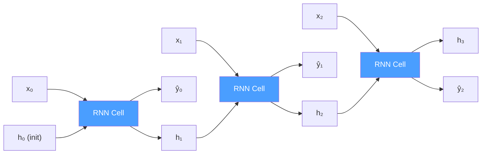
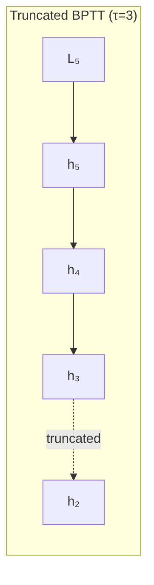
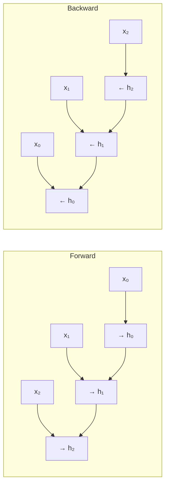
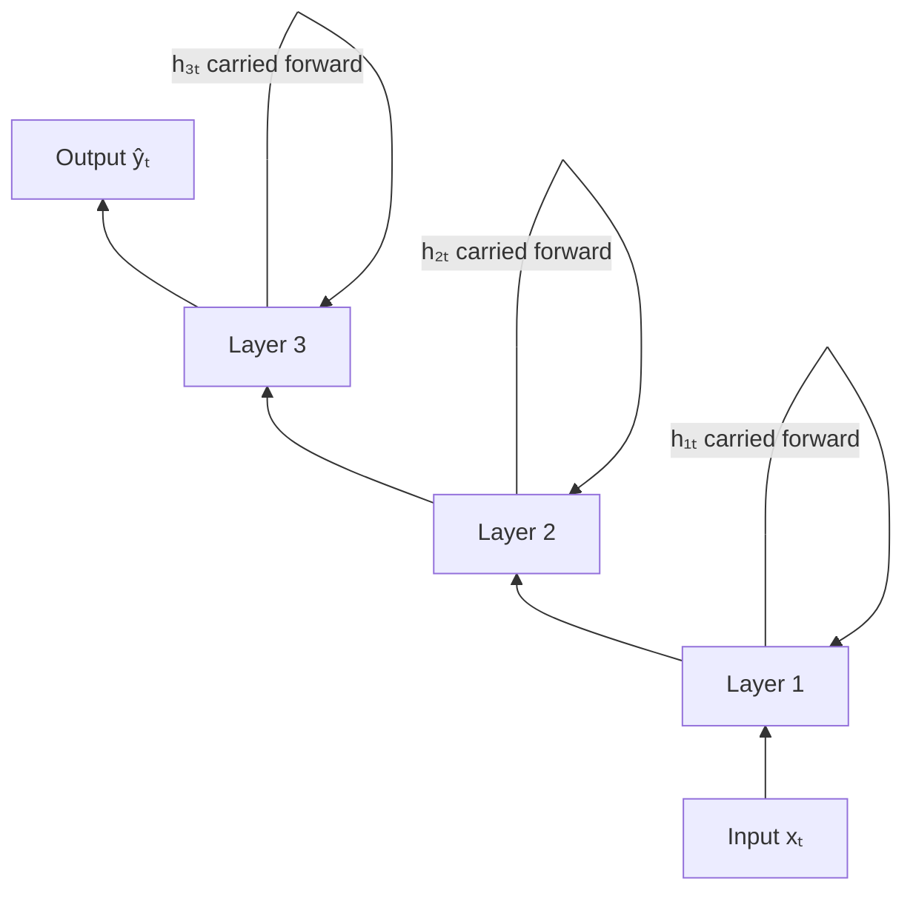
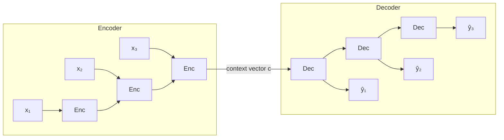

# Recurrent Neural Networks (RNNs)

> **A deep-dive tutorial** on Recurrent Neural Networks — from vanilla RNN architecture
> through backpropagation through time, the vanishing gradient problem, bidirectional and
> sequence-to-sequence variants — with mathematical derivations, diagrams, and
> implementations in Python and Rust.

---

## Table of Contents

1. [Why Recurrence?](#why-recurrence)
2. [Vanilla RNN Architecture](#vanilla-rnn-architecture)
3. [The Forward Pass — Step by Step](#the-forward-pass--step-by-step)
4. [Backpropagation Through Time (BPTT)](#backpropagation-through-time-bptt)
5. [The Vanishing and Exploding Gradient Problem](#the-vanishing-and-exploding-gradient-problem)
6. [Bidirectional RNNs](#bidirectional-rnns)
7. [Deep (Stacked) RNNs](#deep-stacked-rnns)
8. [Sequence-to-Sequence (Seq2Seq)](#sequence-to-sequence-seq2seq)
9. [Implementation: Sequence Classification](#implementation-sequence-classification)
10. [RNN from Scratch](#rnn-from-scratch)
11. [When to Use RNNs](#when-to-use-rnns)
12. [Exercises](#exercises)
13. [References](#references)

---

## Why Recurrence?

Standard feedforward networks assume **fixed-size** inputs and outputs with **no temporal structure**. But many real-world problems involve **sequences** of variable length:

| Problem | Input | Output |
|---|---|---|
| Sentiment analysis | Sentence (variable words) | Positive / Negative |
| Machine translation | English sentence | French sentence |
| Speech recognition | Audio waveform | Text transcript |
| Time-series forecasting | Historical prices | Future prices |
| Music generation | Seed melody | Continuation |

Feedforward networks can't naturally handle these because:
1. Input dimension varies across examples
2. **Order matters** — "dog bites man" ≠ "man bites dog"
3. The same word at different positions should share learned representations (**parameter sharing**)

RNNs solve this by processing sequences **one element at a time**, maintaining a **hidden state** that accumulates information from the past.

---

## Vanilla RNN Architecture

### Unrolled Computation Graph



> **Key insight:** All three "RNN Cell" blocks are **the same cell** with **shared parameters** — the diagram is "unrolled" across time steps.

### Equations

At each time step $t$, the RNN computes:

$$\mathbf{h}_t = \tanh(\mathbf{W}_{hh} \mathbf{h}_{t-1} + \mathbf{W}_{xh} \mathbf{x}_t + \mathbf{b}_h)$$

$$\hat{\mathbf{y}}_t = \mathbf{W}_{hy} \mathbf{h}_t + \mathbf{b}_y$$

where:

| Symbol | Shape | Description |
|---|---|---|
| $\mathbf{x}_t$ | $(d,)$ | Input vector at time $t$ |
| $\mathbf{h}_t$ | $(h,)$ | Hidden state at time $t$ |
| $\hat{\mathbf{y}}_t$ | $(o,)$ | Output at time $t$ |
| $\mathbf{W}_{xh}$ | $(h, d)$ | Input-to-hidden weights |
| $\mathbf{W}_{hh}$ | $(h, h)$ | Hidden-to-hidden weights (recurrence) |
| $\mathbf{W}_{hy}$ | $(o, h)$ | Hidden-to-output weights |
| $\mathbf{b}_h, \mathbf{b}_y$ | $(h,), (o,)$ | Biases |

The **total parameters** are $h \times d + h \times h + h \times o + h + o$ — **independent of sequence length**. This parameter sharing across time is what makes RNNs efficient and able to generalize to unseen sequence lengths.

### Compact Notation

Sometimes written as a single equation by concatenating $\mathbf{h}_{t-1}$ and $\mathbf{x}_t$:

$$\mathbf{h}_t = \tanh\left(\mathbf{W} \begin{bmatrix} \mathbf{h}_{t-1} \\ \mathbf{x}_t \end{bmatrix} + \mathbf{b}\right)$$

where $\mathbf{W} = [\mathbf{W}_{hh} \mid \mathbf{W}_{xh}]$ has shape $(h, h + d)$.

---

## The Forward Pass — Step by Step

Let's trace through a concrete example. Suppose $d=2$ (input dim), $h=3$ (hidden dim), and we have a 3-step sequence.

**Weights** (randomly initialized):

$$\mathbf{W}_{xh} = \begin{pmatrix} 0.1 & 0.2 \\ 0.3 & 0.4 \\ 0.5 & 0.6 \end{pmatrix}, \quad \mathbf{W}_{hh} = \begin{pmatrix} 0.01 & 0.02 & 0.03 \\ 0.04 & 0.05 & 0.06 \\ 0.07 & 0.08 & 0.09 \end{pmatrix}$$

**Input sequence:** $\mathbf{x}_0 = (1, 0)$, $\mathbf{x}_1 = (0, 1)$, $\mathbf{x}_2 = (1, 1)$

**$t = 0$** (with $\mathbf{h}_{-1} = \mathbf{0}$):

$$\mathbf{h}_0 = \tanh(\mathbf{W}_{hh} \cdot \mathbf{0} + \mathbf{W}_{xh} \cdot (1, 0)^T + \mathbf{0})$$
$$= \tanh(0.1, 0.3, 0.5) = (0.0997, 0.2913, 0.4621)$$

**$t = 1$:**

$$\mathbf{h}_1 = \tanh(\mathbf{W}_{hh} \cdot \mathbf{h}_0 + \mathbf{W}_{xh} \cdot (0, 1)^T)$$

And so on — each step feeds the previous hidden state back in.

---

## Backpropagation Through Time (BPTT)

BPTT is just standard backpropagation applied to the **unrolled** computation graph. The total loss is the sum of per-step losses:

$$\mathcal{L} = \sum_{t=1}^{T} \mathcal{L}_t$$

### Gradient Computation

The critical gradient is $\frac{\partial \mathcal{L}}{\partial \mathbf{W}_{hh}}$, which requires **summing contributions from all time steps** because $\mathbf{W}_{hh}$ is shared:

$$\frac{\partial \mathcal{L}}{\partial \mathbf{W}_{hh}} = \sum_{t=1}^{T} \frac{\partial \mathcal{L}_t}{\partial \mathbf{W}_{hh}}$$

For each $\mathcal{L}_t$, the gradient flows backward through the chain of hidden states:

$$\frac{\partial \mathcal{L}_t}{\partial \mathbf{W}_{hh}} = \sum_{k=1}^{t} \frac{\partial \mathcal{L}_t}{\partial \mathbf{h}_t} \left(\prod_{j=k+1}^{t} \frac{\partial \mathbf{h}_j}{\partial \mathbf{h}_{j-1}}\right) \frac{\partial \mathbf{h}_k}{\partial \mathbf{W}_{hh}}$$

The key term is the **Jacobian product**:

$$\prod_{j=k+1}^{t} \frac{\partial \mathbf{h}_j}{\partial \mathbf{h}_{j-1}} = \prod_{j=k+1}^{t} \text{diag}(1 - \mathbf{h}_j^2) \cdot \mathbf{W}_{hh}$$

This product of matrices is what causes the vanishing/exploding gradient problem.

### Truncated BPTT

In practice, we often truncate the backward pass to $\tau$ time steps:



This trades off gradient accuracy for computational efficiency and is essential for very long sequences.

---

## The Vanishing and Exploding Gradient Problem

### The Problem

The gradient signal must flow through a chain of matrix multiplications:

$$\prod_{j=k+1}^{t} \text{diag}(1 - \mathbf{h}_j^2) \cdot \mathbf{W}_{hh}$$

If the **largest singular value** of $\mathbf{W}_{hh}$ is:
- **< 1**: gradients shrink exponentially → **vanishing gradients**
- **> 1**: gradients grow exponentially → **exploding gradients**

Since $\tanh'(x) = 1 - \tanh^2(x) \in (0, 1]$, the diagonal factor always shrinks gradients. Combined with $\mathbf{W}_{hh}$ having singular values $< 1$, the product decays exponentially with $t - k$.

### Consequences

| Problem | Symptom | Effect |
|---|---|---|
| **Vanishing** | Gradients → 0 for distant steps | Model can't learn long-range dependencies |
| **Exploding** | Gradients → ∞ | NaN losses, unstable training |

### Solutions

| Solution | Addresses | How |
|---|---|---|
| **Gradient clipping** | Exploding | Cap gradient norm: $\mathbf{g} \leftarrow \frac{\mathbf{g}}{\|\mathbf{g}\|} \cdot \tau$ if $\|\mathbf{g}\| > \tau$ |
| **LSTM / GRU** | Vanishing | Gating mechanisms allow gradient highways |
| **Skip connections** | Vanishing | Direct paths for gradient flow |
| **Proper initialization** | Both | Orthogonal init for $\mathbf{W}_{hh}$ |
| **Layer normalization** | Both | Normalize hidden states |
| **Transformer architecture** | Both | Replaces recurrence with attention |

**Python** — gradient clipping in PyTorch:

```python
import torch
import torch.nn as nn

model = nn.RNN(input_size=10, hidden_size=64, num_layers=2, batch_first=True)
optimizer = torch.optim.Adam(model.parameters(), lr=0.001)

# Training loop with gradient clipping
for batch in dataloader:
    optimizer.zero_grad()
    output, hidden = model(batch.input)
    loss = criterion(output, batch.target)
    loss.backward()

    # Clip gradients to prevent explosion
    torch.nn.utils.clip_grad_norm_(model.parameters(), max_norm=5.0)

    optimizer.step()
```

---

## Bidirectional RNNs

A standard RNN only has access to **past** context. A bidirectional RNN processes the sequence in **both directions** and concatenates the hidden states:



At each time step, the output is:

$$\mathbf{h}_t = [\overrightarrow{\mathbf{h}_t} \; ; \; \overleftarrow{\mathbf{h}_t}]$$

where $;$ denotes concatenation. The resulting hidden state has dimension $2h$.

**When to use bidirectional RNNs:**
- Classification tasks where the entire sequence is available (sentiment, NER)
- **Not** suitable for autoregressive generation (can't look at the future)

**Python** — bidirectional RNN in PyTorch:

```python
import torch.nn as nn

class BiRNNClassifier(nn.Module):
    def __init__(self, vocab_size, embed_dim, hidden_dim, num_classes):
        super().__init__()
        self.embedding = nn.Embedding(vocab_size, embed_dim)
        self.rnn = nn.RNN(
            input_size=embed_dim,
            hidden_size=hidden_dim,
            num_layers=2,
            batch_first=True,
            bidirectional=True,  # <-- bidirectional
            dropout=0.3,
        )
        # hidden_dim * 2 because of bidirectional concatenation
        self.fc = nn.Linear(hidden_dim * 2, num_classes)

    def forward(self, x):
        # x: (batch, seq_len)
        embedded = self.embedding(x)          # (batch, seq_len, embed_dim)
        output, hidden = self.rnn(embedded)   # output: (batch, seq_len, hidden*2)
        # Use the last time step's output
        last = output[:, -1, :]               # (batch, hidden*2)
        return self.fc(last)                   # (batch, num_classes)
```

---

## Deep (Stacked) RNNs

Stacking multiple RNN layers increases model capacity. The output of layer $l$ becomes the input of layer $l+1$:

$$\mathbf{h}_t^{(l)} = \tanh(\mathbf{W}_{hh}^{(l)} \mathbf{h}_{t-1}^{(l)} + \mathbf{W}_{xh}^{(l)} \mathbf{h}_t^{(l-1)} + \mathbf{b}^{(l)})$$

where $\mathbf{h}_t^{(0)} = \mathbf{x}_t$.



**Practical guidelines:**
- 2-4 layers is typical; diminishing returns beyond 4
- Add **dropout** between layers (not within a layer's recurrence)
- The original seq2seq paper (Sutskever et al., 2014) used 4 LSTM layers

---

## Sequence-to-Sequence (Seq2Seq)

Seq2seq maps a variable-length input sequence to a variable-length output sequence using an **encoder-decoder** architecture:



**Encoder:** Reads the input sequence and compresses it into a fixed-size **context vector** $\mathbf{c} = \mathbf{h}_T^{(\text{enc})}$.

**Decoder:** Generates the output sequence one token at a time, conditioned on $\mathbf{c}$ and previously generated tokens.

### The Bottleneck Problem

The entire input sequence must be compressed into a single vector $\mathbf{c}$. For long sequences, this is a severe information bottleneck — which motivated the **attention mechanism** (Bahdanau et al., 2015) and ultimately the **Transformer** architecture.

---

## Implementation: Sequence Classification

A complete example: sentiment classification on IMDB reviews.

**Python** — PyTorch:

```python
import torch
import torch.nn as nn
from torch.utils.data import DataLoader
from torchtext.datasets import IMDB
from torchtext.data.utils import get_tokenizer
from torchtext.vocab import build_vocab_from_iterator

# --- Data Preparation ---
tokenizer = get_tokenizer("basic_english")

def yield_tokens(data_iter):
    for _, text in data_iter:
        yield tokenizer(text)

# Build vocabulary
train_iter = IMDB(split="train")
vocab = build_vocab_from_iterator(yield_tokens(train_iter), specials=["<unk>", "<pad>"])
vocab.set_default_index(vocab["<unk>"])

def text_pipeline(text):
    return vocab(tokenizer(text))

def collate_batch(batch):
    labels, texts, lengths = [], [], []
    for label, text in batch:
        labels.append(1 if label == "pos" else 0)
        processed = torch.tensor(text_pipeline(text)[:256], dtype=torch.long)
        texts.append(processed)
        lengths.append(len(processed))

    # Pad sequences
    texts = nn.utils.rnn.pad_sequence(texts, batch_first=True, padding_value=vocab["<pad>"])
    return texts, torch.tensor(labels), torch.tensor(lengths)


# --- Model ---
class RNNClassifier(nn.Module):
    def __init__(self, vocab_size, embed_dim, hidden_dim, num_classes, num_layers=2):
        super().__init__()
        self.embedding = nn.Embedding(vocab_size, embed_dim, padding_idx=vocab["<pad>"])
        self.rnn = nn.RNN(
            input_size=embed_dim,
            hidden_size=hidden_dim,
            num_layers=num_layers,
            batch_first=True,
            dropout=0.3,
        )
        self.fc = nn.Linear(hidden_dim, num_classes)
        self.dropout = nn.Dropout(0.5)

    def forward(self, text, lengths):
        embedded = self.dropout(self.embedding(text))

        # Pack padded sequences for efficiency
        packed = nn.utils.rnn.pack_padded_sequence(
            embedded, lengths.cpu(), batch_first=True, enforce_sorted=False
        )
        packed_output, hidden = self.rnn(packed)

        # Use the last hidden state from the top layer
        # hidden: (num_layers, batch, hidden_dim)
        last_hidden = hidden[-1]  # (batch, hidden_dim)
        return self.fc(self.dropout(last_hidden))


# --- Training Loop ---
VOCAB_SIZE = len(vocab)
EMBED_DIM = 128
HIDDEN_DIM = 256
NUM_CLASSES = 2
BATCH_SIZE = 64
EPOCHS = 5

model = RNNClassifier(VOCAB_SIZE, EMBED_DIM, HIDDEN_DIM, NUM_CLASSES)
optimizer = torch.optim.Adam(model.parameters(), lr=1e-3)
criterion = nn.CrossEntropyLoss()

train_iter = IMDB(split="train")
train_loader = DataLoader(
    list(train_iter), batch_size=BATCH_SIZE, shuffle=True, collate_fn=collate_batch
)

for epoch in range(EPOCHS):
    model.train()
    total_loss = 0
    correct = 0
    total = 0

    for texts, labels, lengths in train_loader:
        optimizer.zero_grad()
        predictions = model(texts, lengths)
        loss = criterion(predictions, labels)
        loss.backward()

        # Gradient clipping — crucial for RNNs
        nn.utils.clip_grad_norm_(model.parameters(), max_norm=5.0)

        optimizer.step()

        total_loss += loss.item()
        correct += (predictions.argmax(1) == labels).sum().item()
        total += labels.size(0)

    print(f"Epoch {epoch+1}: Loss={total_loss/len(train_loader):.4f}, Acc={correct/total:.4f}")
```

**Rust** — RNN forward pass with `tch-rs`:

```rust
use tch::{nn, nn::Module, nn::OptimizerConfig, Device, Tensor, Kind};

/// A simple RNN classifier using tch-rs (LibTorch bindings).
struct RNNClassifier {
    embedding: nn::Embedding,
    rnn: nn::RNN,
    fc: nn::Linear,
}

impl RNNClassifier {
    fn new(vs: &nn::Path, vocab_size: i64, embed_dim: i64, hidden_dim: i64, num_classes: i64) -> Self {
        let embedding = nn::embedding(vs / "embedding", vocab_size, embed_dim, Default::default());

        let rnn_config = nn::RNNConfig {
            num_layers: 2,
            batch_first: true,
            dropout: 0.3,
            ..Default::default()
        };
        let rnn = nn::rnn(vs / "rnn", embed_dim, hidden_dim, rnn_config);

        let fc = nn::linear(vs / "fc", hidden_dim, num_classes, Default::default());

        RNNClassifier { embedding, rnn, fc }
    }

    fn forward(&self, input: &Tensor) -> Tensor {
        let embedded = self.embedding.forward(input);
        let (output, _hidden) = self.rnn.seq(&embedded);

        // Get the last time step's output
        // output shape: (batch, seq_len, hidden_dim)
        let seq_len = output.size()[1];
        let last = output.select(1, seq_len - 1);

        self.fc.forward(&last)
    }
}

fn main() {
    let device = Device::cuda_if_available();
    let vs = nn::VarStore::new(device);
    let model = RNNClassifier::new(&vs.root(), 50000, 128, 256, 2);

    let mut opt = nn::Adam::default().build(&vs, 1e-3).unwrap();

    // Example: random input (batch=4, seq_len=20)
    let input = Tensor::randint(50000, &[4, 20], (Kind::Int64, device));
    let target = Tensor::from_slice(&[0i64, 1, 1, 0]).to_device(device);

    for epoch in 0..10 {
        let logits = model.forward(&input);
        let loss = logits.cross_entropy_for_logits(&target);

        opt.backward_step(&loss);

        println!("Epoch {}: loss = {:.4}", epoch, f64::try_from(&loss).unwrap());
    }
}
```

---

## RNN from Scratch

Understanding the internals by building an RNN cell from raw matrix operations.

**Python** — NumPy:

```python
import numpy as np

class VanillaRNN:
    """A minimal RNN cell implemented from scratch."""

    def __init__(self, input_dim: int, hidden_dim: int, output_dim: int):
        # Xavier initialization
        scale_xh = np.sqrt(2.0 / (input_dim + hidden_dim))
        scale_hh = np.sqrt(2.0 / (hidden_dim + hidden_dim))
        scale_hy = np.sqrt(2.0 / (hidden_dim + output_dim))

        self.W_xh = np.random.randn(hidden_dim, input_dim) * scale_xh
        self.W_hh = np.random.randn(hidden_dim, hidden_dim) * scale_hh
        self.W_hy = np.random.randn(output_dim, hidden_dim) * scale_hy
        self.b_h = np.zeros((hidden_dim, 1))
        self.b_y = np.zeros((output_dim, 1))

    def forward(self, inputs: list[np.ndarray], h_prev: np.ndarray | None = None):
        """
        Forward pass through a sequence.

        Parameters
        ----------
        inputs : list of np.ndarray, each shape (input_dim, 1)
            The input sequence.
        h_prev : np.ndarray, shape (hidden_dim, 1) or None
            Initial hidden state (zeros if None).

        Returns
        -------
        outputs : list of np.ndarray
            Output at each time step.
        hiddens : list of np.ndarray
            Hidden state at each time step.
        """
        if h_prev is None:
            h_prev = np.zeros((self.W_hh.shape[0], 1))

        hiddens = []
        outputs = []

        h = h_prev
        for x in inputs:
            # Core RNN computation
            h = np.tanh(self.W_xh @ x + self.W_hh @ h + self.b_h)
            y = self.W_hy @ h + self.b_y
            hiddens.append(h)
            outputs.append(y)

        return outputs, hiddens

    def backward(self, inputs, hiddens, d_outputs, h_prev=None):
        """
        BPTT: compute gradients given upstream gradients on outputs.

        Returns
        -------
        grads : dict
            Gradients for all parameters.
        """
        if h_prev is None:
            h_prev = np.zeros_like(hiddens[0])

        T = len(inputs)
        dW_xh = np.zeros_like(self.W_xh)
        dW_hh = np.zeros_like(self.W_hh)
        dW_hy = np.zeros_like(self.W_hy)
        db_h = np.zeros_like(self.b_h)
        db_y = np.zeros_like(self.b_y)

        dh_next = np.zeros_like(hiddens[0])

        for t in reversed(range(T)):
            # Gradient from output
            dy = d_outputs[t]
            dW_hy += dy @ hiddens[t].T
            db_y += dy

            # Gradient flowing into hidden state
            dh = self.W_hy.T @ dy + dh_next

            # Gradient through tanh: d/dx tanh(x) = 1 - tanh²(x)
            dtanh = dh * (1 - hiddens[t] ** 2)

            db_h += dtanh
            dW_xh += dtanh @ inputs[t].T
            h_prev_t = hiddens[t - 1] if t > 0 else h_prev
            dW_hh += dtanh @ h_prev_t.T

            # Gradient flowing to previous time step
            dh_next = self.W_hh.T @ dtanh

        # Gradient clipping
        for grad in [dW_xh, dW_hh, dW_hy, db_h, db_y]:
            np.clip(grad, -5, 5, out=grad)

        return {
            "W_xh": dW_xh, "W_hh": dW_hh, "W_hy": dW_hy,
            "b_h": db_h, "b_y": db_y,
        }


# --- Demo: learn to echo the input ---
rnn = VanillaRNN(input_dim=3, hidden_dim=16, output_dim=3)

# Simple training: identity mapping (echo input after 1 step delay)
lr = 0.01
for epoch in range(500):
    # Random 5-step sequence
    inputs = [np.random.randn(3, 1) for _ in range(5)]
    targets = [np.zeros((3, 1))] + inputs[:-1]  # shifted by 1

    outputs, hiddens = rnn.forward(inputs)

    # MSE loss gradients
    d_outputs = [2 * (o - t) / len(inputs) for o, t in zip(outputs, targets)]
    loss = sum(np.sum((o - t) ** 2) for o, t in zip(outputs, targets)) / len(inputs)

    grads = rnn.backward(inputs, hiddens, d_outputs)

    # SGD update
    rnn.W_xh -= lr * grads["W_xh"]
    rnn.W_hh -= lr * grads["W_hh"]
    rnn.W_hy -= lr * grads["W_hy"]
    rnn.b_h -= lr * grads["b_h"]
    rnn.b_y -= lr * grads["b_y"]

    if epoch % 100 == 0:
        print(f"Epoch {epoch}: Loss = {loss:.6f}")
```

**Rust** — from-scratch RNN forward pass with `ndarray`:

```rust
use ndarray::{Array1, Array2, Axis};

/// A vanilla RNN cell.
struct RNNCell {
    w_xh: Array2<f64>,  // (hidden_dim, input_dim)
    w_hh: Array2<f64>,  // (hidden_dim, hidden_dim)
    w_hy: Array2<f64>,  // (output_dim, hidden_dim)
    b_h: Array1<f64>,   // (hidden_dim,)
    b_y: Array1<f64>,   // (output_dim,)
}

impl RNNCell {
    fn new(input_dim: usize, hidden_dim: usize, output_dim: usize) -> Self {
        // Simple random initialization (production code should use proper init)
        use rand::Rng;
        let mut rng = rand::thread_rng();
        let scale = 0.1;

        let rand_mat = |rows, cols| -> Array2<f64> {
            Array2::from_shape_fn((rows, cols), |_| rng.gen::<f64>() * scale)
        };

        RNNCell {
            w_xh: rand_mat(hidden_dim, input_dim),
            w_hh: rand_mat(hidden_dim, hidden_dim),
            w_hy: rand_mat(output_dim, hidden_dim),
            b_h: Array1::zeros(hidden_dim),
            b_y: Array1::zeros(output_dim),
        }
    }

    /// Forward pass for one time step.
    fn step(&self, x: &Array1<f64>, h_prev: &Array1<f64>) -> (Array1<f64>, Array1<f64>) {
        // h_t = tanh(W_xh @ x + W_hh @ h_prev + b_h)
        let pre_activation = self.w_xh.dot(x) + self.w_hh.dot(h_prev) + &self.b_h;
        let h = pre_activation.mapv(f64::tanh);

        // y_t = W_hy @ h_t + b_y
        let y = self.w_hy.dot(&h) + &self.b_y;

        (h, y)
    }

    /// Forward pass through an entire sequence.
    fn forward(&self, inputs: &[Array1<f64>]) -> (Vec<Array1<f64>>, Vec<Array1<f64>>) {
        let hidden_dim = self.w_hh.nrows();
        let mut h = Array1::<f64>::zeros(hidden_dim);
        let mut hiddens = Vec::new();
        let mut outputs = Vec::new();

        for x in inputs {
            let (h_new, y) = self.step(x, &h);
            h = h_new;
            hiddens.push(h.clone());
            outputs.push(y);
        }

        (outputs, hiddens)
    }
}

fn main() {
    let rnn = RNNCell::new(3, 16, 3);

    // Create a dummy 5-step sequence with input_dim=3
    let inputs: Vec<Array1<f64>> = (0..5)
        .map(|_| Array1::from_vec(vec![1.0, 0.5, -0.3]))
        .collect();

    let (outputs, hiddens) = rnn.forward(&inputs);

    for (t, (y, h)) in outputs.iter().zip(hiddens.iter()).enumerate() {
        println!("t={}: y={:.3}, h_norm={:.4}", t, y, h.mapv(|v| v * v).sum().sqrt());
    }
}
```

---

## When to Use RNNs

### RNNs Are a Good Choice When:
- You're working with **sequential data** (time series, text, audio)
- Sequences are **moderate length** (< 500 tokens)
- You need **streaming / online** processing (each step depends only on past)
- You have **limited compute** (fewer parameters than transformers)
- You need **low latency** per token (no attention over full sequence)

### Consider Alternatives When:

| Limitation | Better Alternative |
|---|---|
| Long sequences (>500 tokens) | **Transformer** — parallel attention, no vanishing gradient |
| Need to capture long-range deps | **LSTM / GRU** — gating mitigates vanishing gradient |
| Very long sequences (>8k tokens) | **State-space models** (Mamba, S4) — linear complexity |
| Maximum accuracy on NLP tasks | **Pre-trained Transformers** (BERT, GPT) |
| Simple tabular time series | **1D CNN** — parallel, fast |

### RNN Pattern Taxonomy

| Pattern | Input → Output | Example |
|---|---|---|
| **One-to-one** | Single → Single | Standard feedforward (not really RNN) |
| **One-to-many** | Single → Sequence | Image captioning |
| **Many-to-one** | Sequence → Single | Sentiment classification |
| **Many-to-many (aligned)** | Sequence → Sequence (same length) | POS tagging, NER |
| **Many-to-many (unaligned)** | Sequence → Sequence (different length) | Machine translation (seq2seq) |

---

## Exercises

1. **Gradient explosion demo** — Initialize an RNN with $\mathbf{W}_{hh}$ having spectral radius > 1. Forward-pass a 100-step sequence and plot the hidden state norms over time. What happens?

2. **Orthogonal initialization** — Implement orthogonal initialization for $\mathbf{W}_{hh}$ and repeat exercise 1. Does it help?

3. **Truncated BPTT** — Modify the from-scratch BPTT implementation to support a configurable truncation window $\tau$. Compare learning on a long sequence with $\tau = 5, 20, 50, \infty$.

4. **Character-level RNN** — Train a character-level RNN on text from Project Gutenberg. Generate 500 characters of text after training for different numbers of epochs (100, 1000, 10000).

5. **Sequence-to-sequence** — Implement a simple seq2seq model for reversing digit strings (e.g., "123" → "321"). How long a string can the model reliably reverse?

6. **Bidirectional comparison** — Train both a unidirectional and bidirectional RNN on a sentiment classification task. Compare accuracy and training time.

7. **RNN vs. n-gram** — Compare a 3-gram language model with a word-level RNN language model on the same corpus. Which achieves lower perplexity? At what corpus size does the RNN outperform the n-gram model?

---

## References

1. Elman, J.L. (1990). *Finding Structure in Time*. Cognitive Science, 14(2), 179-211.
2. Rumelhart, D.E., Hinton, G.E., & Williams, R.J. (1986). *Learning representations by back-propagating errors*. Nature, 323, 533-536.
3. Bengio, Y., Simard, P., & Frasconi, P. (1994). *Learning Long-Term Dependencies with Gradient Descent is Difficult*. IEEE Transactions on Neural Networks, 5(2), 157-166.
4. Pascanu, R., Mikolov, T., & Bengio, Y. (2013). *On the difficulty of training Recurrent Neural Networks*. ICML.
5. Sutskever, I., Vinyals, O., & Le, Q.V. (2014). *Sequence to Sequence Learning with Neural Networks*. NeurIPS.
6. Bahdanau, D., Cho, K., & Bengio, Y. (2015). *Neural Machine Translation by Jointly Learning to Align and Translate*. ICLR.
7. Karpathy, A. (2015). *The Unreasonable Effectiveness of Recurrent Neural Networks*. [Blog post](https://karpathy.github.io/2015/05/21/rnn-effectiveness/).
8. Rodriguez, C. (2024). *Generative AI Foundations in Python*. Packt Publishing.

---

*Related docs: [Long Short-Term Memory (LSTM)](long_short_term_memory.md) | [N-Grams](n_grams.md) | [Natural Language Processing](natural_language_processing.md)*
