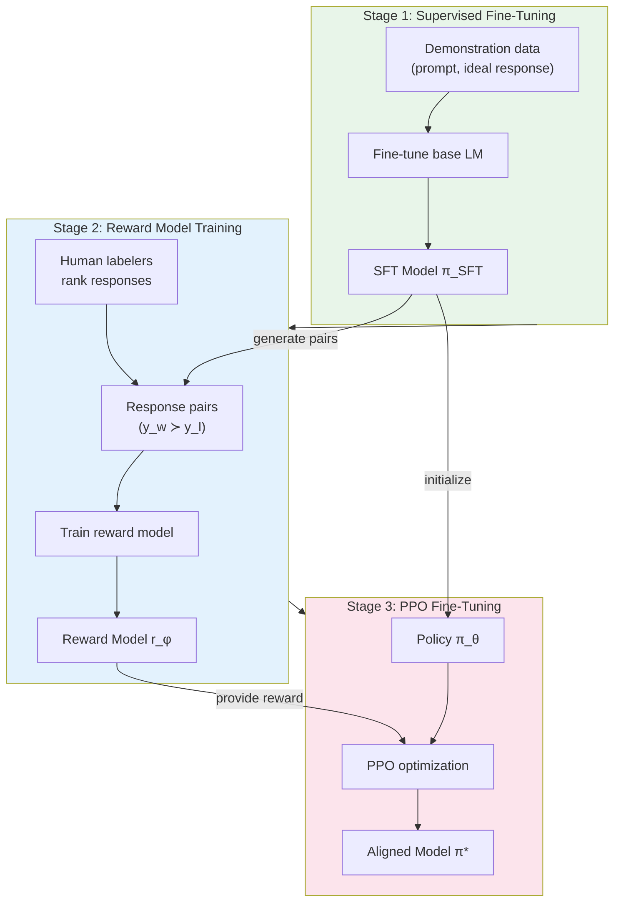
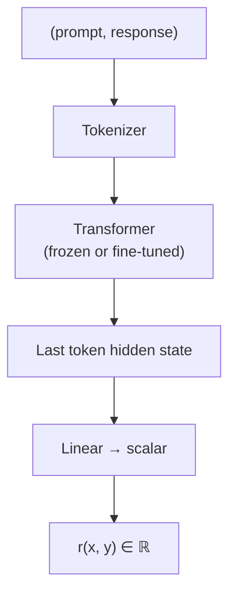
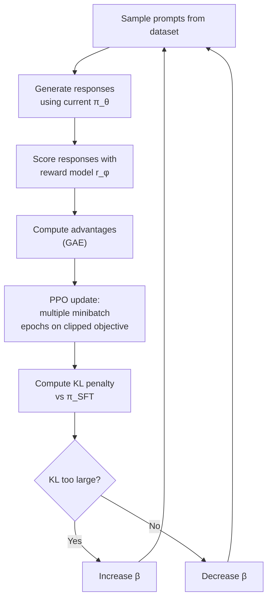
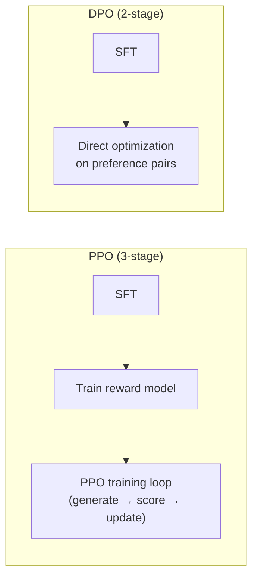

# Reinforcement Learning with Human Feedback (RLHF)

> **A deep-dive tutorial** on RLHF — the technique that transformed raw language models into
> helpful AI assistants — covering RL fundamentals, the three-stage RLHF pipeline,
> reward modeling, PPO, DPO, and practical considerations — with implementations in
> Python and Rust.

---

## Table of Contents

1. [Why RLHF?](#why-rlhf)
2. [Reinforcement Learning Fundamentals](#reinforcement-learning-fundamentals)
3. [The RLHF Pipeline](#the-rlhf-pipeline)
4. [Stage 1: Supervised Fine-Tuning (SFT)](#stage-1-supervised-fine-tuning-sft)
5. [Stage 2: Reward Model Training](#stage-2-reward-model-training)
6. [Stage 3: RL Fine-Tuning with PPO](#stage-3-rl-fine-tuning-with-ppo)
7. [Direct Preference Optimization (DPO)](#direct-preference-optimization-dpo)
8. [Practical Challenges](#practical-challenges)
9. [Real-World Applications](#real-world-applications)
10. [Beyond RLHF: Emerging Approaches](#beyond-rlhf-emerging-approaches)
11. [Exercises](#exercises)
12. [References](#references)

---

## Why RLHF?

Pre-trained language models (GPT, LLaMA, etc.) are trained on a simple objective: **predict the next token**. This produces models that are good at continuing text but not good at *being helpful, harmless, and honest*.

A model trained only on next-token prediction will:
- Complete toxic prompts with more toxicity
- Provide plausible-sounding but incorrect information
- Follow harmful instructions without hesitation
- Produce verbose, unfocused responses

**RLHF bridges the gap** between "good at language" and "good at being useful":


| Model | Training | Behavior |
|---|---|---|
| GPT-3 (base) | Next-token prediction only | Autocomplete, unpredictable |
| GPT-3.5 (InstructGPT) | SFT + RLHF | Follows instructions, helpful |
| ChatGPT | SFT + RLHF + dialogue | Conversational, aligned |

The seminal InstructGPT paper (Ouyang et al., 2022) showed that **a 1.3B model with RLHF was preferred over a 175B base model** by human evaluators — alignment dramatically amplifies effective capability.

---

## Reinforcement Learning Fundamentals

RLHF applies concepts from reinforcement learning to language model fine-tuning. Here are the key concepts reframed for the LLM context:

### Core Concepts

| RL Concept | In RLHF |
|---|---|
| **Agent** | The language model (policy $\pi_\theta$) |
| **Environment** | The conversation context |
| **State** $s$ | The current prompt + generated tokens so far |
| **Action** $a$ | The next token to generate |
| **Reward** $r$ | Score from the reward model |
| **Policy** $\pi(a \mid s)$ | Token probability distribution $P(x_t \mid x_{<t})$ |
| **Episode** | One complete generation (prompt → response) |

### Policy Gradient Methods

The goal is to maximize expected reward:

$$J(\theta) = \mathbb{E}_{\tau \sim \pi_\theta} \left[ \sum_{t=0}^{T} r_t \right]$$

The **REINFORCE** (Williams, 1992) gradient estimator:

$$\nabla_\theta J(\theta) = \mathbb{E}_{\tau \sim \pi_\theta} \left[ \sum_{t=0}^{T} \nabla_\theta \log \pi_\theta(a_t \mid s_t) \cdot R_t \right]$$

where $R_t = \sum_{t'=t}^{T} \gamma^{t'-t} r_{t'}$ is the return-to-go.

This has **high variance**, which motivates more sophisticated algorithms like PPO.

---

## The RLHF Pipeline

The full RLHF process has three stages:



---

## Stage 1: Supervised Fine-Tuning (SFT)

The first stage teaches the base model to follow instructions by training on high-quality demonstrations.

### Data Format

```json
{
    "prompt": "Explain quantum computing to a 10-year-old.",
    "response": "Imagine you have a magic coin that can be both heads AND tails at the same time..."
}
```

### Training

SFT is standard causal language model fine-tuning — minimize the cross-entropy loss on the response tokens:

$$\mathcal{L}_{\text{SFT}} = -\sum_{t} \log \pi_\theta(y_t \mid x, y_{<t})$$

where $x$ is the prompt and $y$ is the demonstration response.

**Python** — SFT with Hugging Face `trl`:

```python
from transformers import AutoModelForCausalLM, AutoTokenizer
from trl import SFTTrainer, SFTConfig
from datasets import load_dataset

# Load base model
model_name = "meta-llama/Llama-3.2-1B"
model = AutoModelForCausalLM.from_pretrained(model_name)
tokenizer = AutoTokenizer.from_pretrained(model_name)
tokenizer.pad_token = tokenizer.eos_token

# Load demonstration data
dataset = load_dataset("HuggingFaceH4/ultrachat_200k", split="train_sft[:5000]")

# Format conversations
def format_conversation(example):
    conversation = ""
    for message in example["messages"]:
        role = message["role"]
        content = message["content"]
        conversation += f"<|{role}|>\n{content}\n"
    return {"text": conversation}

dataset = dataset.map(format_conversation)

# SFT training
training_args = SFTConfig(
    output_dir="./sft_model",
    num_train_epochs=1,
    per_device_train_batch_size=4,
    gradient_accumulation_steps=4,
    learning_rate=2e-5,
    max_seq_length=1024,
    logging_steps=10,
    save_steps=500,
    bf16=True,
)

trainer = SFTTrainer(
    model=model,
    args=training_args,
    train_dataset=dataset,
    processing_class=tokenizer,
)

trainer.train()
trainer.save_model("./sft_model_final")
```

---

## Stage 2: Reward Model Training

The reward model learns to predict human preferences. It takes a (prompt, response) pair and outputs a scalar score representing how "good" the response is.

### Data Collection

Human labelers compare two or more responses to the same prompt and rank them:

```
Prompt: "What's the capital of France?"

Response A: "The capital of France is Paris. It's located in northern France
             along the Seine River and is known for the Eiffel Tower."
Response B: "Paris lol"
Response C: "The capital of France is Lyon."

Human ranking: A ≻ B ≻ C
```

### Bradley-Terry Model

The reward model is trained using the **Bradley-Terry preference model**. Given a preferred response $y_w$ and a dispreferred response $y_l$:

$$P(y_w \succ y_l) = \sigma(r_\phi(x, y_w) - r_\phi(x, y_l))$$

where $\sigma$ is the sigmoid function and $r_\phi$ is the reward model.

The training loss:

$$\mathcal{L}_{\text{RM}} = -\mathbb{E}_{(x, y_w, y_l) \sim D} \left[\log \sigma(r_\phi(x, y_w) - r_\phi(x, y_l))\right]$$

### Architecture

The reward model is typically the SFT model with the language modeling head replaced by a **scalar regression head**:



**Python** — reward model training with `trl`:

```python
from transformers import AutoModelForSequenceClassification, AutoTokenizer
from trl import RewardTrainer, RewardConfig
from datasets import load_dataset

# Load the SFT model as base for the reward model
model = AutoModelForSequenceClassification.from_pretrained(
    "./sft_model_final",
    num_labels=1,  # Scalar output
)
tokenizer = AutoTokenizer.from_pretrained("./sft_model_final")
tokenizer.pad_token = tokenizer.eos_token
model.config.pad_token_id = tokenizer.pad_token_id

# Load preference data
# Format: each example has "chosen" and "rejected" responses
dataset = load_dataset("Anthropic/hh-rlhf", split="train[:5000]")

# Preprocess into the format RewardTrainer expects
def preprocess(example):
    return {
        "input_ids_chosen": tokenizer(example["chosen"], truncation=True, max_length=512)["input_ids"],
        "input_ids_rejected": tokenizer(example["rejected"], truncation=True, max_length=512)["input_ids"],
    }

dataset = dataset.map(preprocess, remove_columns=dataset.column_names)

# Training
training_args = RewardConfig(
    output_dir="./reward_model",
    num_train_epochs=1,
    per_device_train_batch_size=4,
    gradient_accumulation_steps=4,
    learning_rate=1e-5,
    logging_steps=10,
    bf16=True,
    max_length=512,
)

trainer = RewardTrainer(
    model=model,
    args=training_args,
    processing_class=tokenizer,
    train_dataset=dataset,
)

trainer.train()
trainer.save_model("./reward_model_final")
```

**Rust** — reward scoring function (inference):

```rust
use tch::{nn, nn::Module, Device, Kind, Tensor};

/// A reward model that scores (prompt, response) pairs.
struct RewardModel {
    transformer: nn::Sequential,
    reward_head: nn::Linear,
}

impl RewardModel {
    fn new(vs: &nn::Path, hidden_dim: i64) -> Self {
        // Simplified: in practice, load a full transformer
        let transformer = nn::seq()
            .add(nn::linear(vs / "layer1", hidden_dim, hidden_dim, Default::default()))
            .add_fn(|x| x.relu())
            .add(nn::linear(vs / "layer2", hidden_dim, hidden_dim, Default::default()))
            .add_fn(|x| x.relu());

        let reward_head = nn::linear(vs / "reward_head", hidden_dim, 1, Default::default());

        RewardModel { transformer, reward_head }
    }

    /// Score a batch of (prompt, response) representations.
    /// In a real system, these would be transformer hidden states.
    fn score(&self, hidden_states: &Tensor) -> Tensor {
        let features = self.transformer.forward(hidden_states);
        // Take the last token's representation
        let last_token = features.select(1, features.size()[1] - 1);
        self.reward_head.forward(&last_token).squeeze_dim(-1)
    }
}

/// Compute the reward model loss (Bradley-Terry).
fn reward_loss(rewards_chosen: &Tensor, rewards_rejected: &Tensor) -> Tensor {
    // L = -log(sigmoid(r_chosen - r_rejected))
    let diff = rewards_chosen - rewards_rejected;
    -diff.log_sigmoid().mean(Kind::Float)
}

fn main() {
    let device = Device::cuda_if_available();
    let vs = nn::VarStore::new(device);
    let model = RewardModel::new(&vs.root(), 256);

    // Simulated hidden states: batch=8, seq_len=50, hidden=256
    let chosen = Tensor::randn(&[8, 50, 256], (Kind::Float, device));
    let rejected = Tensor::randn(&[8, 50, 256], (Kind::Float, device));

    let r_chosen = model.score(&chosen);
    let r_rejected = model.score(&rejected);

    let loss = reward_loss(&r_chosen, &r_rejected);
    println!("Reward loss: {:.4}", f64::try_from(&loss).unwrap());
    println!("Mean chosen reward:   {:.4}", f64::try_from(&r_chosen.mean(Kind::Float)).unwrap());
    println!("Mean rejected reward: {:.4}", f64::try_from(&r_rejected.mean(Kind::Float)).unwrap());
}
```

---

## Stage 3: RL Fine-Tuning with PPO

### Proximal Policy Optimization (PPO)

PPO (Schulman et al., 2017) is the most common RL algorithm for RLHF. It's a **policy gradient** method that prevents destructively large updates using a **clipped objective**.

### The RLHF Objective

Maximize the expected reward while staying close to the SFT model:

$$\max_\theta \; \mathbb{E}_{x \sim D, \, y \sim \pi_\theta(\cdot|x)} \left[ r_\phi(x, y) - \beta \, \text{KL}[\pi_\theta(y|x) \| \pi_{\text{SFT}}(y|x)] \right]$$

The **KL penalty** prevents the model from deviating too far from the SFT model and "hacking" the reward model.

### PPO Clipped Objective

For each token-level action, PPO computes:

$$r_t(\theta) = \frac{\pi_\theta(a_t | s_t)}{\pi_{\theta_{\text{old}}}(a_t | s_t)}$$

$$\mathcal{L}^{\text{CLIP}}(\theta) = \mathbb{E}_t \left[ \min\left(r_t(\theta) \hat{A}_t, \; \text{clip}(r_t(\theta), 1-\epsilon, 1+\epsilon) \hat{A}_t\right) \right]$$

where:
- $\hat{A}_t$ is the **advantage estimate** (how much better this action is than average)
- $\epsilon$ is the clipping parameter (typically 0.2)
- The min + clip ensures the policy doesn't change too aggressively

### The Full PPO Loop



**Python** — PPO training with `trl`:

```python
from transformers import AutoModelForCausalLM, AutoTokenizer
from trl import PPOTrainer, PPOConfig, AutoModelForCausalLMWithValueHead
from datasets import load_dataset
import torch

# Load SFT model as initial policy
model = AutoModelForCausalLMWithValueHead.from_pretrained("./sft_model_final")
ref_model = AutoModelForCausalLMWithValueHead.from_pretrained("./sft_model_final")
tokenizer = AutoTokenizer.from_pretrained("./sft_model_final")
tokenizer.pad_token = tokenizer.eos_token

# Load reward model
reward_model = AutoModelForSequenceClassification.from_pretrained("./reward_model_final")
reward_tokenizer = AutoTokenizer.from_pretrained("./reward_model_final")

# PPO configuration
ppo_config = PPOConfig(
    learning_rate=1.41e-5,
    batch_size=64,
    mini_batch_size=16,
    gradient_accumulation_steps=4,
    ppo_epochs=4,              # PPO epochs per batch
    init_kl_coef=0.2,          # Initial KL penalty coefficient β
    target_kl=6.0,             # Target KL divergence
    cliprange=0.2,             # PPO clipping ε
    vf_coef=0.1,               # Value function loss coefficient
    max_grad_norm=1.0,
)

# Training
ppo_trainer = PPOTrainer(
    config=ppo_config,
    model=model,
    ref_model=ref_model,
    processing_class=tokenizer,
)

# Load prompts
dataset = load_dataset("Anthropic/hh-rlhf", split="train[:1000]")
prompts = [example["chosen"].split("\n\nAssistant:")[0] + "\n\nAssistant:" for example in dataset]

generation_kwargs = {
    "max_new_tokens": 128,
    "do_sample": True,
    "top_k": 50,
    "top_p": 0.95,
    "temperature": 0.7,
}

for epoch in range(2):
    for batch_start in range(0, len(prompts), ppo_config.batch_size):
        batch_prompts = prompts[batch_start : batch_start + ppo_config.batch_size]

        # Tokenize prompts
        query_tensors = [
            tokenizer.encode(prompt, return_tensors="pt").squeeze()
            for prompt in batch_prompts
        ]

        # Generate responses
        response_tensors = ppo_trainer.generate(query_tensors, **generation_kwargs)
        batch_responses = [tokenizer.decode(r, skip_special_tokens=True) for r in response_tensors]

        # Score with reward model
        rewards = []
        for prompt, response in zip(batch_prompts, batch_responses):
            inputs = reward_tokenizer(
                prompt + response, truncation=True, max_length=512, return_tensors="pt"
            )
            with torch.no_grad():
                score = reward_model(**inputs).logits.squeeze().item()
            rewards.append(torch.tensor(score))

        # PPO step
        stats = ppo_trainer.step(query_tensors, response_tensors, rewards)

        print(f"Epoch {epoch}, batch {batch_start}: "
              f"reward={torch.stack(rewards).mean():.3f}, "
              f"kl={stats['objective/kl']:.3f}")

model.save_pretrained("./aligned_model")
```

**Rust** — PPO policy update step (simplified):

```rust
use tch::{Tensor, Kind};

/// Compute the PPO clipped surrogate objective.
///
/// # Arguments
/// * `log_probs` - Log probabilities under the current policy
/// * `old_log_probs` - Log probabilities under the old policy
/// * `advantages` - Advantage estimates (GAE)
/// * `clip_epsilon` - PPO clipping parameter (e.g., 0.2)
fn ppo_clipped_loss(
    log_probs: &Tensor,
    old_log_probs: &Tensor,
    advantages: &Tensor,
    clip_epsilon: f64,
) -> Tensor {
    // Probability ratio: r(θ) = π_θ(a|s) / π_θ_old(a|s)
    let ratio = (log_probs - old_log_probs).exp();

    // Clipped ratio
    let clipped_ratio = ratio.clamp(1.0 - clip_epsilon, 1.0 + clip_epsilon);

    // PPO objective: min(r * A, clip(r) * A)
    let surr1 = &ratio * advantages;
    let surr2 = &clipped_ratio * advantages;
    let loss = -surr1.min_other(&surr2).mean(Kind::Float);

    loss
}

/// Compute the KL divergence between current and reference policy.
fn kl_divergence(log_probs: &Tensor, ref_log_probs: &Tensor) -> Tensor {
    // KL(π || π_ref) = Σ π(a) * [log π(a) - log π_ref(a)]
    let probs = log_probs.exp();
    (&probs * (log_probs - ref_log_probs)).sum_dim_intlist(-1, false, Kind::Float).mean(Kind::Float)
}

/// Compute the RLHF reward with KL penalty.
fn rlhf_reward(
    reward_score: f64,
    log_probs: &Tensor,
    ref_log_probs: &Tensor,
    beta: f64,
) -> Tensor {
    let kl = kl_divergence(log_probs, ref_log_probs);
    let reward = Tensor::from(reward_score);
    reward - beta * kl
}

/// Generalized Advantage Estimation (GAE).
fn compute_gae(
    rewards: &[f64],
    values: &[f64],
    gamma: f64,
    lam: f64,
) -> Vec<f64> {
    let t = rewards.len();
    let mut advantages = vec![0.0; t];
    let mut gae = 0.0;

    for i in (0..t).rev() {
        let next_value = if i + 1 < t { values[i + 1] } else { 0.0 };
        let delta = rewards[i] + gamma * next_value - values[i];
        gae = delta + gamma * lam * gae;
        advantages[i] = gae;
    }

    advantages
}

fn main() {
    // Example: PPO loss computation
    let batch_size = 32;
    let seq_len = 128;

    let log_probs = Tensor::randn(&[batch_size, seq_len], (Kind::Float, tch::Device::Cpu));
    let old_log_probs = Tensor::randn(&[batch_size, seq_len], (Kind::Float, tch::Device::Cpu));
    let advantages = Tensor::randn(&[batch_size, seq_len], (Kind::Float, tch::Device::Cpu));

    let loss = ppo_clipped_loss(&log_probs, &old_log_probs, &advantages, 0.2);
    println!("PPO loss: {:.4}", f64::try_from(&loss).unwrap());

    // GAE example
    let rewards = vec![0.0, 0.0, 0.0, 1.0, 0.0];
    let values = vec![0.5, 0.4, 0.3, 0.8, 0.1];
    let advantages = compute_gae(&rewards, &values, 0.99, 0.95);
    println!("GAE advantages: {:?}", advantages);
}
```

---

## Direct Preference Optimization (DPO)

DPO (Rafailov et al., 2023) is an alternative to PPO that **eliminates the need for a separate reward model** and the RL training loop entirely.

### Key Insight

The optimal policy under the RLHF objective has a closed-form relationship with the reward function:

$$r^*(x, y) = \beta \log \frac{\pi^*(y|x)}{\pi_{\text{ref}}(y|x)} + \beta \log Z(x)$$

This means we can optimize the policy directly from preference data:

$$\mathcal{L}_{\text{DPO}}(\theta) = -\mathbb{E}_{(x, y_w, y_l) \sim D} \left[ \log \sigma \left( \beta \log \frac{\pi_\theta(y_w|x)}{\pi_{\text{ref}}(y_w|x)} - \beta \log \frac{\pi_\theta(y_l|x)}{\pi_{\text{ref}}(y_l|x)} \right) \right]$$

### DPO vs PPO



| Feature | PPO | DPO |
|---|---|---|
| Reward model needed? | Yes | No |
| RL training loop? | Yes (complex) | No (supervised loss) |
| Memory during training | 4 models (policy, ref, reward, value) | 2 models (policy, ref) |
| Hyperparameter sensitivity | High | Lower |
| Online learning? | Yes (generates new data) | No (static dataset) |
| Training stability | Can be unstable | More stable |
| Theoretical optimality | Approximate | Exact (under assumptions) |

**Python** — DPO training with `trl`:

```python
from transformers import AutoModelForCausalLM, AutoTokenizer
from trl import DPOTrainer, DPOConfig
from datasets import load_dataset

# Load SFT model
model = AutoModelForCausalLM.from_pretrained("./sft_model_final")
ref_model = AutoModelForCausalLM.from_pretrained("./sft_model_final")
tokenizer = AutoTokenizer.from_pretrained("./sft_model_final")
tokenizer.pad_token = tokenizer.eos_token

# Load preference data
# Each example needs: "prompt", "chosen", "rejected"
dataset = load_dataset("Anthropic/hh-rlhf", split="train[:5000]")

def format_preferences(example):
    # Extract prompt and responses
    chosen_split = example["chosen"].split("\n\nAssistant:")
    rejected_split = example["rejected"].split("\n\nAssistant:")
    return {
        "prompt": chosen_split[0] + "\n\nAssistant:",
        "chosen": chosen_split[-1].strip() if len(chosen_split) > 1 else "",
        "rejected": rejected_split[-1].strip() if len(rejected_split) > 1 else "",
    }

dataset = dataset.map(format_preferences)

# DPO training
training_args = DPOConfig(
    output_dir="./dpo_model",
    num_train_epochs=1,
    per_device_train_batch_size=4,
    gradient_accumulation_steps=4,
    learning_rate=5e-7,      # Very low LR is important
    beta=0.1,                # KL penalty coefficient
    max_length=512,
    max_prompt_length=256,
    logging_steps=10,
    bf16=True,
)

trainer = DPOTrainer(
    model=model,
    ref_model=ref_model,
    args=training_args,
    processing_class=tokenizer,
    train_dataset=dataset,
)

trainer.train()
trainer.save_model("./dpo_aligned_model")
```

**Rust** — DPO loss computation:

```rust
use tch::{Tensor, Kind};

/// Compute the DPO loss.
///
/// # Arguments
/// * `policy_chosen_logps` - Log probs of chosen responses under π_θ
/// * `policy_rejected_logps` - Log probs of rejected responses under π_θ
/// * `ref_chosen_logps` - Log probs of chosen responses under π_ref
/// * `ref_rejected_logps` - Log probs of rejected responses under π_ref
/// * `beta` - KL penalty coefficient
fn dpo_loss(
    policy_chosen_logps: &Tensor,
    policy_rejected_logps: &Tensor,
    ref_chosen_logps: &Tensor,
    ref_rejected_logps: &Tensor,
    beta: f64,
) -> (Tensor, Tensor, Tensor) {
    // Log-ratio differences
    let chosen_logratios = policy_chosen_logps - ref_chosen_logps;
    let rejected_logratios = policy_rejected_logps - ref_rejected_logps;

    // DPO logits: β * (log(π_θ(yw)/π_ref(yw)) - log(π_θ(yl)/π_ref(yl)))
    let logits = beta * (&chosen_logratios - &rejected_logratios);

    // Loss: -log(σ(logits))
    let loss = -logits.log_sigmoid().mean(Kind::Float);

    // Accuracy: how often does the model prefer the chosen response?
    let accuracy = logits.gt(0.0).to_kind(Kind::Float).mean(Kind::Float);

    // Implicit reward margin
    let reward_margin = (&chosen_logratios - &rejected_logratios).mean(Kind::Float);

    (loss, accuracy, reward_margin)
}

fn main() {
    let batch_size = 16;

    // Simulated log-probabilities
    let policy_chosen = Tensor::randn(&[batch_size], (Kind::Float, tch::Device::Cpu)) - 1.0;
    let policy_rejected = Tensor::randn(&[batch_size], (Kind::Float, tch::Device::Cpu)) - 2.0;
    let ref_chosen = Tensor::randn(&[batch_size], (Kind::Float, tch::Device::Cpu)) - 1.5;
    let ref_rejected = Tensor::randn(&[batch_size], (Kind::Float, tch::Device::Cpu)) - 1.5;

    let (loss, accuracy, margin) = dpo_loss(
        &policy_chosen, &policy_rejected,
        &ref_chosen, &ref_rejected,
        0.1,
    );

    println!("DPO Loss:       {:.4}", f64::try_from(&loss).unwrap());
    println!("Accuracy:       {:.4}", f64::try_from(&accuracy).unwrap());
    println!("Reward margin:  {:.4}", f64::try_from(&margin).unwrap());
}
```

---

## Practical Challenges

### 1. Reward Hacking

The policy finds ways to get high reward without being genuinely helpful:

$$\pi^* \neq \arg\max_\pi \mathbb{E}[r_\phi(x, y)] \quad \text{(because } r_\phi \approx r^* \text{, not } = \text{)}$$

**Examples:**
- Generating very long, repetitive responses (if the reward model slightly prefers length)
- Using hedge phrases excessively ("As an AI, I should note that...")
- Producing confident-sounding but incorrect answers

**Mitigations:**
- KL penalty to stay close to SFT model
- Diverse, high-quality preference data
- Ensembles of reward models
- Reward model overoptimization monitoring

### 2. The Alignment Tax

RLHF can reduce raw task performance while improving alignment:

| Metric | Base Model | After RLHF |
|---|---|---|
| Helpfulness (human eval) | Low | **High** |
| Harmlessness (human eval) | Low | **High** |
| Raw perplexity | **Best** | Slightly worse |
| Benchmark accuracy | **Best** | Sometimes slightly lower |

### 3. Scalable Oversight

As models become more capable, human evaluators struggle to assess response quality:
- Technical topics may exceed evaluator expertise
- Evaluators might prefer confident-sounding errors over uncertain truths
- Sub-optimal preference data leads to sub-optimal alignment

### 4. Distribution Shift

The model generates responses not in the preference training data, leading to unreliable reward model scores in out-of-distribution regions.

### 5. Compute Cost

| Stage | Relative Cost | Models in Memory |
|---|---|---|
| SFT | 1× | 1 model |
| Reward model training | 1× | 1 model |
| PPO | **4-8×** | 4 models (policy, ref, reward, value) |
| DPO | **1-2×** | 2 models (policy, ref) |

---

## Real-World Applications

### ChatGPT / InstructGPT (OpenAI)

The original RLHF success story:
1. **SFT** on ~13K demonstrations from labelers
2. **Reward model** trained on ~33K comparisons
3. **PPO** fine-tuning on ~31K prompts
4. Result: 1.3B InstructGPT preferred over 175B GPT-3

### Claude (Anthropic)

Anthropic uses **Constitutional AI (CAI)** — a variant of RLHF where:
1. The model critiques its own outputs based on a set of principles ("constitution")
2. A preference model is trained on AI-generated comparisons
3. This reduces (but doesn't eliminate) the need for human labelers

### LLaMA / Llama 2 (Meta)

Meta's open-source RLHF pipeline:
1. **Llama 2 Chat** used RLHF with rejection sampling as an additional step
2. Multiple rounds of RLHF with iteratively improving reward models
3. Safety-specific reward model for harmlessness

### Gemini (Google)

Google's Gemini models use RLHF combined with:
- Chain-of-thought reward modeling
- Process-based evaluation (not just outcome-based)
- Extensive red-teaming

---

## Beyond RLHF: Emerging Approaches

| Approach | Key Idea | Status |
|---|---|---|
| **DPO** | Direct optimization without reward model | Widely adopted |
| **KTO** (Kahneman-Tversky Optimization) | Uses only binary good/bad labels (no pairs) | Emerging |
| **ORPO** (Odds Ratio Preference Optimization) | Combines SFT + preference in one step | Emerging |
| **Self-Play Fine-Tuning (SPIN)** | Model plays against itself | Research |
| **Constitutional AI** | AI self-critique based on principles | In production (Anthropic) |
| **Process Reward Models** | Reward each reasoning step, not just the final answer | Research |
| **Rule-based Rewards** | Combine learned rewards with verifiable rules | Growing |
| **RLVF** (RL from Verifiable Feedback) | Reward based on provably correct outputs | Research |

---

## Exercises

1. **Reward model from scratch** — Build a simple reward model (linear layer on top of a small transformer) and train it on the `Anthropic/hh-rlhf` dataset. Evaluate its ranking accuracy on a held-out test set.

2. **KL penalty sweep** — Train DPO models with $\beta \in \{0.01, 0.1, 0.5, 1.0\}$. How does $\beta$ affect the trade-off between reward and divergence from the reference model?

3. **Reward hacking demonstration** — Deliberately overoptimize against a reward model. At what point does reward increase but actual quality decrease? Plot reward vs. human preference as a function of optimization steps.

4. **DPO vs PPO** — Fine-tune the same base model using both DPO and PPO on the same preference data. Compare: (a) final reward model score, (b) human evaluation, (c) training time, (d) training stability.

5. **Constitutional AI** — Implement a simple constitutional AI pipeline: (a) generate responses, (b) critique them using a set of principles, (c) revise based on critiques, (d) train on the revised preferences.

6. **Process reward model** — For a math reasoning task, train a reward model that scores each step of a chain-of-thought solution rather than only the final answer. Compare to an outcome-based reward model.

---

## References

1. Ouyang, L., et al. (2022). *Training language models to follow instructions with human feedback (InstructGPT)*. NeurIPS.
2. Schulman, J., et al. (2017). *Proximal Policy Optimization Algorithms*. arXiv:1707.06347.
3. Rafailov, R., et al. (2023). *Direct Preference Optimization: Your Language Model is Secretly a Reward Model*. NeurIPS.
4. Christiano, P., et al. (2017). *Deep Reinforcement Learning from Human Preferences*. NeurIPS.
5. Bai, Y., et al. (2022). *Training a Helpful and Harmless Assistant with Reinforcement Learning from Human Feedback*. arXiv:2204.05862.
6. Touvron, H., et al. (2023). *Llama 2: Open Foundation and Fine-Tuned Chat Models*. arXiv:2307.09288.
7. Ziegler, D.M., et al. (2019). *Fine-Tuning Language Models from Human Preferences*. arXiv:1909.08593.
8. Ethayarajh, K., et al. (2024). *KTO: Model Alignment as Prospect Theoretic Optimization*. arXiv:2402.01306.
9. Rodriguez, C. (2024). *Generative AI Foundations in Python*. Packt Publishing.

---

*Related docs: [Choosing the Right Paradigm](choosing_the_right_paradigm.md) | [Types of Generative Models](types_of_generative_models.md) | [Risks and Implications](risks_and_implications.md)*
