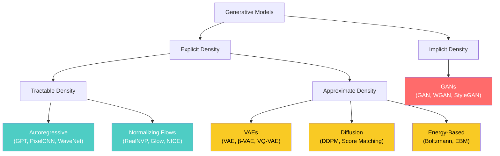
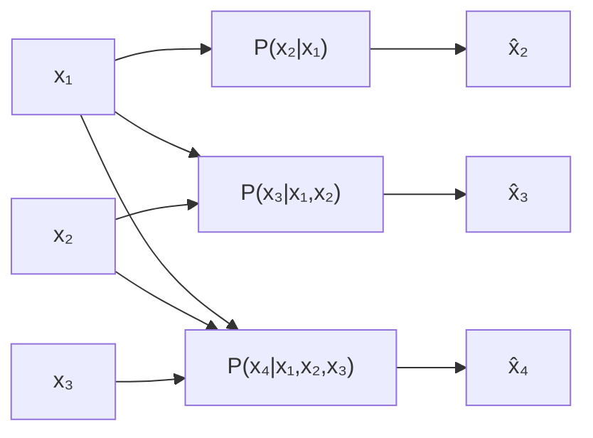
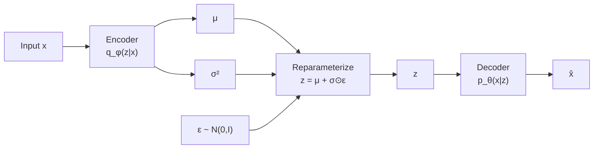
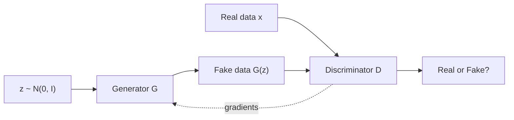
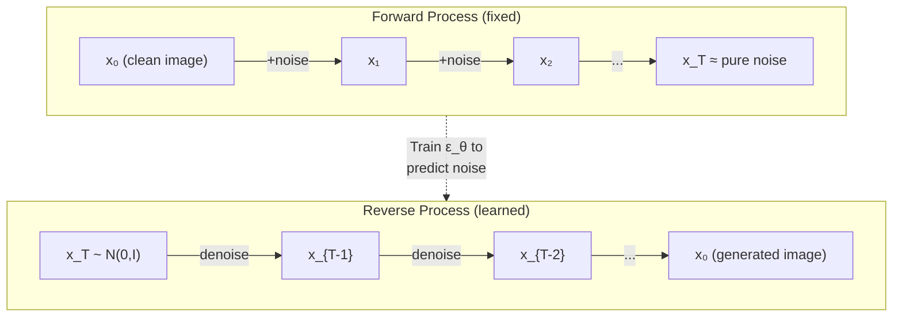
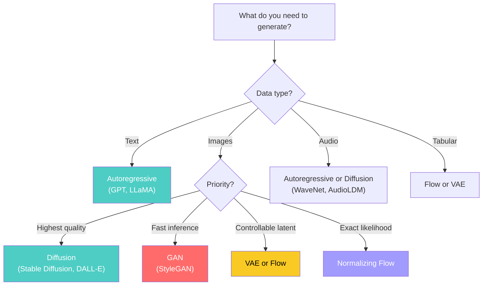

# Types of Generative Models

> **A deep-dive tutorial** on the major families of generative models — GANs, VAEs,
> autoregressive models, diffusion models, normalizing flows, and energy-based models —
> covering their mathematical foundations, architectures, strengths, and weaknesses
> — with implementations in Python and Rust.

---

## Table of Contents

1. [What Makes a Model "Generative"?](#what-makes-a-model-generative)
2. [Taxonomy of Generative Models](#taxonomy-of-generative-models)
3. [Autoregressive Models](#autoregressive-models)
4. [Variational Autoencoders (VAEs)](#variational-autoencoders-vaes)
5. [Generative Adversarial Networks (GANs)](#generative-adversarial-networks-gans)
6. [Diffusion Models](#diffusion-models)
7. [Normalizing Flows](#normalizing-flows)
8. [Energy-Based Models](#energy-based-models)
9. [Comparison Table](#comparison-table)
10. [Choosing the Right Generative Model](#choosing-the-right-generative-model)
11. [Exercises](#exercises)
12. [References](#references)

---

## What Makes a Model "Generative"?

A generative model learns the data distribution $P(X)$ (or a conditional version $P(X \mid Y)$) and can:

1. **Sample** — Draw new data points $x_{\text{new}} \sim P(X)$
2. **Evaluate** — Compute (or approximate) the likelihood $P(x)$ for a given $x$
3. **Represent** — Learn meaningful latent representations of the data

Not all generative models do all three equally well:

| Capability | Autoregressive | VAE | GAN | Diffusion | Flow | EBM |
|---|---|---|---|---|---|---|
| **Exact likelihood** | Yes | No (ELBO) | No | No (ELBO) | **Yes** | No (unnormalized) |
| **Fast sampling** | Slow (sequential) | **Fast** | **Fast** | Slow (iterative) | **Fast** | Slow (MCMC) |
| **High quality** | High | Medium | **High** | **Highest** | Medium | Medium-High |
| **Mode coverage** | **Good** | **Good** | Poor | **Good** | **Good** | **Good** |
| **Training stability** | **Stable** | **Stable** | Unstable | **Stable** | **Stable** | Unstable |

---

## Taxonomy of Generative Models



- **Explicit density** models define $P(X)$ explicitly (even if only approximately)
- **Implicit density** models can generate samples from $P(X)$ without computing the density

---

## Autoregressive Models

### Core Idea

Factor the joint distribution using the chain rule of probability:

$$P(x_1, x_2, \ldots, x_n) = \prod_{i=1}^{n} P(x_i \mid x_1, \ldots, x_{i-1})$$

Each conditional is modeled by a neural network. This gives an **exact, tractable likelihood**.

### Architecture



### Examples

| Model | Domain | Architecture |
|---|---|---|
| **GPT / LLaMA** | Text | Transformer decoder |
| **PixelCNN** | Images | Masked convolutions |
| **WaveNet** | Audio | Dilated causal convolutions |
| **MADE** | Tabular | Masked fully-connected |

### Strengths & Weaknesses

| Pro | Con |
|---|---|
| Exact log-likelihood | Sequential sampling (slow) |
| Stable training | Can't easily interpolate in latent space |
| Good mode coverage | Order dependence (for non-sequential data) |
| State-of-the-art for text | Left-to-right bias |

**Python** — a character-level autoregressive model with PyTorch:

```python
import torch
import torch.nn as nn
import torch.nn.functional as F

class CharAutoregressive(nn.Module):
    """Character-level autoregressive language model."""

    def __init__(self, vocab_size: int, embed_dim: int = 64, hidden_dim: int = 128, n_layers: int = 2):
        super().__init__()
        self.embedding = nn.Embedding(vocab_size, embed_dim)
        self.lstm = nn.LSTM(embed_dim, hidden_dim, n_layers, batch_first=True)
        self.head = nn.Linear(hidden_dim, vocab_size)

    def forward(self, x: torch.Tensor) -> torch.Tensor:
        """Forward pass. x: (batch, seq_len) of token indices."""
        emb = self.embedding(x)                    # (batch, seq, embed)
        hidden, _ = self.lstm(emb)                 # (batch, seq, hidden)
        logits = self.head(hidden)                 # (batch, seq, vocab)
        return logits

    def log_prob(self, x: torch.Tensor) -> torch.Tensor:
        """Compute exact log P(x) = Σ log P(x_t | x_{<t})."""
        logits = self.forward(x[:, :-1])           # Predict next token
        targets = x[:, 1:]                         # Shifted targets
        log_probs = F.log_softmax(logits, dim=-1)
        token_log_probs = log_probs.gather(2, targets.unsqueeze(-1)).squeeze(-1)
        return token_log_probs.sum(dim=-1)         # Sum over sequence

    @torch.no_grad()
    def sample(self, start_token: int, max_len: int = 100, temperature: float = 1.0) -> list[int]:
        """Autoregressively sample a sequence."""
        self.eval()
        tokens = [start_token]
        x = torch.tensor([[start_token]])
        hidden = None

        for _ in range(max_len):
            emb = self.embedding(x)
            out, hidden = self.lstm(emb, hidden)
            logits = self.head(out[:, -1, :]) / temperature
            probs = F.softmax(logits, dim=-1)
            next_token = torch.multinomial(probs, 1).item()
            tokens.append(next_token)
            x = torch.tensor([[next_token]])

        return tokens

# Training example
def train_autoregressive():
    text = "to be or not to be that is the question whether tis nobler in the mind"

    # Build vocabulary
    chars = sorted(set(text))
    char_to_idx = {c: i for i, c in enumerate(chars)}
    idx_to_char = {i: c for c, i in char_to_idx.items()}
    vocab_size = len(chars)

    # Prepare data
    data = torch.tensor([char_to_idx[c] for c in text]).unsqueeze(0)

    model = CharAutoregressive(vocab_size)
    optimizer = torch.optim.Adam(model.parameters(), lr=0.01)

    for epoch in range(200):
        logits = model(data[:, :-1])
        loss = F.cross_entropy(logits.reshape(-1, vocab_size), data[:, 1:].reshape(-1))
        optimizer.zero_grad()
        loss.backward()
        optimizer.step()

        if (epoch + 1) % 50 == 0:
            log_p = model.log_prob(data)
            print(f"Epoch {epoch+1}: loss={loss.item():.4f}, log P(x)={log_p.item():.2f}")

    # Generate
    tokens = model.sample(char_to_idx['t'], max_len=50, temperature=0.8)
    generated = ''.join(idx_to_char[t] for t in tokens if t in idx_to_char)
    print(f"Generated: {generated}")

train_autoregressive()
```

**Rust** — autoregressive sampling with `tch-rs`:

```rust
use tch::{nn, nn::Module, nn::RNNConfig, Device, Kind, Tensor};

struct CharLM {
    embedding: nn::Embedding,
    lstm: nn::LSTM,
    head: nn::Linear,
    hidden_dim: i64,
    n_layers: i64,
}

impl CharLM {
    fn new(vs: &nn::Path, vocab_size: i64, embed_dim: i64, hidden_dim: i64, n_layers: i64) -> Self {
        let embedding = nn::embedding(vs / "emb", vocab_size, embed_dim, Default::default());
        let lstm = nn::lstm(vs / "lstm", embed_dim, hidden_dim, RNNConfig {
            num_layers: n_layers,
            batch_first: true,
            ..Default::default()
        });
        let head = nn::linear(vs / "head", hidden_dim, vocab_size, Default::default());
        CharLM { embedding, lstm, head, hidden_dim, n_layers }
    }

    fn forward(&self, x: &Tensor) -> Tensor {
        let emb = self.embedding.forward(x);
        let (output, _) = self.lstm.seq(&emb);
        self.head.forward(&output)
    }

    fn sample(&self, start_token: i64, max_len: usize, temperature: f64) -> Vec<i64> {
        let device = Device::Cpu;
        let mut tokens = vec![start_token];
        let mut input = Tensor::from_slice(&[start_token]).view([1, 1]).to_device(device);

        // Initialize hidden state
        let h0 = Tensor::zeros(&[self.n_layers, 1, self.hidden_dim], (Kind::Float, device));
        let c0 = Tensor::zeros(&[self.n_layers, 1, self.hidden_dim], (Kind::Float, device));
        let mut state = nn::LSTMState((h0, c0));

        for _ in 0..max_len {
            let emb = self.embedding.forward(&input);
            let (output, new_state) = self.lstm.step(&emb.squeeze_dim(1), &state);
            state = new_state;

            let logits = self.head.forward(&output) / temperature;
            let probs = logits.softmax(-1, Kind::Float);
            let next_token = probs.multinomial(1, true).int64_value(&[0, 0]);

            tokens.push(next_token);
            input = Tensor::from_slice(&[next_token]).view([1, 1]);
        }

        tokens
    }
}
```

---

## Variational Autoencoders (VAEs)

### Core Idea

Learn a latent variable model $P_\theta(X) = \int P_\theta(X \mid Z) P(Z) \, dZ$ where:
- $P(Z) = \mathcal{N}(0, I)$ — standard Gaussian prior
- $P_\theta(X \mid Z)$ — decoder (neural network)
- $Q_\phi(Z \mid X)$ — encoder (approximate posterior)

### The ELBO

The marginal likelihood is intractable, so we maximize a lower bound:

$$\log P(X) \geq \underbrace{\mathbb{E}_{Z \sim Q_\phi(Z|X)}[\log P_\theta(X | Z)]}_{\text{reconstruction}} - \underbrace{D_{\text{KL}}(Q_\phi(Z|X) \| P(Z))}_{\text{regularization}}$$

This is the **Evidence Lower BOund (ELBO)**.

### Architecture



### The Reparameterization Trick

Instead of sampling $z \sim Q_\phi(Z \mid X)$ directly (which blocks gradient flow):

$$z = \mu_\phi(x) + \sigma_\phi(x) \odot \epsilon, \quad \epsilon \sim \mathcal{N}(0, I)$$

This makes the sampling operation differentiable through $\mu$ and $\sigma$.

### KL Divergence (Closed Form)

For the Gaussian case, the KL term has an analytical solution:

$$D_{\text{KL}}(\mathcal{N}(\mu, \sigma^2) \| \mathcal{N}(0, 1)) = \frac{1}{2} \sum_{j=1}^{d} \left( \mu_j^2 + \sigma_j^2 - \ln \sigma_j^2 - 1 \right)$$

**Python** — VAE implementation:

```python
import torch
import torch.nn as nn
import torch.nn.functional as F
from torch.utils.data import DataLoader
from torchvision import datasets, transforms

class VAE(nn.Module):
    def __init__(self, input_dim: int = 784, hidden_dim: int = 256, latent_dim: int = 20):
        super().__init__()
        self.latent_dim = latent_dim

        # Encoder: x → (μ, log σ²)
        self.encoder = nn.Sequential(
            nn.Linear(input_dim, hidden_dim),
            nn.ReLU(),
            nn.Linear(hidden_dim, hidden_dim),
            nn.ReLU(),
        )
        self.fc_mu = nn.Linear(hidden_dim, latent_dim)
        self.fc_logvar = nn.Linear(hidden_dim, latent_dim)

        # Decoder: z → x̂
        self.decoder = nn.Sequential(
            nn.Linear(latent_dim, hidden_dim),
            nn.ReLU(),
            nn.Linear(hidden_dim, hidden_dim),
            nn.ReLU(),
            nn.Linear(hidden_dim, input_dim),
            nn.Sigmoid(),
        )

    def encode(self, x: torch.Tensor) -> tuple[torch.Tensor, torch.Tensor]:
        h = self.encoder(x)
        return self.fc_mu(h), self.fc_logvar(h)

    def reparameterize(self, mu: torch.Tensor, logvar: torch.Tensor) -> torch.Tensor:
        std = torch.exp(0.5 * logvar)
        eps = torch.randn_like(std)
        return mu + std * eps

    def decode(self, z: torch.Tensor) -> torch.Tensor:
        return self.decoder(z)

    def forward(self, x: torch.Tensor) -> tuple[torch.Tensor, torch.Tensor, torch.Tensor]:
        mu, logvar = self.encode(x)
        z = self.reparameterize(mu, logvar)
        x_hat = self.decode(z)
        return x_hat, mu, logvar

    def loss(self, x: torch.Tensor, x_hat: torch.Tensor,
             mu: torch.Tensor, logvar: torch.Tensor) -> torch.Tensor:
        # Reconstruction loss (binary cross-entropy)
        recon = F.binary_cross_entropy(x_hat, x, reduction='sum')
        # KL divergence (closed form for Gaussians)
        kl = -0.5 * torch.sum(1 + logvar - mu.pow(2) - logvar.exp())
        return recon + kl

    @torch.no_grad()
    def generate(self, n_samples: int = 16) -> torch.Tensor:
        z = torch.randn(n_samples, self.latent_dim)
        return self.decode(z)

    @torch.no_grad()
    def interpolate(self, x1: torch.Tensor, x2: torch.Tensor, steps: int = 10) -> torch.Tensor:
        """Interpolate between two data points in latent space."""
        mu1, _ = self.encode(x1.unsqueeze(0))
        mu2, _ = self.encode(x2.unsqueeze(0))
        alphas = torch.linspace(0, 1, steps)
        z_interp = torch.stack([mu1 * (1 - a) + mu2 * a for a in alphas]).squeeze(1)
        return self.decode(z_interp)


def train_vae():
    transform = transforms.Compose([transforms.ToTensor(), transforms.Lambda(lambda x: x.view(-1))])
    dataset = datasets.MNIST('./data', train=True, download=True, transform=transform)
    loader = DataLoader(dataset, batch_size=128, shuffle=True)

    model = VAE(input_dim=784, hidden_dim=256, latent_dim=20)
    optimizer = torch.optim.Adam(model.parameters(), lr=1e-3)

    for epoch in range(10):
        total_loss = 0
        for batch, _ in loader:
            x_hat, mu, logvar = model(batch)
            loss = model.loss(batch, x_hat, mu, logvar)

            optimizer.zero_grad()
            loss.backward()
            optimizer.step()
            total_loss += loss.item()

        avg_loss = total_loss / len(dataset)
        print(f"Epoch {epoch+1}: avg ELBO loss = {avg_loss:.2f}")

    # Generate new samples
    samples = model.generate(16)
    print(f"Generated {samples.shape[0]} samples, shape: {samples.shape}")

    return model

model = train_vae()
```

**Rust** — VAE forward pass and sampling:

```rust
use tch::{nn, nn::Module, Device, Kind, Tensor};

struct VAE {
    // Encoder
    enc_fc1: nn::Linear,
    enc_fc2: nn::Linear,
    fc_mu: nn::Linear,
    fc_logvar: nn::Linear,
    // Decoder
    dec_fc1: nn::Linear,
    dec_fc2: nn::Linear,
    dec_out: nn::Linear,
    latent_dim: i64,
}

impl VAE {
    fn new(vs: &nn::Path, input_dim: i64, hidden_dim: i64, latent_dim: i64) -> Self {
        VAE {
            enc_fc1: nn::linear(vs / "enc1", input_dim, hidden_dim, Default::default()),
            enc_fc2: nn::linear(vs / "enc2", hidden_dim, hidden_dim, Default::default()),
            fc_mu: nn::linear(vs / "mu", hidden_dim, latent_dim, Default::default()),
            fc_logvar: nn::linear(vs / "logvar", hidden_dim, latent_dim, Default::default()),
            dec_fc1: nn::linear(vs / "dec1", latent_dim, hidden_dim, Default::default()),
            dec_fc2: nn::linear(vs / "dec2", hidden_dim, hidden_dim, Default::default()),
            dec_out: nn::linear(vs / "dec_out", hidden_dim, input_dim, Default::default()),
            latent_dim,
        }
    }

    fn encode(&self, x: &Tensor) -> (Tensor, Tensor) {
        let h = self.enc_fc1.forward(x).relu();
        let h = self.enc_fc2.forward(&h).relu();
        let mu = self.fc_mu.forward(&h);
        let logvar = self.fc_logvar.forward(&h);
        (mu, logvar)
    }

    fn reparameterize(&self, mu: &Tensor, logvar: &Tensor) -> Tensor {
        let std = (logvar * 0.5).exp();
        let eps = Tensor::randn_like(&std);
        mu + std * eps
    }

    fn decode(&self, z: &Tensor) -> Tensor {
        let h = self.dec_fc1.forward(z).relu();
        let h = self.dec_fc2.forward(&h).relu();
        self.dec_out.forward(&h).sigmoid()
    }

    fn forward(&self, x: &Tensor) -> (Tensor, Tensor, Tensor) {
        let (mu, logvar) = self.encode(x);
        let z = self.reparameterize(&mu, &logvar);
        let x_hat = self.decode(&z);
        (x_hat, mu, logvar)
    }

    /// ELBO loss = reconstruction + KL divergence.
    fn loss(&self, x: &Tensor, x_hat: &Tensor, mu: &Tensor, logvar: &Tensor) -> Tensor {
        // Binary cross-entropy reconstruction
        let recon = x_hat.binary_cross_entropy::<Tensor>(x, None, tch::Reduction::Sum);

        // KL divergence: -0.5 * Σ(1 + log(σ²) - μ² - σ²)
        let kl = -0.5 * (1.0 + logvar - mu.pow_tensor_scalar(2) - logvar.exp()).sum(Kind::Float);

        recon + kl
    }

    /// Generate new samples from the prior.
    fn generate(&self, n_samples: i64) -> Tensor {
        let z = Tensor::randn(&[n_samples, self.latent_dim], (Kind::Float, Device::Cpu));
        self.decode(&z)
    }
}

fn main() {
    let vs = nn::VarStore::new(Device::Cpu);
    let vae = VAE::new(&vs.root(), 784, 256, 20);

    // Forward pass on random data
    let x = Tensor::rand(&[32, 784], (Kind::Float, Device::Cpu));
    let (x_hat, mu, logvar) = vae.forward(&x);
    let loss = vae.loss(&x, &x_hat, &mu, &logvar);
    println!("VAE loss: {:.2}", f64::try_from(&loss).unwrap());

    // Generate
    let samples = vae.generate(16);
    println!("Generated shape: {:?}", samples.size());
}
```

---

## Generative Adversarial Networks (GANs)

### Core Idea

Two networks compete in a minimax game:
- **Generator** $G(z)$: maps noise $z \sim P_Z$ to fake data
- **Discriminator** $D(x)$: classifies real vs. fake

$$\min_G \max_D \; \mathbb{E}_{x \sim P_{\text{data}}}[\log D(x)] + \mathbb{E}_{z \sim P_Z}[\log(1 - D(G(z)))]$$

At equilibrium, $G$ generates data indistinguishable from real data and $D$ outputs 0.5 for everything.

### Architecture



### Training Dynamics

GAN training alternates between:

1. **Update D** — maximize $\log D(x) + \log(1 - D(G(z)))$
2. **Update G** — minimize $\log(1 - D(G(z)))$ (or equivalently maximize $\log D(G(z))$)

### Common Variants

| Variant | Key Improvement |
|---|---|
| **DCGAN** | Convolutional architecture, stable training |
| **WGAN** | Wasserstein distance, better gradients |
| **WGAN-GP** | Gradient penalty instead of clipping |
| **StyleGAN** | Style-based generator, state-of-the-art faces |
| **CycleGAN** | Unpaired image-to-image translation |
| **Conditional GAN** | Class-conditional generation |
| **BigGAN** | Large-scale, class-conditional ImageNet |

**Python** — simple GAN on MNIST:

```python
import torch
import torch.nn as nn
from torch.utils.data import DataLoader
from torchvision import datasets, transforms

class Generator(nn.Module):
    def __init__(self, latent_dim: int = 100, output_dim: int = 784):
        super().__init__()
        self.net = nn.Sequential(
            nn.Linear(latent_dim, 256),
            nn.LeakyReLU(0.2),
            nn.BatchNorm1d(256),
            nn.Linear(256, 512),
            nn.LeakyReLU(0.2),
            nn.BatchNorm1d(512),
            nn.Linear(512, 1024),
            nn.LeakyReLU(0.2),
            nn.BatchNorm1d(1024),
            nn.Linear(1024, output_dim),
            nn.Tanh(),
        )

    def forward(self, z: torch.Tensor) -> torch.Tensor:
        return self.net(z)

class Discriminator(nn.Module):
    def __init__(self, input_dim: int = 784):
        super().__init__()
        self.net = nn.Sequential(
            nn.Linear(input_dim, 512),
            nn.LeakyReLU(0.2),
            nn.Dropout(0.3),
            nn.Linear(512, 256),
            nn.LeakyReLU(0.2),
            nn.Dropout(0.3),
            nn.Linear(256, 1),
            nn.Sigmoid(),
        )

    def forward(self, x: torch.Tensor) -> torch.Tensor:
        return self.net(x)

def train_gan():
    latent_dim = 100
    device = torch.device('cuda' if torch.cuda.is_available() else 'cpu')

    transform = transforms.Compose([
        transforms.ToTensor(),
        transforms.Normalize([0.5], [0.5]),  # Scale to [-1, 1]
        transforms.Lambda(lambda x: x.view(-1)),
    ])
    dataset = datasets.MNIST('./data', train=True, download=True, transform=transform)
    loader = DataLoader(dataset, batch_size=128, shuffle=True)

    G = Generator(latent_dim).to(device)
    D = Discriminator().to(device)

    opt_G = torch.optim.Adam(G.parameters(), lr=2e-4, betas=(0.5, 0.999))
    opt_D = torch.optim.Adam(D.parameters(), lr=2e-4, betas=(0.5, 0.999))
    criterion = nn.BCELoss()

    for epoch in range(50):
        d_loss_total, g_loss_total = 0, 0

        for real_data, _ in loader:
            batch_size = real_data.size(0)
            real_data = real_data.to(device)

            real_labels = torch.ones(batch_size, 1, device=device)
            fake_labels = torch.zeros(batch_size, 1, device=device)

            # --- Train Discriminator ---
            z = torch.randn(batch_size, latent_dim, device=device)
            fake_data = G(z).detach()

            d_real = D(real_data)
            d_fake = D(fake_data)
            d_loss = criterion(d_real, real_labels) + criterion(d_fake, fake_labels)

            opt_D.zero_grad()
            d_loss.backward()
            opt_D.step()

            # --- Train Generator ---
            z = torch.randn(batch_size, latent_dim, device=device)
            fake_data = G(z)
            d_fake = D(fake_data)
            g_loss = criterion(d_fake, real_labels)  # Generator wants D to say "real"

            opt_G.zero_grad()
            g_loss.backward()
            opt_G.step()

            d_loss_total += d_loss.item()
            g_loss_total += g_loss.item()

        n_batches = len(loader)
        print(f"Epoch {epoch+1}: D_loss={d_loss_total/n_batches:.4f}, "
              f"G_loss={g_loss_total/n_batches:.4f}")

    return G, D

G, D = train_gan()
```

**Rust** — GAN generator and discriminator:

```rust
use tch::{nn, nn::Module, nn::OptimizerConfig, Device, Kind, Tensor};

fn generator(vs: &nn::Path, latent_dim: i64, output_dim: i64) -> nn::Sequential {
    nn::seq()
        .add(nn::linear(vs / "g1", latent_dim, 256, Default::default()))
        .add_fn(|x| x.leaky_relu())
        .add(nn::linear(vs / "g2", 256, 512, Default::default()))
        .add_fn(|x| x.leaky_relu())
        .add(nn::linear(vs / "g3", 512, 1024, Default::default()))
        .add_fn(|x| x.leaky_relu())
        .add(nn::linear(vs / "g4", 1024, output_dim, Default::default()))
        .add_fn(|x| x.tanh())
}

fn discriminator(vs: &nn::Path, input_dim: i64) -> nn::Sequential {
    nn::seq()
        .add(nn::linear(vs / "d1", input_dim, 512, Default::default()))
        .add_fn(|x| x.leaky_relu())
        .add(nn::linear(vs / "d2", 512, 256, Default::default()))
        .add_fn(|x| x.leaky_relu())
        .add(nn::linear(vs / "d3", 256, 1, Default::default()))
        .add_fn(|x| x.sigmoid())
}

fn train_gan_step(
    gen: &nn::Sequential,
    disc: &nn::Sequential,
    real_data: &Tensor,
    latent_dim: i64,
    device: Device,
) -> (f64, f64) {
    let batch_size = real_data.size()[0];

    // --- Discriminator loss ---
    let z = Tensor::randn(&[batch_size, latent_dim], (Kind::Float, device));
    let fake = gen.forward(&z).detach();

    let d_real = disc.forward(real_data);
    let d_fake = disc.forward(&fake);

    let ones = Tensor::ones(&[batch_size, 1], (Kind::Float, device));
    let zeros = Tensor::zeros(&[batch_size, 1], (Kind::Float, device));

    let d_loss = d_real.binary_cross_entropy::<Tensor>(&ones, None, tch::Reduction::Mean)
        + d_fake.binary_cross_entropy::<Tensor>(&zeros, None, tch::Reduction::Mean);

    // --- Generator loss ---
    let z = Tensor::randn(&[batch_size, latent_dim], (Kind::Float, device));
    let fake = gen.forward(&z);
    let d_fake = disc.forward(&fake);
    let g_loss = d_fake.binary_cross_entropy::<Tensor>(&ones, None, tch::Reduction::Mean);

    (
        f64::try_from(&d_loss).unwrap(),
        f64::try_from(&g_loss).unwrap(),
    )
}
```

---

## Diffusion Models

### Core Idea

Gradually add noise to data (forward process), then learn to reverse the process (backward / denoising):

$$x_0 \xrightarrow{\text{add noise}} x_1 \xrightarrow{\text{add noise}} \cdots \xrightarrow{\text{add noise}} x_T \approx \mathcal{N}(0, I)$$

$$x_T \xrightarrow{\text{denoise}} x_{T-1} \xrightarrow{\text{denoise}} \cdots \xrightarrow{\text{denoise}} x_0 \approx P_{\text{data}}$$

### Forward Process

A Markov chain that corrupts data with Gaussian noise:

$$q(x_t \mid x_{t-1}) = \mathcal{N}(x_t; \sqrt{1 - \beta_t} \, x_{t-1}, \beta_t I)$$

Key property — we can jump directly to any timestep:

$$q(x_t \mid x_0) = \mathcal{N}(x_t; \sqrt{\bar{\alpha}_t} \, x_0, (1 - \bar{\alpha}_t) I)$$

where $\bar{\alpha}_t = \prod_{s=1}^{t} (1 - \beta_s)$.

### Reverse Process (Learned)

$$p_\theta(x_{t-1} \mid x_t) = \mathcal{N}(x_{t-1}; \mu_\theta(x_t, t), \sigma_t^2 I)$$

The model predicts the **noise** $\epsilon_\theta(x_t, t)$ that was added:

$$\mu_\theta(x_t, t) = \frac{1}{\sqrt{\alpha_t}} \left( x_t - \frac{\beta_t}{\sqrt{1 - \bar{\alpha}_t}} \epsilon_\theta(x_t, t) \right)$$

### Training Objective

Simplified denoising objective:

$$\mathcal{L}_{\text{simple}} = \mathbb{E}_{t, x_0, \epsilon} \left[ \| \epsilon - \epsilon_\theta(\sqrt{\bar{\alpha}_t} x_0 + \sqrt{1 - \bar{\alpha}_t} \epsilon, t) \|^2 \right]$$



**Python** — simplified DDPM:

```python
import torch
import torch.nn as nn
import torch.nn.functional as F

class SimpleDiffusion:
    """A simplified Denoising Diffusion Probabilistic Model."""

    def __init__(self, n_timesteps: int = 1000, beta_start: float = 1e-4, beta_end: float = 0.02):
        self.n_timesteps = n_timesteps

        # Linear noise schedule
        self.betas = torch.linspace(beta_start, beta_end, n_timesteps)
        self.alphas = 1.0 - self.betas
        self.alpha_bar = torch.cumprod(self.alphas, dim=0)

    def forward_process(self, x0: torch.Tensor, t: torch.Tensor) -> tuple[torch.Tensor, torch.Tensor]:
        """Add noise to x0 at timestep t. Returns (noisy_x, noise)."""
        noise = torch.randn_like(x0)
        alpha_bar_t = self.alpha_bar[t].view(-1, 1)  # For 1D data

        # x_t = √ᾱ_t * x_0 + √(1-ᾱ_t) * ε
        x_t = torch.sqrt(alpha_bar_t) * x0 + torch.sqrt(1 - alpha_bar_t) * noise
        return x_t, noise

    def training_loss(self, model: nn.Module, x0: torch.Tensor) -> torch.Tensor:
        """Compute the simplified training loss."""
        batch_size = x0.shape[0]
        t = torch.randint(0, self.n_timesteps, (batch_size,))
        x_t, noise = self.forward_process(x0, t)

        # Model predicts the noise
        t_emb = t.float() / self.n_timesteps  # Normalize timestep
        predicted_noise = model(x_t, t_emb)

        return F.mse_loss(predicted_noise, noise)

    @torch.no_grad()
    def sample(self, model: nn.Module, shape: tuple[int, ...]) -> torch.Tensor:
        """Generate samples via the reverse process."""
        x = torch.randn(shape)

        for t in reversed(range(self.n_timesteps)):
            t_batch = torch.full((shape[0],), t)
            t_emb = t_batch.float() / self.n_timesteps

            # Predict noise
            predicted_noise = model(x, t_emb)

            # Compute x_{t-1}
            alpha_t = self.alphas[t]
            alpha_bar_t = self.alpha_bar[t]
            beta_t = self.betas[t]

            mean = (1 / torch.sqrt(alpha_t)) * (
                x - (beta_t / torch.sqrt(1 - alpha_bar_t)) * predicted_noise
            )

            if t > 0:
                noise = torch.randn_like(x)
                sigma = torch.sqrt(beta_t)
                x = mean + sigma * noise
            else:
                x = mean

        return x


class NoisePredictor(nn.Module):
    """Simple MLP noise predictor (for 1D data; use U-Net for images)."""

    def __init__(self, data_dim: int, hidden_dim: int = 256):
        super().__init__()
        self.net = nn.Sequential(
            nn.Linear(data_dim + 1, hidden_dim),  # +1 for timestep
            nn.SiLU(),
            nn.Linear(hidden_dim, hidden_dim),
            nn.SiLU(),
            nn.Linear(hidden_dim, hidden_dim),
            nn.SiLU(),
            nn.Linear(hidden_dim, data_dim),
        )

    def forward(self, x: torch.Tensor, t: torch.Tensor) -> torch.Tensor:
        t = t.unsqueeze(-1) if t.dim() == 1 else t
        inp = torch.cat([x, t], dim=-1)
        return self.net(inp)


# Training on 2D Swiss Roll data
def train_diffusion():
    from sklearn.datasets import make_swiss_roll

    # Generate data
    X, _ = make_swiss_roll(n_samples=10000, noise=0.5)
    X = torch.tensor(X[:, [0, 2]], dtype=torch.float32)  # 2D projection
    X = (X - X.mean(0)) / X.std(0)  # Normalize

    model = NoisePredictor(data_dim=2)
    diffusion = SimpleDiffusion(n_timesteps=200)
    optimizer = torch.optim.Adam(model.parameters(), lr=1e-3)

    for epoch in range(100):
        idx = torch.randint(0, len(X), (256,))
        batch = X[idx]

        loss = diffusion.training_loss(model, batch)
        optimizer.zero_grad()
        loss.backward()
        optimizer.step()

        if (epoch + 1) % 20 == 0:
            print(f"Epoch {epoch+1}: loss={loss.item():.6f}")

    # Generate samples
    samples = diffusion.sample(model, (500, 2))
    print(f"Generated {samples.shape[0]} 2D samples")

    return model, diffusion

model, diffusion = train_diffusion()
```

**Rust** — diffusion forward process and noise schedule:

```rust
use tch::{Kind, Tensor};

struct DiffusionSchedule {
    betas: Tensor,
    alphas: Tensor,
    alpha_bar: Tensor,
    n_timesteps: i64,
}

impl DiffusionSchedule {
    fn linear(n_timesteps: i64, beta_start: f64, beta_end: f64) -> Self {
        let betas = Tensor::linspace(beta_start, beta_end, n_timesteps, (Kind::Float, tch::Device::Cpu));
        let alphas = 1.0 - &betas;
        let alpha_bar = alphas.cumprod(0, Kind::Float);

        DiffusionSchedule { betas, alphas, alpha_bar, n_timesteps }
    }

    /// Forward diffusion: add noise to x0 at timestep t.
    fn forward_process(&self, x0: &Tensor, t: &Tensor) -> (Tensor, Tensor) {
        let noise = Tensor::randn_like(x0);

        let alpha_bar_t = self.alpha_bar.index_select(0, t).unsqueeze(-1);
        let sqrt_alpha_bar = alpha_bar_t.sqrt();
        let sqrt_one_minus = (1.0 - &alpha_bar_t).sqrt();

        let x_t = &sqrt_alpha_bar * x0 + &sqrt_one_minus * &noise;
        (x_t, noise)
    }

    /// Compute one reverse step: x_t → x_{t-1}.
    fn reverse_step(&self, x_t: &Tensor, predicted_noise: &Tensor, t: i64) -> Tensor {
        let alpha_t = f64::try_from(self.alphas.get(t)).unwrap();
        let alpha_bar_t = f64::try_from(self.alpha_bar.get(t)).unwrap();
        let beta_t = f64::try_from(self.betas.get(t)).unwrap();

        let coeff = beta_t / (1.0 - alpha_bar_t).sqrt();
        let mean = (1.0 / alpha_t.sqrt()) * (x_t - coeff * predicted_noise);

        if t > 0 {
            let sigma = beta_t.sqrt();
            let noise = Tensor::randn_like(x_t);
            mean + sigma * noise
        } else {
            mean
        }
    }
}

fn main() {
    let schedule = DiffusionSchedule::linear(1000, 1e-4, 0.02);

    // Demonstrate progressive noise addition
    let x0 = Tensor::randn(&[4, 2], (Kind::Float, tch::Device::Cpu));

    println!("Original data variance: {:.4}",
        f64::try_from(&x0.var(true)).unwrap());

    for &t in &[0i64, 100, 500, 999] {
        let t_tensor = Tensor::from_slice(&[t]);
        let (x_t, _) = schedule.forward_process(&x0, &t_tensor);

        let variance = f64::try_from(&x_t.var(true)).unwrap();
        let alpha_bar = f64::try_from(schedule.alpha_bar.get(t)).unwrap();
        println!("t={:>4}: variance={:.4}, ᾱ_t={:.4}", t, variance, alpha_bar);
    }
}
```

---

## Normalizing Flows

### Core Idea

Transform a simple distribution (e.g., Gaussian) through a sequence of **invertible** transformations:

$$z_0 \sim P_Z = \mathcal{N}(0, I)$$
$$z_k = f_k(z_{k-1}), \quad k = 1, \ldots, K$$
$$x = z_K$$

By the **change of variables formula**, we get an exact likelihood:

$$\log P(x) = \log P_Z(z_0) - \sum_{k=1}^{K} \log \left| \det \frac{\partial f_k}{\partial z_{k-1}} \right|$$

### Key Constraint

Each transformation $f_k$ must be:
1. **Invertible** (so we can compute $z_0$ from $x$)
2. **Have a tractable Jacobian determinant** (for the likelihood)

### Common Flow Architectures

| Architecture | Jacobian Trick | Expressiveness |
|---|---|---|
| **NICE** | Volume-preserving (det = 1) | Low |
| **RealNVP** | Triangular Jacobian | Medium |
| **Glow** | 1×1 convolutions + affine coupling | High |
| **Neural Spline Flows** | Monotonic rational-quadratic splines | Very High |

### Affine Coupling Layer (RealNVP)

Split input into two halves $x = (x_a, x_b)$:

$$y_a = x_a \quad \text{(unchanged)}$$
$$y_b = x_b \odot \exp(s(x_a)) + t(x_a)$$

The Jacobian is **triangular** → determinant is just:

$$\log |\det J| = \sum_i s(x_a)_i$$

**Python** — normalizing flow with affine coupling:

```python
import torch
import torch.nn as nn

class AffineCoupling(nn.Module):
    """An affine coupling layer (RealNVP-style)."""

    def __init__(self, dim: int, hidden_dim: int = 64):
        super().__init__()
        self.dim = dim
        self.split = dim // 2

        # Scale and translate networks
        self.net = nn.Sequential(
            nn.Linear(self.split, hidden_dim),
            nn.ReLU(),
            nn.Linear(hidden_dim, hidden_dim),
            nn.ReLU(),
            nn.Linear(hidden_dim, (dim - self.split) * 2),  # s and t
        )

    def forward(self, x: torch.Tensor) -> tuple[torch.Tensor, torch.Tensor]:
        """Forward: x → z, returns (z, log_det)."""
        x_a, x_b = x[:, :self.split], x[:, self.split:]
        st = self.net(x_a)
        s, t = st.chunk(2, dim=-1)
        s = torch.tanh(s)  # Bound scale for stability

        z_a = x_a
        z_b = x_b * torch.exp(s) + t
        z = torch.cat([z_a, z_b], dim=-1)

        log_det = s.sum(dim=-1)
        return z, log_det

    def inverse(self, z: torch.Tensor) -> torch.Tensor:
        z_a, z_b = z[:, :self.split], z[:, self.split:]
        st = self.net(z_a)
        s, t = st.chunk(2, dim=-1)
        s = torch.tanh(s)

        x_a = z_a
        x_b = (z_b - t) * torch.exp(-s)
        return torch.cat([x_a, x_b], dim=-1)


class NormalizingFlow(nn.Module):
    """Stack of affine coupling layers with alternating splits."""

    def __init__(self, dim: int, n_layers: int = 6, hidden_dim: int = 64):
        super().__init__()
        self.layers = nn.ModuleList()
        for i in range(n_layers):
            self.layers.append(AffineCoupling(dim, hidden_dim))
            # Permutation: reverse dimensions for alternating splits
            perm = torch.arange(dim - 1, -1, -1)
            self.register_buffer(f'perm_{i}', perm)

    def forward(self, x: torch.Tensor) -> tuple[torch.Tensor, torch.Tensor]:
        """Compute z and total log determinant."""
        log_det_total = torch.zeros(x.shape[0], device=x.device)
        z = x
        for i, layer in enumerate(self.layers):
            z, log_det = layer(z)
            log_det_total += log_det
            perm = getattr(self, f'perm_{i}')
            z = z[:, perm]
        return z, log_det_total

    def log_prob(self, x: torch.Tensor) -> torch.Tensor:
        """Exact log likelihood."""
        z, log_det = self.forward(x)
        # Prior: standard Gaussian
        log_pz = -0.5 * (z.pow(2) + torch.log(torch.tensor(2 * 3.14159))).sum(dim=-1)
        return log_pz + log_det

    @torch.no_grad()
    def sample(self, n_samples: int) -> torch.Tensor:
        """Sample by inverting the flow."""
        z = torch.randn(n_samples, self.layers[0].dim)
        x = z
        for i in reversed(range(len(self.layers))):
            perm = getattr(self, f'perm_{i}')
            inv_perm = torch.argsort(perm)
            x = x[:, inv_perm]
            x = self.layers[i].inverse(x)
        return x


# Training
flow = NormalizingFlow(dim=2, n_layers=8)
optimizer = torch.optim.Adam(flow.parameters(), lr=1e-3)

# Moons dataset
from sklearn.datasets import make_moons
X, _ = make_moons(n_samples=5000, noise=0.05)
X = torch.tensor(X, dtype=torch.float32)

for epoch in range(500):
    idx = torch.randint(0, len(X), (256,))
    batch = X[idx]

    log_prob = flow.log_prob(batch)
    loss = -log_prob.mean()

    optimizer.zero_grad()
    loss.backward()
    optimizer.step()

    if (epoch + 1) % 100 == 0:
        avg_ll = flow.log_prob(X).mean().item()
        print(f"Epoch {epoch+1}: avg log-likelihood = {avg_ll:.4f}")

samples = flow.sample(1000)
print(f"Generated {samples.shape[0]} samples")
```

---

## Energy-Based Models

### Core Idea

Define an unnormalized density:

$$P_\theta(x) = \frac{e^{-E_\theta(x)}}{Z(\theta)}, \quad Z(\theta) = \int e^{-E_\theta(x)} dx$$

where $E_\theta(x)$ is the **energy function** (a neural network) and $Z(\theta)$ is the **partition function** (intractable).

### Why the Partition Function is a Problem

- Cannot compute $P(x)$ exactly (need $Z$)
- Cannot train with maximum likelihood directly
- Must use alternative training methods:
  - **Contrastive Divergence (CD)**
  - **Score Matching**
  - **Noise-Contrastive Estimation (NCE)**

### Score Matching

Instead of learning $P(x)$, learn the **score function** (gradient of log density):

$$s_\theta(x) = \nabla_x \log P_\theta(x) = -\nabla_x E_\theta(x)$$

Training objective:

$$\mathcal{L}_{\text{SM}} = \mathbb{E}_{x \sim P_{\text{data}}} \left[ \frac{1}{2} \| s_\theta(x) - \nabla_x \log P_{\text{data}}(x) \|^2 \right]$$

This is equivalent (up to a constant) to **denoising score matching**, which connects EBMs to diffusion models.

### Connection to Other Models

| Model | Can be viewed as EBM? |
|---|---|
| Boltzmann machines | Yes (original EBMs) |
| Diffusion models | Yes (score-based EBMs) |
| Discriminative classifiers | Yes ($E(x, y) = -\log P(y \mid x)$) |
| GANs (discriminator) | Yes ($D(x) \approx P(\text{real} \mid x)$) |

---

## Comparison Table

| | Autoregressive | VAE | GAN | Diffusion | Flow | EBM |
|---|---|---|---|---|---|---|
| **Likelihood** | Exact | ELBO | None | ELBO (approx) | **Exact** | Unnormalized |
| **Sample quality** | High | Medium | High | **Highest** | Medium | Medium |
| **Sampling speed** | Slow | **Fast** | **Fast** | Very slow | **Fast** | Very slow |
| **Training** | Stable | Stable | **Unstable** | Stable | Stable | Unstable |
| **Mode coverage** | Good | Good | **Poor** | Good | Good | Good |
| **Latent space** | No | **Yes** | Yes | No* | **Yes** | No |
| **Interpolation** | Hard | **Easy** | Easy | Hard | **Easy** | Hard |
| **Best for** | Text, audio | Latent repr., interp. | Images, video | Images, audio | Density est. | Theory, score |
| **Key models** | GPT, WaveNet | VAE, VQ-VAE | StyleGAN | DALL-E 2, Stable Diff | Glow | Boltzmann |

\* Diffusion models operate in a latent space in Latent Diffusion Models (LDMs), e.g., Stable Diffusion.

---

## Choosing the Right Generative Model



### Quick Guidelines

1. **Text generation** → Autoregressive (Transformer-based)
2. **Highest-fidelity images** → Diffusion
3. **Real-time image generation** → GAN
4. **Meaningful latent space** → VAE or Flow
5. **Exact density estimation** → Normalizing Flow
6. **Theoretical flexibility** → Energy-Based Model
7. **Both generation + understanding** → VAE (bidirectional)

---

## Exercises

1. **VAE vs GAN on MNIST** — Train both models on MNIST. Qualitatively compare: (a) sample diversity, (b) sample sharpness, (c) interpolation smoothness. Which model exhibits mode collapse?

2. **Diffusion ablation** — Train a DDPM on a 2D dataset. Vary the number of timesteps $T \in \{10, 50, 200, 1000\}$. How does $T$ affect sample quality vs. sampling speed?

3. **Flow likelihood** — Train a normalizing flow and a VAE on the same data. Compare: (a) exact log-likelihood (flow) vs. ELBO (VAE), (b) sample quality. Does higher likelihood always mean better samples?

4. **GAN stability** — Train a vanilla GAN, WGAN, and WGAN-GP on CIFAR-10. Track the discriminator and generator losses. Which is most stable? Use FID to evaluate sample quality.

5. **Hybrid model** — Combine a VAE (for latent space) with a GAN (for sharper outputs) — this is a VAE-GAN. Train it and compare to standalone VAE and GAN.

6. **Conditional generation** — Add class conditioning to a diffusion model (classifier-free guidance). Generate class-conditional samples and evaluate both quality and adherence to the specified class.

---

## References

1. Goodfellow, I., et al. (2014). *Generative Adversarial Nets*. NeurIPS.
2. Kingma, D.P., & Welling, M. (2013). *Auto-Encoding Variational Bayes*. arXiv:1312.6114.
3. Ho, J., et al. (2020). *Denoising Diffusion Probabilistic Models*. NeurIPS.
4. Rezende, D., & Mohamed, S. (2015). *Variational Inference with Normalizing Flows*. ICML.
5. Dinh, L., et al. (2016). *Density estimation using Real-NVP*. arXiv:1605.08803.
6. LeCun, Y., et al. (2006). *A Tutorial on Energy-Based Learning*. Predicting Structured Data.
7. Song, Y., & Ermon, S. (2019). *Generative Modeling by Estimating Gradients of the Data Distribution*. NeurIPS.
8. Vaswani, A., et al. (2017). *Attention Is All You Need*. NeurIPS.
9. van den Oord, A., et al. (2016). *Pixel Recurrent Neural Networks*. ICML.
10. Karras, T., et al. (2019). *A Style-Based Generator Architecture for Generative Adversarial Networks (StyleGAN)*. CVPR.
11. Rombach, L., et al. (2022). *High-Resolution Image Synthesis with Latent Diffusion Models*. CVPR.
12. Rodriguez, C. (2024). *Generative AI Foundations in Python*. Packt Publishing.

---

*Related docs: [Choosing the Right Paradigm](choosing_the_right_paradigm.md) | [Risks and Implications](risks_and_implications.md) | [Recurrent Neural Networks](recurrent_neural_networks.md)*
